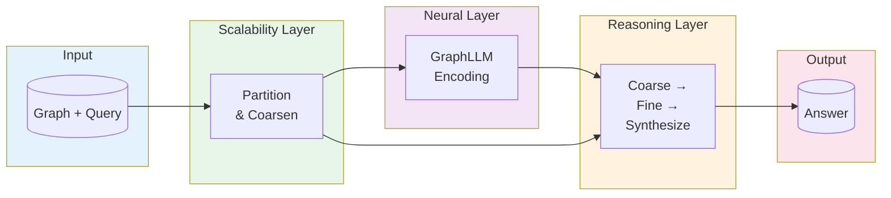
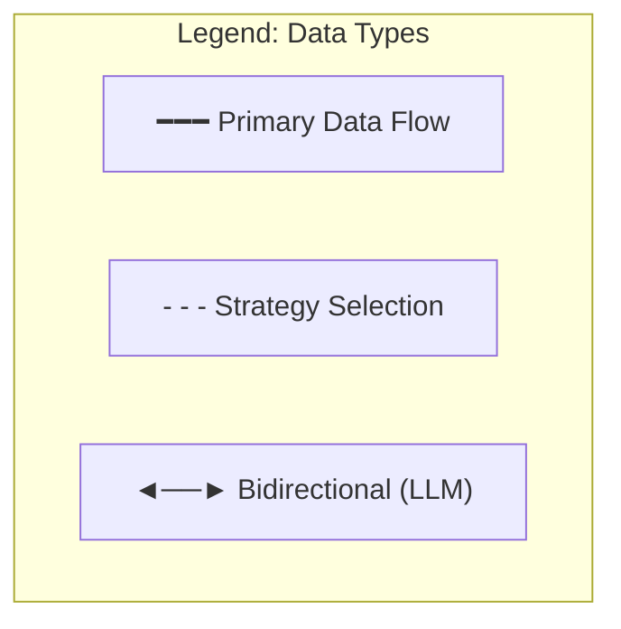
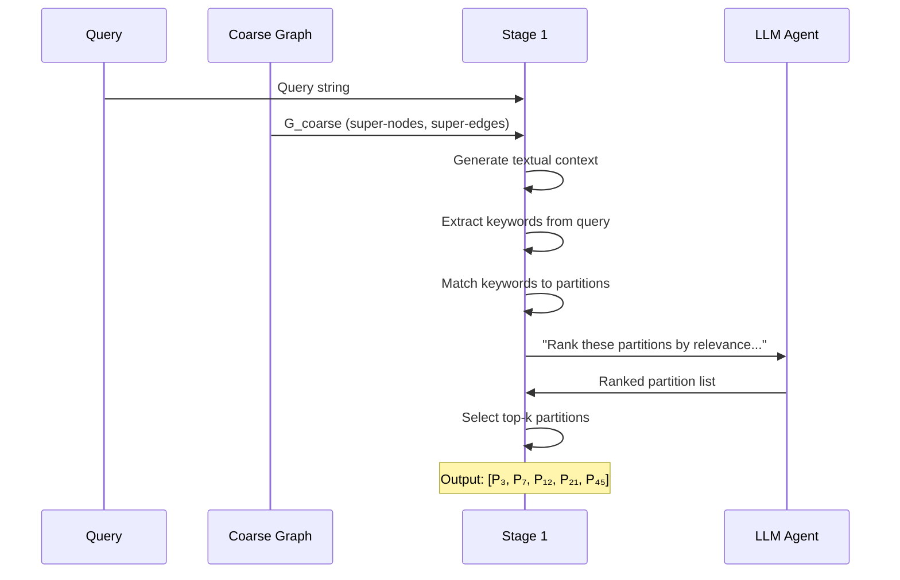
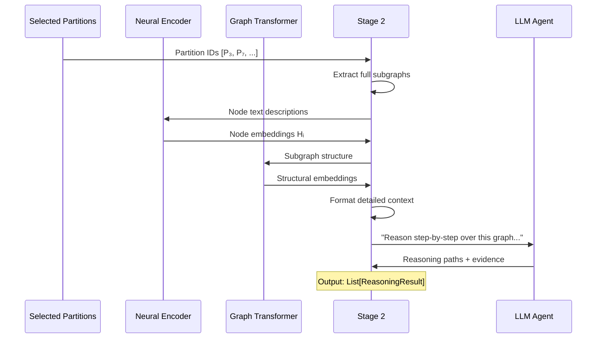
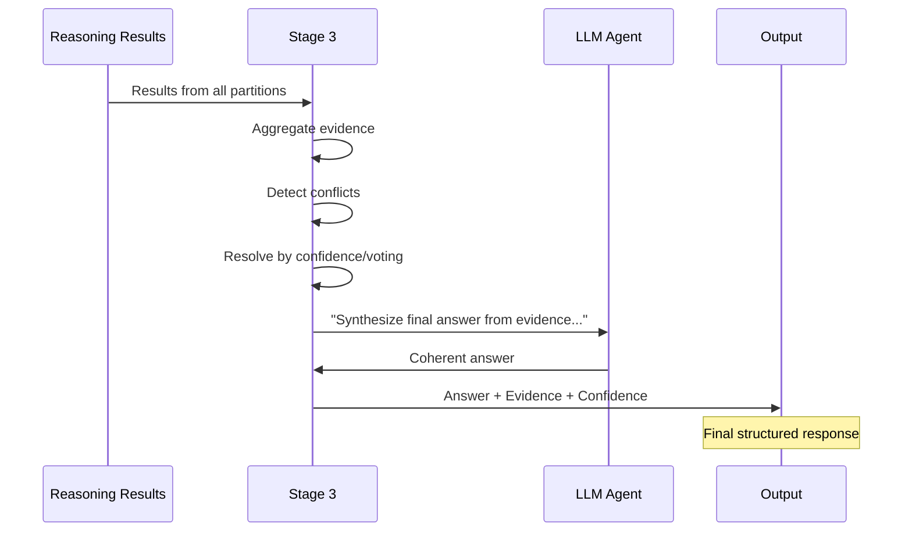
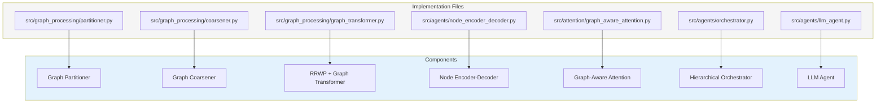

# S-GraphLLM Architecture Diagram

This document contains the validated Mermaid.js diagram representing the complete S-GraphLLM architecture.

## Validation Notes

The original reference diagram had the following issues that have been corrected:

1. **Missing connection from Orchestrator to ReasoningProcess**: The orchestrator should connect to the reasoning stages, not directly to the result
2. **Unclear data flow labels**: Added specific input/output types for all edges
3. **GraphLLM components not properly integrated**: Fixed the flow showing when neural components are applied
4. **Missing LLM Agent component**: Added explicit LLM Agent that serves all reasoning stages
5. **Incorrect stage transitions**: Fixed the flow between stages to show proper data dependencies

---

## Complete Architecture Diagram

```mermaid
flowchart TD
    %% ═══════════════════════════════════════════════════════════════════
    %% LAYER 1: INPUT LAYER
    %% ═══════════════════════════════════════════════════════════════════
    subgraph InputLayer ["📥 Layer 1: Input Layer"]
        direction LR
        KG([("Knowledge Graph G=(V,E,X)")])
        Query([("Natural Language Query Q")])
    end

    %% ═══════════════════════════════════════════════════════════════════
    %% LAYER 2: SCALABILITY LAYER
    %% ═══════════════════════════════════════════════════════════════════
    subgraph ScalabilityLayer ["⚡ Layer 2: Scalability Layer"]
        direction TB
        
        GP["Graph Partitioner<br/>━━━━━━━━━━━━━━━<br/>Divides G into k partitions"]
        GC["Graph Coarsener<br/>━━━━━━━━━━━━━━━<br/>Creates summarized graph"]
        
        GP -->|"Partitions P₁...Pₖ"| GC
        
        subgraph PartitionStrategies ["Partitioning Strategies"]
            direction LR
            PS1["METIS-like<br/>Spectral Clustering"]
            PS2["Community Detection<br/>Louvain Algorithm"]
            PS3["Balanced<br/>Node Ordering"]
        end
        
        GP -.->|"Strategy Selection"| PS1
        GP -.->|"Strategy Selection"| PS2
        GP -.->|"Strategy Selection"| PS3
    end

    %% ═══════════════════════════════════════════════════════════════════
    %% LAYER 3: GRAPHLLM NEURAL COMPONENTS
    %% ═══════════════════════════════════════════════════════════════════
    subgraph NeuralLayer ["🧠 Layer 3: GraphLLM Neural Components"]
        direction TB
        
        subgraph NodeUnderstanding ["Node Understanding (Section 3.2)"]
            direction LR
            NE["Node Encoder<br/>━━━━━━━━━━━━━━━<br/>TransformerEncoder(dᵢ, W_D)"]
            ND["Node Decoder<br/>━━━━━━━━━━━━━━━<br/>TransformerDecoder(Q, cᵢ)"]
            NE -->|"Context Vectors cᵢ"| ND
        end
        
        subgraph StructUnderstanding ["Structure Understanding (Section 3.3)"]
            direction LR
            RRWP["RRWP Encoding<br/>━━━━━━━━━━━━━━━<br/>R = [I, M, M², ..., Mᶜ⁻¹]"]
            GRIT["Graph Transformer<br/>━━━━━━━━━━━━━━━<br/>Multi-head Sparse Attention"]
            RRWP -->|"Positional Encoding"| GRIT
        end
        
        subgraph AttnModulation ["Attention Modulation (Novel)"]
            direction LR
            SIM["Similarity Metric<br/>━━━━━━━━━━━━━━━<br/>Shortest Path / Jaccard"]
            GAA["Graph-Aware Attention<br/>━━━━━━━━━━━━━━━<br/>α' = softmax(QKᵀ/√d + β·S)"]
            SIM -->|"Similarity Matrix S"| GAA
        end
    end

    %% ═══════════════════════════════════════════════════════════════════
    %% LAYER 4: HIERARCHICAL REASONING LAYER
    %% ═══════════════════════════════════════════════════════════════════
    subgraph ReasoningLayer ["🔄 Layer 4: Hierarchical Reasoning Layer"]
        direction TB
        
        Orchestrator["Hierarchical Reasoning Orchestrator<br/>━━━━━━━━━━━━━━━━━━━━━━━━━━━<br/>Coordinates 3-stage reasoning process"]
        
        subgraph Stage1 ["Stage 1: Coarse-Grained Reasoning"]
            direction TB
            S1_Context["Generate Coarse Context<br/>━━━━━━━━━━━━━━━<br/>Textual summary of G_coarse"]
            S1_Keywords["Extract Query Keywords<br/>━━━━━━━━━━━━━━━<br/>Entity & concept extraction"]
            S1_Filter["Filter Partitions<br/>━━━━━━━━━━━━━━━<br/>Keyword matching + relevance"]
            S1_LLM["LLM: Partition Ranking<br/>━━━━━━━━━━━━━━━<br/>Select top-k partitions"]
            
            S1_Context --> S1_Keywords
            S1_Keywords --> S1_Filter
            S1_Filter -->|"Candidate Partitions"| S1_LLM
        end
        
        subgraph Stage2 ["Stage 2: Fine-Grained Reasoning"]
            direction TB
            S2_Extract["Extract Subgraphs<br/>━━━━━━━━━━━━━━━<br/>Full subgraph for each Pᵢ"]
            S2_Neural["Apply Neural Encoding<br/>━━━━━━━━━━━━━━━<br/>Node + Structure embeddings"]
            S2_Format["Format Detailed Context<br/>━━━━━━━━━━━━━━━<br/>Entity-relationship text"]
            S2_LLM["LLM: Multi-hop Reasoning<br/>━━━━━━━━━━━━━━━<br/>Chain-of-thought over graph"]
            
            S2_Extract --> S2_Neural
            S2_Neural --> S2_Format
            S2_Format -->|"Rich Graph Context"| S2_LLM
        end
        
        subgraph Stage3 ["Stage 3: Answer Synthesis"]
            direction TB
            S3_Aggregate["Aggregate Evidence<br/>━━━━━━━━━━━━━━━<br/>Combine from all partitions"]
            S3_Resolve["Conflict Resolution<br/>━━━━━━━━━━━━━━━<br/>Majority vote / confidence"]
            S3_LLM["LLM: Final Synthesis<br/>━━━━━━━━━━━━━━━<br/>Generate coherent answer"]
            
            S3_Aggregate --> S3_Resolve
            S3_Resolve -->|"Resolved Evidence"| S3_LLM
        end
        
        %% LLM Agent (shared)
        LLMAgent["LLM Agent<br/>━━━━━━━━━━━━━━━<br/>GPT-4.1-mini / Gemini"]
        
        Orchestrator --> Stage1
        S1_LLM -->|"Selected Partition IDs"| Stage2
        S2_LLM -->|"Reasoning Results"| Stage3
    end

    %% ═══════════════════════════════════════════════════════════════════
    %% LAYER 5: OUTPUT LAYER
    %% ═══════════════════════════════════════════════════════════════════
    subgraph OutputLayer ["📤 Layer 5: Output Layer"]
        direction LR
        Result([("Final Answer<br/>+ Evidence<br/>+ Confidence<br/>+ Reasoning Trace")])
    end

    %% ═══════════════════════════════════════════════════════════════════
    %% INTER-LAYER CONNECTIONS
    %% ═══════════════════════════════════════════════════════════════════
    
    %% Input to Scalability
    KG -->|"Graph G = (V, E, X)"| GP
    Query -->|"Query string Q"| Orchestrator
    
    %% Scalability to Neural
    KG -->|"Node text descriptions"| NE
    GP -->|"Partition structure"| RRWP
    
    %% Scalability to Reasoning
    GC -->|"Coarse graph G_coarse"| S1_Context
    GP -->|"Partition mapping"| S2_Extract
    
    %% Neural to Reasoning
    ND -->|"Node embeddings Hᵢ"| S2_Neural
    GRIT -->|"Structural embeddings"| S2_Neural
    GAA -->|"Attention weights α'"| S2_LLM
    
    %% LLM Agent connections
    S1_LLM <-->|"Prompt / Response"| LLMAgent
    S2_LLM <-->|"Prompt / Response"| LLMAgent
    S3_LLM <-->|"Prompt / Response"| LLMAgent
    
    %% Reasoning to Output
    S3_LLM -->|"Synthesized Answer"| Result

    %% ═══════════════════════════════════════════════════════════════════
    %% STYLING
    %% ═══════════════════════════════════════════════════════════════════
    
    classDef inputStyle fill:#e3f2fd,stroke:#1565c0,stroke-width:2px,color:#0d47a1
    classDef scalabilityStyle fill:#e8f5e9,stroke:#2e7d32,stroke-width:2px,color:#1b5e20
    classDef neuralStyle fill:#f3e5f5,stroke:#7b1fa2,stroke-width:2px,color:#4a148c
    classDef reasoningStyle fill:#fff3e0,stroke:#ef6c00,stroke-width:2px,color:#e65100
    classDef outputStyle fill:#fce4ec,stroke:#c2185b,stroke-width:2px,color:#880e4f
    classDef llmStyle fill:#e0f7fa,stroke:#00838f,stroke-width:3px,color:#006064
    classDef strategyStyle fill:#f5f5f5,stroke:#757575,stroke-width:1px,stroke-dasharray: 5 5
    
    class KG,Query inputStyle
    class GP,GC scalabilityStyle
    class PS1,PS2,PS3 strategyStyle
    class NE,ND,RRWP,GRIT,SIM,GAA neuralStyle
    class Orchestrator,S1_Context,S1_Keywords,S1_Filter,S1_LLM,S2_Extract,S2_Neural,S2_Format,S2_LLM,S3_Aggregate,S3_Resolve,S3_LLM reasoningStyle
    class LLMAgent llmStyle
    class Result outputStyle
```

---

## Simplified Overview Diagram

For presentations and high-level understanding:



---

## Component Interaction Matrix



| From Component | To Component | Data Type | Format |
|----------------|--------------|-----------|--------|
| Knowledge Graph | Graph Partitioner | Graph | `G = (V, E, X)` |
| Graph Partitioner | Graph Coarsener | Partitions | `List[Set[NodeID]]` |
| Graph Coarsener | Stage 1 | Coarse Graph | `G_coarse = (V*, E*)` |
| Knowledge Graph | Node Encoder | Text | `List[str]` |
| Graph Partitioner | RRWP Encoding | Adjacency | `torch.Tensor` |
| Node Decoder | Stage 2 | Embeddings | `torch.Tensor[n, d]` |
| Graph Transformer | Stage 2 | Embeddings | `torch.Tensor[n, d]` |
| Graph-Aware Attention | Stage 2 LLM | Weights | `torch.Tensor[n, n]` |
| Stage 1 LLM | Stage 2 | Partition IDs | `List[int]` |
| Stage 2 LLM | Stage 3 | Results | `List[ReasoningResult]` |
| Stage 3 LLM | Output | Answer | `str + metadata` |

---

## Stage-by-Stage Data Flow

### Stage 1: Coarse-Grained Reasoning



### Stage 2: Fine-Grained Reasoning



### Stage 3: Answer Synthesis



---

## Implementation File Mapping



---

## Rendering Instructions

To render these diagrams:

1. **GitHub**: Diagrams render automatically in `.md` files
2. **VS Code**: Install "Markdown Preview Mermaid Support" extension
3. **Online**: Use [Mermaid Live Editor](https://mermaid.live/)
4. **CLI**: Use `manus-render-diagram` utility:
   ```bash
   manus-render-diagram docs/architecture_diagram.md output.png
   ```

---

**Document Version**: 1.0  
**Last Updated**: January 2026  
**Maintainer**: S-GraphLLM Team
