# S-GraphLLM Architecture Diagram

This document contains the validated Mermaid.js diagram representing the complete S-GraphLLM architecture.

## Validation Notes

The original reference diagram had the following issues that have been corrected:

1. **Missing connection from Orchestrator to ReasoningProcess**: The orchestrator should connect to the reasoning stages, not directly to the result
2. **Unclear data flow labels**: Added specific input/output types for all edges
3. **GraphLLM components not properly integrated**: Fixed the flow showing when neural components are applied
4. **Missing LLM Agent component**: Added explicit LLM Agent that serves all reasoning stages
5. **Incorrect stage transitions**: Fixed the flow between stages to show proper data dependencies

---

## Complete Architecture Diagram

### Main Flow


### Layer 2: Scalability Layer


### Layer 3: GraphLLM Neural Components


### Layer 4: Hierarchical Reasoning

```mermaid
flowchart TD
    Orch["Hierarchical Orchestrator"] --> Stage1
    
    subgraph Stage1["Stage 1: Coarse-Grained"]
        S1A["Generate Coarse Context"] --> S1B["Extract Keywords"]
        S1B --> S1C["Filter Partitions"]
        S1C --> S1D["LLM: Rank Partitions"]
    end
    
    Stage1 --> Stage2
    
    subgraph Stage2["Stage 2: Fine-Grained"]
        S2A["Extract Subgraphs"] --> S2B["Apply Neural Encoding"]
        S2B --> S2C["Format Context"]
        S2C --> S2D["LLM: Multi-hop Reasoning"]
    end
    
    Stage2 --> Stage3
    
    subgraph Stage3["Stage 3: Synthesis"]
        S3A["Aggregate Evidence"] --> S3B["Resolve Conflicts"]
        S3B --> S3C["LLM: Final Answer"]
    end
    
    LLM["LLM Agent"] -.-> S1D
    LLM -.-> S2D
    LLM -.-> S3C
    
    style Orch fill:#fff3e0,stroke:#ef6c00,stroke-width:3px
    style Stage1 fill:#fff9e6,stroke:#ffa726
    style Stage2 fill:#fff9e6,stroke:#ffa726
    style Stage3 fill:#fff9e6,stroke:#ffa726
    style LLM fill:#e0f7fa,stroke:#00838f,stroke-width:2px
```



### Complete Data Flow


---

## Simplified Overview Diagram

For presentations and high-level understanding:


---

## Component Interaction Matrix


| From Component | To Component | Data Type | Format |
|----------------|--------------|-----------|--------|
| Knowledge Graph | Graph Partitioner | Graph | `G = (V, E, X)` |
| Graph Partitioner | Graph Coarsener | Partitions | `List[Set[NodeID]]` |
| Graph Coarsener | Stage 1 | Coarse Graph | `G_coarse = (V*, E*)` |
| Knowledge Graph | Node Encoder | Text | `List[str]` |
| Graph Partitioner | RRWP Encoding | Adjacency | `torch.Tensor` |
| Node Decoder | Stage 2 | Embeddings | `torch.Tensor[n, d]` |
| Graph Transformer | Stage 2 | Embeddings | `torch.Tensor[n, d]` |
| Graph-Aware Attention | Stage 2 LLM | Weights | `torch.Tensor[n, n]` |
| Stage 1 LLM | Stage 2 | Partition IDs | `List[int]` |
| Stage 2 LLM | Stage 3 | Results | `List[ReasoningResult]` |
| Stage 3 LLM | Output | Answer | `str + metadata` |

---

## Stage-by-Stage Data Flow

### Stage 1: Coarse-Grained Reasoning


### Stage 2: Fine-Grained Reasoning


### Stage 3: Answer Synthesis


---

## Implementation File Mapping


---

## Rendering Instructions

To render these diagrams:

1. **GitHub**: Diagrams render automatically in `.md` files
2. **VS Code**: Install "Markdown Preview Mermaid Support" extension
3. **Online**: Use [Mermaid Live Editor](https://mermaid.live/)
4. **CLI**: Use `manus-render-diagram` utility:
   ```bash
   manus-render-diagram docs/architecture_diagram.md output.png
   ```

---

**Document Version**: 1.0  
**Last Updated**: January 2026  
**Maintainer**: S-GraphLLM Team
