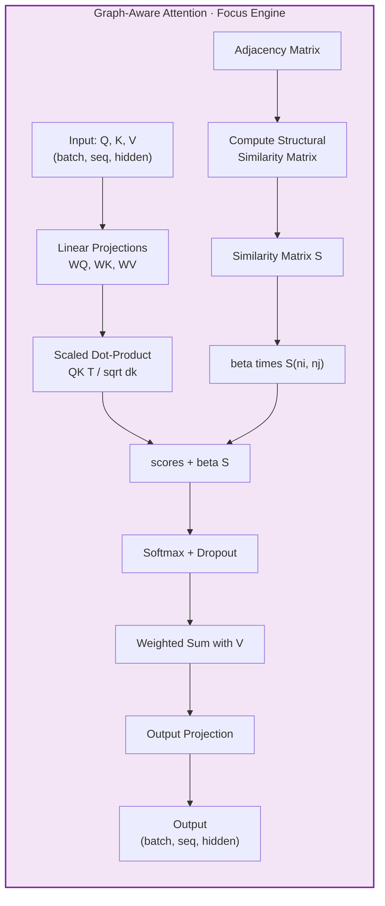

# Graph-Aware Attention — The Focus Engine

> Graph-Aware Attention is S-GraphLLM's **novel contribution** to the Neural Layer. It modulates the standard scaled dot-product attention mechanism used in LLMs by injecting a **structural bias** term derived from the graph topology. The core idea is simple but powerful: tokens corresponding to nodes that are structurally close in the graph should attend to each other more strongly. This is achieved by adding a learnable scalar $\beta$ multiplied by a structural similarity score $S(n_i, n_j)$ to the standard $QK^\top / \sqrt{d_k}$ attention logits before softmax. The mechanism sits inside **Layer 3 (Neural Components)** alongside the Semantic Engine (Node Encoder-Decoder) and the Structural Engine (Graph Transformer), and its outputs — graph-modulated attention weights — are used during **Stage 2 (Fine-Grained Reasoning)** of the Hierarchical Reasoning Layer to help the LLM focus on graph-relevant entities.
>
> **See also**: [README.md — Key Components § 4](../../README.md), [Component Guide — § 3.5](../component_guide.md).

---

## Architecture Overview

Within the S-GraphLLM four-layer stack (**Scalability → Neural → Reasoning → Output**), the Graph-Aware Attention module belongs to the **Neural Layer** and operates as follows:

1. **Structural Similarity Computation** — Before attention, a pairwise structural similarity matrix $S$ is computed from the graph's adjacency matrix using either shortest-path distance or Jaccard (common-neighbors) similarity.
2. **Standard Q/K/V Attention** — Query, Key, and Value projections are computed as in standard multi-head attention.
3. **Structural Bias Injection** — The attention logits are augmented with $\beta \cdot S(n_i, n_j)$, where $\beta$ is a learnable parameter.
4. **Softmax and Output** — Standard softmax normalization, dropout, and output projection follow.



The structural bias term steers the LLM's attention toward graph-adjacent entities without overriding the learned semantic attention — the balance is controlled by $\beta$, which the model learns end-to-end.

---

## Components Breakdown

### 1. `GraphAwareAttentionConfig` — Configuration Dataclass

* **Location**: `src/attention/graph_aware_attention.py`, lines 22–30
* **Purpose**: A Python `@dataclass` that encapsulates all configuration parameters for the Graph-Aware Attention module. Provides a clean, type-safe interface for initialization.
* **Paper Reference**: Configuration for the S-GraphLLM novel attention mechanism.

#### Fields

| Field | Type | Default | Line | Description |
|-------|------|---------|------|-------------|
| `hidden_dim` | `int` | `768` | 25 | Dimension of the hidden representations (should match the LLM's hidden size). |
| `num_heads` | `int` | `8` | 26 | Number of attention heads. |
| `beta_init` | `float` | `0.5` | 27 | Initial value for the learnable $\beta$ parameter that controls the strength of structural bias. |
| `similarity_metric` | `str` | `"shortest_path"` | 28 | Which metric to use for computing structural similarity: `"shortest_path"` or `"common_neighbors"`. |
| `dropout` | `float` | `0.1` | 29 | Dropout rate applied to attention weights. |
| `max_distance` | `int` | `5` | 30 | Maximum graph distance considered for shortest-path similarity. Paths longer than this are treated as infinite distance (similarity = 0). |

#### Corresponding YAML Keys

In `configs/model_config.yaml` (lines 22–24):

```yaml
# Attention configuration
graph_aware_attention_beta: 0.5
similarity_metric: "shortest_path"  # or "common_neighbors"
```

And in the `Config` class (`src/utils.py`, lines 57–59):

| Config Field | Default | Maps to |
|-------------|---------|---------|
| `Config.graph_aware_attention_beta` (line 58) | `0.5` | `GraphAwareAttentionConfig.beta_init` |
| `Config.similarity_metric` (line 59) | `"shortest_path"` | `GraphAwareAttentionConfig.similarity_metric` |

#### Python Perspective

```python
from src.attention.graph_aware_attention import GraphAwareAttentionConfig

config = GraphAwareAttentionConfig(
    hidden_dim=768,
    num_heads=8,
    beta_init=0.5,
    similarity_metric="shortest_path",
    dropout=0.1,
    max_distance=5
)
```

---

### 2. `GraphAwareAttention` — Core Attention Module

* **Location**: `src/attention/graph_aware_attention.py`, lines 33–177
* **Purpose**: Implements the graph-aware attention mechanism. This is the main computation module: it performs standard scaled dot-product multi-head attention and adds a learnable structural bias term $\beta \cdot S(n_i, n_j)$ to the attention logits. Also provides diagnostics through `get_attention_focus()`.
* **Paper Reference**: S-GraphLLM enhancement — Modified attention formula.

#### The Math

**Modified attention** (S-GraphLLM Equation):

$$\alpha'_{ij} = \frac{\exp\!\left(\frac{q_i^\top k_j}{\sqrt{d_k}} + \beta \cdot S(n_i, n_j)\right)}{\sum_{l} \exp\!\left(\frac{q_i^\top k_l}{\sqrt{d_k}} + \beta \cdot S(n_i, n_l)\right)}$$

| Symbol | Definition | Code counterpart |
|--------|-----------|------------------|
| $q_i \in \mathbb{R}^{d_k}$ | Query vector for token/node $i$ after projection and multi-head reshape. | `Q` after projection and reshape at **lines 109, 114** |
| $k_j \in \mathbb{R}^{d_k}$ | Key vector for token/node $j$. | `K` after projection and reshape at **lines 110, 115** |
| $v_j \in \mathbb{R}^{d_k}$ | Value vector for token/node $j$. | `V` after projection and reshape at **lines 111, 116** |
| $d_k = D_h / H$ | Head dimension (hidden dim divided by number of heads). | `self.head_dim = hidden_dim // num_heads` at **line 49** |
| $\beta \in \mathbb{R}$ | Learnable scalar controlling the strength of structural bias. Initialized to `config.beta_init`. | `self.beta` — `nn.Parameter(torch.tensor(config.beta_init))` at **line 59** |
| $S(n_i, n_j) \in [0, 1]$ | Structural similarity between nodes $i$ and $j$. Computed externally and passed in, or set via `set_structural_similarity_matrix()`. | `structural_similarity` argument or `self.structural_similarity_matrix` attribute (line 68) |
| $W_Q \in \mathbb{R}^{D_h \times D_h}$ | Query projection matrix. | `self.query` — `nn.Linear(hidden_dim, hidden_dim)` at **line 54** |
| $W_K \in \mathbb{R}^{D_h \times D_h}$ | Key projection matrix. | `self.key` — `nn.Linear(hidden_dim, hidden_dim)` at **line 55** |
| $W_V \in \mathbb{R}^{D_h \times D_h}$ | Value projection matrix. | `self.value` — `nn.Linear(hidden_dim, hidden_dim)` at **line 56** |
| $W_O \in \mathbb{R}^{D_h \times D_h}$ | Output projection matrix. | `self.output_projection` — `nn.Linear(hidden_dim, hidden_dim)` at **line 62** |
| Dropout | Applied to attention weights after softmax. | `self.dropout` — `nn.Dropout(config.dropout)` at **line 65** |

**Step-by-step**:

1. **Project**: $Q = xW_Q$, $K = xW_K$, $V = xW_V$
2. **Reshape**: Split each into $H$ heads of dimension $d_k$
3. **Score**: $\text{scores} = \frac{QK^\top}{\sqrt{d_k}}$
4. **Inject bias**: $\text{scores} = \text{scores} + \beta \cdot S$
5. **Mask** (optional): Set masked positions to $-\infty$
6. **Normalize**: $\alpha' = \text{softmax}(\text{scores})$
7. **Attend**: $\text{output} = \alpha' V$
8. **Project**: $\text{output} = \text{output} \cdot W_O$

#### Plain English Input / Output

* **Input**:
  - `query`: Tensor of shape `(batch_size, seq_len, hidden_dim)`, dtype `torch.float32`. Typically the hidden states of the LLM for the current layer.
  - `key`: Same shape as `query`. In self-attention, `key == query`.
  - `value`: Same shape as `query`. In self-attention, `value == query`.
  - `attention_mask` *(optional)*: Binary tensor of shape `(batch_size, seq_len)` or `(batch_size, seq_len, seq_len)`. Positions with `0` are masked (set to $-\infty$ before softmax).
  - `structural_similarity` *(optional)*: Float tensor of shape `(seq_len, seq_len)`, `(batch_size, seq_len, seq_len)`, or `None`. The pairwise structural similarity matrix. For example, for a 10-node graph, a `(10, 10)` matrix where entry `[i, j]` is $S(n_i, n_j) \in [0, 1]$.

  **Concrete example**: For a batch of 2 graphs, each with 10 nodes and `hidden_dim=768`:
  - `query = torch.randn(2, 10, 768)` — hidden states for 10 nodes
  - `structural_similarity = torch.rand(2, 10, 10)` — pairwise similarity scores

* **Output**: A tuple of:
  - `output`: Tensor of shape `(batch_size, seq_len, hidden_dim)` — the attention output.
  - `attention_weights`: Tensor of shape `(batch_size, num_heads, seq_len, seq_len)` — the computed attention weights (useful for visualization/diagnostics).

* **Side Effects / State**:
  - `self.structural_similarity_matrix` (line 68): An optional attribute that can be set via `set_structural_similarity_matrix()` to provide a persistent similarity matrix. This is **not** a registered buffer — it's a plain tensor attribute.
  - `self.beta` (line 59): Learnable parameter updated during training.

#### Python Perspective

```python
import torch
import numpy as np
from src.attention.graph_aware_attention import GraphAwareAttention, GraphAwareAttentionConfig

config = GraphAwareAttentionConfig(hidden_dim=768, num_heads=8, beta_init=0.5)
attn = GraphAwareAttention(config)

batch_size, seq_len, hidden_dim = 2, 10, 768
query = torch.randn(batch_size, seq_len, hidden_dim)  # (2, 10, 768)
key = query                                             # self-attention
value = query                                           # self-attention

# Structural similarity: 10-node graph
similarity = torch.rand(batch_size, seq_len, seq_len)  # (2, 10, 10)

output, attn_weights = attn(query, key, value, structural_similarity=similarity)
# output.shape == torch.Size([2, 10, 768])             # (batch, seq, hidden)
# attn_weights.shape == torch.Size([2, 8, 10, 10])     # (batch, heads, seq, seq)
```

#### Internal Method Walkthrough

**`__init__(self, config)`** (lines 38–68)

1. Stores config and extracts `hidden_dim`, `num_heads` (lines 46–48).
2. Computes `self.head_dim = hidden_dim // num_heads` (line 49) and asserts divisibility (line 51).
3. Creates Q/K/V projections: `self.query` (line 54), `self.key` (line 55), `self.value` (line 56) — all `nn.Linear(hidden_dim, hidden_dim)`.
4. Creates the learnable beta: `self.beta = nn.Parameter(torch.tensor(config.beta_init))` (line 59).
5. Creates `self.output_projection = nn.Linear(hidden_dim, hidden_dim)` (line 62).
6. Creates `self.dropout = nn.Dropout(config.dropout)` (line 65).
7. Initializes `self.structural_similarity_matrix = None` (line 68).

**`set_structural_similarity_matrix(self, similarity_matrix)`** (lines 70–82)

1. Converts a NumPy array to a float PyTorch tensor and moves it to the same device as the query projection weights (lines 80–82).
2. Stores as `self.structural_similarity_matrix`.

**`forward(self, query, key, value, attention_mask=None, structural_similarity=None)`** (lines 84–159)

1. **Get dimensions** (line 106): `batch_size, seq_len, _ = query.shape`.
2. **Project Q/K/V** (lines 109–111): `Q = self.query(query)`, `K = self.key(key)`, `V = self.value(value)`.
3. **Reshape for multi-head** (lines 114–116): Reshape to `(batch, seq, num_heads, head_dim)` then transpose to `(batch, num_heads, seq, head_dim)`.
4. **Compute attention scores** (line 119): `scores = torch.matmul(Q, K.transpose(-2, -1)) / np.sqrt(self.head_dim)` — standard scaled dot-product.
5. **Structural bias injection** (lines 122–132):
   - If `structural_similarity` is provided:
     - 2D tensor `(seq, seq)` → unsqueeze to `(1, 1, seq, seq)` (line 126).
     - 3D tensor `(batch, seq, seq)` → unsqueeze to `(batch, 1, seq, seq)` (line 129).
     - **Add bias** (line 132): `scores = scores + self.beta * structural_similarity`.
6. **Apply attention mask** (lines 135–143):
   - 2D mask `(batch, seq)` → expand to `(batch, 1, 1, seq)` (line 138).
   - 3D mask `(batch, seq, seq)` → expand to `(batch, 1, seq, seq)` (line 141).
   - Masked fill with $-\infty$ (line 143).
7. **Softmax** (line 146): `attention_weights = F.softmax(scores, dim=-1)`.
8. **Dropout** (line 147): `attention_weights = self.dropout(attention_weights)`.
9. **Weighted values** (line 150): `output = torch.matmul(attention_weights, V)` — shape `(batch, num_heads, seq, head_dim)`.
10. **Reshape back** (lines 153–154): Transpose and reshape to `(batch, seq, hidden_dim)`.
11. **Output projection** (line 157): `output = self.output_projection(output)`.
12. **Return** `(output, attention_weights)` (line 159).

**`get_attention_focus(self)`** (lines 161–177)

1. Checks if `structural_similarity_matrix` is set (line 168); returns error dict if not.
2. Returns a dictionary with diagnostic statistics (lines 173–177):
   - `beta_value`: Current value of the learnable $\beta$ parameter.
   - `similarity_matrix_mean`: Mean of the similarity matrix.
   - `similarity_matrix_std`: Standard deviation of the similarity matrix.

---

### 3. `MultiHeadGraphAwareAttention` — Multi-Head Wrapper

* **Location**: `src/attention/graph_aware_attention.py`, lines 180–230
* **Purpose**: A wrapper that creates multiple independent `GraphAwareAttention` heads and concatenates their outputs. This provides a simpler multi-head implementation where each head is a fully independent attention module.
* **Paper Reference**: Multi-head extension of the S-GraphLLM attention mechanism.

#### The Math

$$\text{output} = \text{Concat}(\text{head}_1, \text{head}_2, \ldots, \text{head}_H)$$

where each head independently computes:

$$\text{head}_h = \text{GraphAwareAttention}_h(Q, K, V, S)$$

**Note**: Unlike the single `GraphAwareAttention` which internally reshapes for multi-head computation, this wrapper creates $H$ **separate** `GraphAwareAttention` instances, each with its own full set of parameters. The outputs are concatenated along the feature dimension, producing an output of dimension $H \times D_h$.

| Symbol | Definition | Code counterpart |
|--------|-----------|------------------|
| $H$ | Number of attention heads. | `config.num_heads` |
| $\text{head}_h$ | Output of the $h$-th attention head. | `self.attention_heads[h]` — `GraphAwareAttention(config)` at **lines 189–191** |

#### Plain English Input / Output

* **Input**: Same as `GraphAwareAttention.forward()`:
  - `query`, `key`, `value`: Each `(batch_size, seq_len, hidden_dim)`.
  - `attention_mask` *(optional)*: `(batch_size, seq_len)` or `(batch_size, seq_len, seq_len)`.
  - `structural_similarity` *(optional)*: `(batch_size, seq_len, seq_len)` or `(seq_len, seq_len)`.

* **Output**: A tuple of:
  - `final_output`: Tensor of shape `(batch_size, seq_len, hidden_dim * num_heads)` — the concatenated output from all heads.
  - `all_attention_weights`: A Python list of `num_heads` tensors, each of shape `(batch_size, num_heads_inner, seq_len, seq_len)`.

* **Side Effects / State**: Each head independently maintains its own `beta` and `structural_similarity_matrix`.

#### Python Perspective

```python
import torch
from src.attention.graph_aware_attention import MultiHeadGraphAwareAttention, GraphAwareAttentionConfig

config = GraphAwareAttentionConfig(hidden_dim=768, num_heads=4)
multi_attn = MultiHeadGraphAwareAttention(config)

query = torch.randn(2, 10, 768)                       # (batch, seq, hidden)
similarity = torch.rand(2, 10, 10)                     # (batch, seq, seq)

output, all_weights = multi_attn(query, query, query, structural_similarity=similarity)
# output.shape == torch.Size([2, 10, 3072])            # (batch, seq, hidden * num_heads)
# len(all_weights) == 4                                # one per head
```

#### Internal Method Walkthrough

**`__init__(self, config)`** (lines 185–191)

1. Stores the config (line 188).
2. Creates `self.attention_heads` — a `nn.ModuleList` of `config.num_heads` independent `GraphAwareAttention` instances (lines 189–191).

**`forward(self, query, key, value, attention_mask=None, structural_similarity=None)`** (lines 193–230)

1. **Initialize collectors** (lines 215–216): `outputs = []`, `all_attention_weights = []`.
2. **Per-head computation** (lines 218–225): Iterates over `self.attention_heads`, calling each head's `forward()` and collecting outputs and attention weights.
3. **Concatenate** (line 228): `final_output = torch.cat(outputs, dim=-1)` — concatenates along the feature dimension.
4. **Return** `(final_output, all_attention_weights)` (line 230).

---

### 4. `compute_structural_similarity_matrix()` — Pairwise Similarity Computation

* **Location**: `src/attention/graph_aware_attention.py`, lines 233–270
* **Purpose**: Computes a full pairwise structural similarity matrix for a sequence of graph nodes, using either shortest-path or common-neighbors (Jaccard) similarity. This is the function that produces the $S(n_i, n_j)$ matrix used by `GraphAwareAttention`.
* **Paper Reference**: S-GraphLLM similarity metrics.

#### The Math

**Shortest-path metric**:

$$S(n_i, n_j) = \frac{1}{1 + d(n_i, n_j)}$$

where $d(n_i, n_j)$ is the shortest path distance between nodes $i$ and $j$. If no path exists within `max_distance`, $S(n_i, n_j) = 0$.

**Self-similarity**: $S(n_i, n_i) = 1.0$ (line 256).

Implemented at **line 261**: `similarity_matrix[i, j] = 1.0 / (1.0 + distance) if distance < float('inf') else 0.0`.

**Common-neighbors (Jaccard) metric**:

$$S(n_i, n_j) = \frac{|\mathcal{N}(n_i) \cap \mathcal{N}(n_j)|}{|\mathcal{N}(n_i) \cup \mathcal{N}(n_j)|}$$

where $\mathcal{N}(n)$ is the set of neighbors of node $n$.

Implemented at **lines 262–268**:

```python
neighbors_i = set(np.where(adj_matrix[i] > 0)[0])
neighbors_j = set(np.where(adj_matrix[j] > 0)[0])
common = len(neighbors_i & neighbors_j)
union = len(neighbors_i | neighbors_j)
similarity_matrix[i, j] = common / union if union > 0 else 0.0
```

| Symbol | Definition | Code counterpart |
|--------|-----------|------------------|
| $d(n_i, n_j)$ | Shortest path distance between nodes $i$ and $j$. | Return value of `_compute_shortest_path(adj_matrix, i, j, max_distance)` at **line 260** |
| $\mathcal{N}(n_i)$ | Set of neighbors of node $i$ (nodes connected by an edge). | `set(np.where(adj_matrix[i] > 0)[0])` at **line 264** |
| $S \in \mathbb{R}^{L \times L}$ | The full similarity matrix, where $L$ is `seq_len`. | `similarity_matrix` — initialized at **line 251** |

#### Plain English Input / Output

* **Input**:
  - `adj_matrix`: NumPy array of shape `(N, N)` representing the graph's adjacency matrix. For example, a 20-node graph gives a `(20, 20)` matrix.
  - `seq_len`: Integer specifying how many nodes to compute similarities for (may be less than $N$).
  - `metric`: String, either `"shortest_path"` (default) or `"common_neighbors"`.
  - `max_distance`: Integer (default 5) — maximum BFS depth for shortest-path metric.

* **Output**: NumPy array of shape `(seq_len, seq_len)` with values in $[0, 1]$. Diagonal entries are 1.0 (self-similarity). For example, `similarity_matrix[3, 7] = 0.25` means nodes 3 and 7 are 3 hops apart (since $1/(1+3) = 0.25$).

* **Side Effects / State**: None. Pure function.

#### Python Perspective

```python
import numpy as np
from src.attention.graph_aware_attention import compute_structural_similarity_matrix

# 5-node graph: 0-1-2-3-4 (path graph)
adj = np.zeros((5, 5))
adj[0, 1] = adj[1, 0] = 1
adj[1, 2] = adj[2, 1] = 1
adj[2, 3] = adj[3, 2] = 1
adj[3, 4] = adj[4, 3] = 1

sim = compute_structural_similarity_matrix(adj, seq_len=5, metric="shortest_path", max_distance=5)
# sim.shape == (5, 5)
# sim[0, 0] == 1.0                                    # self
# sim[0, 1] == 0.5                                    # 1/(1+1) = 0.5
# sim[0, 2] == 0.333...                               # 1/(1+2) ≈ 0.33
# sim[0, 4] == 0.2                                    # 1/(1+4) = 0.2

sim_jaccard = compute_structural_similarity_matrix(adj, seq_len=5, metric="common_neighbors")
# sim_jaccard[1, 3] > 0                               # nodes 1 and 3 share neighbor 2
```

#### Internal Method Walkthrough

**`compute_structural_similarity_matrix(adj_matrix, seq_len, metric, max_distance)`** (lines 233–270)

1. **Initialize** (line 251): `similarity_matrix = np.zeros((seq_len, seq_len))`.
2. **Double loop** (lines 253–268): For each pair `(i, j)`:
   - If `i == j`: Set to 1.0 (line 256).
   - If `metric == "shortest_path"` (lines 258–261):
     - Call `_compute_shortest_path(adj_matrix, i, j, max_distance)` (line 260).
     - Compute $1/(1+d)$ if path found, else 0.0 (line 261).
   - If `metric == "common_neighbors"` (lines 262–268):
     - Find neighbor sets using `np.where` (lines 264–265).
     - Compute Jaccard similarity (lines 266–268).
3. **Return** `similarity_matrix` (line 270).

---

### 5. `_compute_shortest_path()` — BFS Shortest Path

* **Location**: `src/attention/graph_aware_attention.py`, lines 273–311
* **Purpose**: Computes the shortest path distance between two nodes in an unweighted graph using Breadth-First Search (BFS), with an early termination at `max_distance` hops.
* **Paper Reference**: Supporting utility for the shortest-path similarity metric.

#### The Math

Standard BFS shortest path:

$$d(s, t) = \min \{|P| : P \text{ is a path from } s \text{ to } t\}$$

If no path exists within `max_distance` hops, returns $\infty$.

#### Plain English Input / Output

* **Input**:
  - `adj_matrix`: NumPy array `(N, N)`.
  - `start`: Integer, source node index.
  - `end`: Integer, target node index.
  - `max_distance`: Integer, maximum BFS depth.

* **Output**: `float` — the shortest path distance, or `float('inf')` if unreachable.

* **Side Effects / State**: None. Pure function.

#### Python Perspective

```python
import numpy as np
from src.attention.graph_aware_attention import _compute_shortest_path

adj = np.zeros((5, 5))
adj[0, 1] = adj[1, 0] = 1
adj[1, 2] = adj[2, 1] = 1

distance = _compute_shortest_path(adj, start=0, end=2, max_distance=5)
# distance == 2.0                                      # 0 → 1 → 2

distance_unreachable = _compute_shortest_path(adj, start=0, end=4, max_distance=5)
# distance_unreachable == float('inf')                  # no path exists
```

#### Internal Method Walkthrough

**`_compute_shortest_path(adj_matrix, start, end, max_distance)`** (lines 273–311)

1. **Import deque** (line 291): `from collections import deque` — lazy import.
2. **Initialize BFS** (lines 293–296): `visited = [False] * n`, `queue = deque([(start, 0)])`, `visited[start] = True`.
3. **BFS loop** (lines 298–309):
   - Pop `(node, dist)` from queue (line 299).
   - If `node == end`: return `float(dist)` (lines 301–302).
   - If `dist < max_distance`: find neighbors via `np.where(adj_matrix[node] > 0)[0]` (line 305), enqueue unvisited ones with `dist + 1` (lines 306–309).
4. **No path found** (line 311): Return `float('inf')`.

---

### 6. Utility Functions in `src/utils.py`

The following functions in `src/utils.py` provide complementary structural similarity computation:

#### `compute_structural_similarity()` — Pairwise Node Similarity

* **Location**: `src/utils.py`, lines 91–148
* **Purpose**: Computes the structural similarity between **two specific nodes** given an adjacency matrix. Supports `"shortest_path"` and `"common_neighbors"` metrics. This is the single-pair counterpart to `compute_structural_similarity_matrix()`.

| Metric | Formula | Line |
|--------|---------|------|
| Shortest path | $S(n_i, n_j) = 1/(1 + d(n_i, n_j))$ | 124 |
| Common neighbors (Jaccard) | $S(n_i, n_j) = \|\mathcal{N}(n_i) \cap \mathcal{N}(n_j)\| / \|\mathcal{N}(n_i) \cup \mathcal{N}(n_j)\|$ | 138–145 |

**Internal BFS** (lines 113–133): Uses `collections.deque` for BFS, same algorithm as `_compute_shortest_path()` in the attention module.

```python
from src.utils import compute_structural_similarity
import numpy as np

adj = np.eye(5)  # placeholder
sim = compute_structural_similarity(adj, node_i=0, node_j=2, metric="shortest_path")
# sim ∈ [0.0, 1.0]
```

#### `batch_structural_similarity()` — Batch Computation

* **Location**: `src/utils.py`, lines 151–171
* **Purpose**: Computes structural similarity for a **batch of node pairs** efficiently by iterating over the list and calling `compute_structural_similarity()` for each pair.

```python
from src.utils import batch_structural_similarity
import numpy as np

adj = np.zeros((5, 5))
adj[0, 1] = adj[1, 0] = 1
adj[1, 2] = adj[2, 1] = 1

pairs = [(0, 1), (0, 2), (1, 2)]
similarities = batch_structural_similarity(adj, pairs, metric="shortest_path")
# similarities.shape == (3,)                           # one score per pair
# similarities[0] == 0.5                               # 1/(1+1) for adjacent nodes
```

#### `Config.graph_aware_attention_beta`

* **Location**: `src/utils.py`, line 58
* **Purpose**: Default beta value (`0.5`) stored in the system-wide `Config` object. This value initializes `GraphAwareAttentionConfig.beta_init`.

---

### 7. Module Exports — `src/attention/__init__.py`

* **Location**: `src/attention/__init__.py`, lines 1–15
* **Purpose**: Defines the public API of the `src.attention` package.

**Exported symbols** (lines 3–8, 10–15):

| Export | Source |
|--------|--------|
| `GraphAwareAttention` | `src/attention/graph_aware_attention.py`, line 33 |
| `GraphAwareAttentionConfig` | `src/attention/graph_aware_attention.py`, line 22 |
| `MultiHeadGraphAwareAttention` | `src/attention/graph_aware_attention.py`, line 180 |
| `compute_structural_similarity_matrix` | `src/attention/graph_aware_attention.py`, line 233 |

**Usage**:

```python
from src.attention import (
    GraphAwareAttention,
    GraphAwareAttentionConfig,
    MultiHeadGraphAwareAttention,
    compute_structural_similarity_matrix,
)
```

---

## Configuration

All relevant configuration fields for the Graph-Aware Attention engine:

### From `configs/model_config.yaml`

| YAML Key (line) | Default | Type | Effect |
|-----------------|---------|------|--------|
| `graph_aware_attention_beta` (line 23) | `0.5` | `float` | Initial value for the learnable $\beta$ parameter. Higher values make the model rely more on graph structure; lower values make it rely more on learned semantic attention. |
| `similarity_metric` (line 24) | `"shortest_path"` | `str` | Which metric to use: `"shortest_path"` (distance-based) or `"common_neighbors"` (Jaccard-based). |
| `hidden_dim` (line 6) | `1024` | `int` | Hidden dimension for attention projections. |
| `num_heads` (line 8) | `8` | `int` | Number of attention heads. |
| `dropout` (line 9) | `0.1` | `float` | Dropout rate on attention weights. |

### From `GraphAwareAttentionConfig` Dataclass

| Field (line) | Default | Type | Maps to YAML Key |
|-------------|---------|------|------------------|
| `hidden_dim` (25) | `768` | `int` | `hidden_dim` |
| `num_heads` (26) | `8` | `int` | `num_heads` |
| `beta_init` (27) | `0.5` | `float` | `graph_aware_attention_beta` |
| `similarity_metric` (28) | `"shortest_path"` | `str` | `similarity_metric` |
| `dropout` (29) | `0.1` | `float` | `dropout` |
| `max_distance` (30) | `5` | `int` | *(not in YAML — hardcoded default)* |

### From `Config` Class (`src/utils.py`)

| Field (line) | Default | Type |
|-------------|---------|------|
| `graph_aware_attention_beta` (58) | `0.5` | `float` |
| `similarity_metric` (59) | `"shortest_path"` | `str` |
| `hidden_dim` (41) | `1024` | `int` |
| `num_heads` (43) | `8` | `int` |
| `dropout` (44) | `0.1` | `float` |

**YAML excerpt** (`configs/model_config.yaml`, lines 22–24):

```yaml
# Attention configuration
graph_aware_attention_beta: 0.5
similarity_metric: "shortest_path"  # or "common_neighbors"
```

---

## Cross-References

### Other Engine Docs

- [**Node Encoder-Decoder (The Semantic Engine)**](engine_node_encoder_decoder.md) — Produces node semantic representations. The Graph-Aware Attention module can use these representations as the Q/K/V inputs, modulating their interactions based on graph structure.
- [**Graph Transformer / GRIT (The Structural Engine)**](engine_graph_transformer.md) — Learns structural node embeddings using RRWP. While the Graph Transformer captures structure through edge-level attention with positional encoding, Graph-Aware Attention captures structure by biasing token-level attention with global similarity scores — these are complementary approaches.

### Project Documentation

- [**README.md — Key Components § 4**](../../README.md) — High-level description and the modified attention formula.
- [**README.md — Novel Contributions**](../../README.md) — Lists Graph-Aware Attention as a novel contribution of S-GraphLLM.
- [**docs/component_guide.md — § 3.5**](../component_guide.md) — Detailed component guide for Graph-Aware Attention, including theoretical basis (inspired by Graph Attention Networks), mechanism of action, and comparison with standard attention.
- [**docs/architecture_diagram.md — Layer 3**](../architecture_diagram.md) — Mermaid diagrams showing the Similarity Metric → Graph-Aware Attention data flow within the Neural Layer, and its connection to Stage 2 reasoning.
- [**docs/architecture_diagram.md — Component Interaction Matrix**](../architecture_diagram.md) — Shows that Graph-Aware Attention sends attention weights of shape `torch.Tensor[n, n]` to the Stage 2 LLM.
- [**docs/hierarchical_reasoning_theory.md — § Stage 2**](../hierarchical_reasoning_theory.md) — Describes how graph-aware attention weights are used during fine-grained multi-hop reasoning within selected partitions.
- [**docs/graph_partitioning_theory.md**](../graph_partitioning_theory.md) — Covers the Scalability Layer that partitions the graph before this engine computes similarity matrices for individual subgraphs.

---

**Document Version**: 1.0
**Last Updated**: February 2026
**Primary Source**: `src/attention/graph_aware_attention.py` (312 lines)
**Supporting Sources**: `src/utils.py` (lines 91–171), `src/attention/__init__.py` (15 lines), `configs/model_config.yaml` (lines 22–24)
**Inspiration**: Velickovic, P., et al. (2018). *Graph Attention Networks.* ICLR. [arXiv:1710.10903](https://arxiv.org/abs/1710.10903)
**Paper**: Chai, Z., et al. (2025). *GraphLLM: Boosting Graph Reasoning Ability of Large Language Model.* IEEE Transactions on Big Data. [arXiv:2310.05845](https://arxiv.org/abs/2310.05845)
