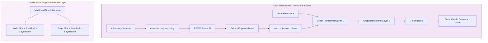

# Graph Transformer / GRIT — The Structural Engine

> The Graph Transformer is the **structural backbone** of S-GraphLLM's Neural Layer. It learns graph-structure representations by applying sparse multi-head attention over graph edges, modulated by **Relative Random Walk Positional Encoding (RRWP)**. This component implements the graph transformer described in **Section 3.3** of the GraphLLM paper and draws heavily from the **GRIT** (Graph Inductive Biases in Transformers without Message Passing) architecture. In the four-layer pipeline, the Structural Engine sits inside **Layer 3 (Neural Components)** alongside the Semantic Engine (Node Encoder-Decoder) and the Focus Engine (Graph-Aware Attention). Its outputs — structure-aware node embeddings — feed into the Hierarchical Reasoning Layer for coarse-to-fine query answering. The key innovation is that RRWP provides each edge with a rich positional encoding that captures multi-hop connectivity, enabling the transformer to reason about graph topology without explicit message passing.
>
> **See also**: [README.md — Key Components § 1](../../README.md), [Component Guide — § 3.3–3.4](../component_guide.md).

---

## Architecture Overview

Within the S-GraphLLM four-layer stack (**Scalability → Neural → Reasoning → Output**), the Graph Transformer belongs to the **Neural Layer** and operates through the following pipeline:

1. **RRWP Computation** — Computes the random walk matrix $M = D^{-1}A$ and stacks its powers $[I, M, M^2, \ldots, M^{C-1}]$ to form relative positional encodings for every node pair.
2. **Edge Attribute Extraction** — Extracts RRWP values for each edge and projects them through a learnable linear layer.
3. **Multi-Head Graph Attention** — For each layer, computes Q/K/V projections, modulates attention scores with edge features, applies signed square root and Einstein summation, and aggregates messages via sparse softmax.
4. **Feed-Forward + Residual** — Standard FFN with residual connections and layer normalization for both node and edge streams.



The RRWP encoding injects graph topology into every attention computation, allowing the model to distinguish direct neighbors from distant nodes — a critical capability for graph reasoning tasks.

---

## Components Breakdown

### 1. `pyg_softmax()` — Sparse Softmax for Graph Attention

* **Location**: `src/graph_processing/graph_transformer.py`, lines 21–43
* **Purpose**: Computes a numerically stable, sparsely evaluated softmax over graph edges. This is the normalization function used by `MultiHeadGraphAttention.propagate_attention()` to convert raw attention scores into probability distributions, computed only over the edges that actually exist in the graph.
* **Paper Reference**: Standard sparse softmax used in the GRIT attention mechanism (Section 3.3).

#### The Math

For each destination node $j$, the softmax is computed over all incoming edges:

$$\text{pyg\_softmax}(\text{src}_e, \text{index}_e) = \frac{\exp(\text{src}_e - \max_{e' \in \mathcal{N}(j)} \text{src}_{e'})}{\sum_{e' \in \mathcal{N}(j)} \exp(\text{src}_{e'} - \max_{e'' \in \mathcal{N}(j)} \text{src}_{e''})}$$

| Symbol | Definition | Code counterpart |
|--------|-----------|------------------|
| $\text{src}$ | Raw attention scores for each edge. | `src` argument — shape `(E, num_heads, 1)` |
| $\text{index}$ | Destination node index for each edge, used for grouping. | `index` argument — shape `(E,)` |
| $\max_{e' \in \mathcal{N}(j)}$ | Maximum score among edges arriving at the same destination, for numerical stability. | `scatter_max(src, index, dim=0, dim_size=num_nodes)` at **line 37** |
| $\sum_{e'}$ | Sum of exponentiated scores per destination node. | `scatter_add(out, index, dim=0, dim_size=num_nodes)` at **line 41** |
| $\epsilon = 10^{-16}$ | Small constant to prevent division by zero. | Literal `1e-16` at **line 41** |

**Numerical stability**: The max-subtraction trick (line 37) prevents overflow in the exponentiation step. This is equivalent to the standard LogSumExp stabilization.

#### Plain English Input / Output

* **Input**:
  - `src`: Attention score tensor of shape `(E, num_heads, 1)`, dtype `torch.float32`, where $E$ is the number of edges.
  - `index`: Integer tensor of shape `(E,)` mapping each edge to its destination node.
  - `num_nodes` *(optional)*: Total number of nodes $N$. If `None`, inferred as `index.max() + 1`.

* **Output**: Normalized attention weights of the same shape `(E, num_heads, 1)`, summing to 1.0 per destination node.

* **Side Effects / State**: None. Pure function.

#### Python Perspective

```python
import torch
from src.graph_processing.graph_transformer import pyg_softmax

# 10 edges, 8 attention heads, 1 score per head
scores = torch.randn(10, 8, 1)                       # (E, num_heads, 1)
dst_indices = torch.tensor([0, 0, 1, 1, 1, 2, 2, 3, 3, 3])  # destination node per edge

normalized = pyg_softmax(scores, dst_indices, num_nodes=4)
# normalized.shape == torch.Size([10, 8, 1])
# For edges going to node 0: normalized[0] + normalized[1] ≈ 1.0 per head
```

#### Internal Method Walkthrough

**`pyg_softmax(src, index, num_nodes=None)`** (lines 21–43)

1. **Infer num_nodes** (lines 33–34): If not provided, compute `num_nodes = index.max().item() + 1`.
2. **Max subtraction** (line 37): `out = src - scatter_max(src, index, dim=0, dim_size=num_nodes)[0][index]` — subtracts the per-group maximum for numerical stability. Uses `scatter_max` from `torch_scatter` (`src/graph_processing/graph_transformer.py`, line 15).
3. **Exponentiate** (line 38): `out = out.exp()`.
4. **Normalize** (line 41): `out = out / (scatter_add(out, index, dim=0, dim_size=num_nodes)[index] + 1e-16)` — divides by the per-group sum, with epsilon for safety. Uses `scatter_add` from `torch_scatter` (line 15).
5. **Return** the normalized tensor (line 43).

---

### 2. `compute_rrwp_encoding()` — Relative Random Walk Positional Encoding

* **Location**: `src/graph_processing/graph_transformer.py`, lines 46–87
* **Purpose**: Computes the RRWP tensor for a graph, which encodes the probability of reaching node $j$ from node $i$ in exactly $k$ random walk steps for $k = 0, 1, \ldots, C-1$. This provides each node pair with a rich structural fingerprint.
* **Paper Reference**: Equation 6 — $R_{i,j} = [I_{i,j}, M_{i,j}, M^2_{i,j}, \ldots, M^{C-1}_{i,j}] \in \mathbb{R}^C$.

#### The Math

**Equation 6 (RRWP)**:

$$R_{i,j} = \left[I_{i,j},\; M_{i,j},\; M^2_{i,j},\; \ldots,\; M^{C-1}_{i,j}\right] \in \mathbb{R}^C$$

where:

$$M = D^{-1} A$$

| Symbol | Definition | Code counterpart |
|--------|-----------|------------------|
| $A \in \mathbb{R}^{N \times N}$ | Adjacency matrix of the graph. | `adj_matrix` argument |
| $D \in \mathbb{R}^{N \times N}$ | Degree matrix — diagonal matrix where $D_{ii} = \sum_j A_{ij}$. | `degree = adj_matrix.sum(dim=1)` at **line 69** |
| $D^{-1}$ | Inverse degree matrix. Nodes with zero degree receive $D^{-1}_{ii} = 0$ to avoid division by zero. | `degree_inv = torch.where(degree > 0, 1.0 / degree, torch.zeros_like(degree))` at **line 70**; `D_inv = torch.diag(degree_inv)` at **line 71** |
| $M = D^{-1}A$ | Random walk transition matrix — $M_{ij}$ is the probability of stepping from node $i$ to node $j$ in one step. | `M = torch.matmul(D_inv, adj_matrix)` at **line 74** |
| $M^0 = I$ | Identity matrix — step 0 (self-loop). | `M_power = torch.eye(n, device=device)` at **line 78** |
| $M^k$ | $k$-th power of $M$ — probability of reaching $j$ from $i$ in exactly $k$ steps. | `M_power = torch.matmul(M_power, M)` at **line 82**, iterated in loop at **lines 80–82** |
| $C$ | Maximum number of random walk steps (RRWP dimension). | `max_steps` argument (default 8) |
| $R \in \mathbb{R}^{N \times N \times C}$ | The final RRWP tensor. Each entry $R_{i,j}$ is a $C$-dimensional vector encoding the structural relationship between nodes $i$ and $j$. | `rrwp_encoding` at **line 85** |

**Interpretation**:
- $R_{i,j}[0] = I_{i,j}$: Self-identity (1 if $i = j$, else 0)
- $R_{i,j}[1] = M_{i,j}$: Direct neighbor probability
- $R_{i,j}[2] = M^2_{i,j}$: 2-hop reachability probability
- $R_{i,j}[k]$: $k$-hop reachability probability

#### Plain English Input / Output

* **Input**:
  - `adj_matrix`: A square float tensor of shape `(N, N)`, dtype `torch.float32`, representing the graph adjacency matrix. For example, a 5-node graph produces a `(5, 5)` tensor with 1s where edges exist and 0s elsewhere.
  - `max_steps`: Integer (default 8) specifying how many random walk powers to compute ($C$ in the paper).

* **Output**: A float tensor of shape `(N, N, max_steps)`, dtype `torch.float32`. Entry `[i, j, k]` is $M^k_{i,j}$ — the probability of a random walk from node $i$ reaching node $j$ in exactly $k$ steps.

* **Side Effects / State**: None. Pure function.

#### Python Perspective

```python
import torch
from src.graph_processing.graph_transformer import compute_rrwp_encoding

# Simple 4-node graph: 0-1-2-3 (path graph)
adj = torch.zeros(4, 4)
adj[0, 1] = adj[1, 0] = 1.0
adj[1, 2] = adj[2, 1] = 1.0
adj[2, 3] = adj[3, 2] = 1.0

rrwp = compute_rrwp_encoding(adj, max_steps=8)
# rrwp.shape == torch.Size([4, 4, 8])                # (N, N, max_steps)
# rrwp[0, 0, 0] == 1.0                               # I[0,0] = 1 (self-loop at step 0)
# rrwp[0, 1, 1] == 1.0                               # M[0,1] = 1.0 (node 0 has one neighbor: 1)
# rrwp[0, 2, 2] > 0                                  # M²[0,2] > 0 (reachable in 2 hops)
```

#### Internal Method Walkthrough

**`compute_rrwp_encoding(adj_matrix, max_steps=8)`** (lines 46–87)

1. **Setup** (lines 65–66): Get device and node count $n$.
2. **Degree computation** (line 69): `degree = adj_matrix.sum(dim=1)` — row-sum gives the degree of each node.
3. **Inverse degree** (line 70): `degree_inv = torch.where(degree > 0, 1.0 / degree, torch.zeros_like(degree))` — safe inverse, mapping zero-degree nodes to 0.
4. **Degree inverse matrix** (line 71): `D_inv = torch.diag(degree_inv)` — diagonal matrix.
5. **Random walk matrix** (line 74): `M = torch.matmul(D_inv, adj_matrix)` — $M = D^{-1}A$.
6. **Iterative power computation** (lines 77–82):
   - Initialize `M_power = torch.eye(n)` (the identity, $M^0$).
   - For each step $k$ from 0 to `max_steps - 1`:
     - Append `M_power.unsqueeze(-1)` to the `rrwp` list (line 81).
     - Update `M_power = torch.matmul(M_power, M)` (line 82).
7. **Stack** (line 85): `rrwp_encoding = torch.cat(rrwp, dim=-1)` — concatenates along the last dimension to produce shape `(N, N, max_steps)`.
8. **Return** (line 87).

---

### 3. `MultiHeadGraphAttention` — Sparse Graph Attention with Edge Bias

* **Location**: `src/graph_processing/graph_transformer.py`, lines 90–255
* **Purpose**: Implements the core multi-head attention mechanism of the Graph Transformer. Unlike standard dense attention, this operates sparsely over graph edges only. It uses RRWP-derived edge features to modulate attention scores via edge bias and edge weight projections, followed by signed square root, ReLU, Einstein summation with a learnable weight, and sparse softmax.
* **Paper Reference**: Section 3.3 of the GraphLLM paper — attention with edge bias and RRWP modulation.

#### The Math

**Attention score computation**:

$$\text{score}_{e} = (K_{\text{src}(e)} + Q_{\text{dst}(e)}) \odot W_{ew}(R_e) + W_{eb}(R_e)$$

**Signed square root** (for gradient-friendly normalization):

$$\hat{\text{score}} = \sqrt{\text{ReLU}(\text{score})} - \sqrt{\text{ReLU}(-\text{score})}$$

**Add bias and ReLU**:

$$\tilde{\text{score}} = \text{ReLU}(\hat{\text{score}} + W_{eb}(R_e))$$

**Einstein summation with learnable weight** $A_w$:

$$\alpha_e = \text{einsum}(\text{``ehd,dhc}\to\text{ehc''}, \tilde{\text{score}}, A_w) \quad \in \mathbb{R}^{E \times H \times 1}$$

**Sparse softmax** (per destination node):

$$\hat{\alpha}_e = \text{pyg\_softmax}(\text{clamp}(\alpha_e, -C, C),\; \text{dst}(e))$$

**Message aggregation**:

$$x'_j = \sum_{e \in \mathcal{N}_\text{in}(j)} \hat{\alpha}_e \cdot V_{\text{src}(e)}$$

| Symbol | Definition | Code counterpart |
|--------|-----------|------------------|
| $W_Q \in \mathbb{R}^{d \times d}$ | Query projection matrix (with bias). | `self.wq` — `nn.Linear(embed_dim, embed_dim, bias=True)` at **line 127** |
| $W_K \in \mathbb{R}^{d \times d}$ | Key projection matrix (no bias). | `self.wk` — `nn.Linear(embed_dim, embed_dim, bias=False)` at **line 128** |
| $W_V \in \mathbb{R}^{d \times d}$ | Value projection matrix (no bias). | `self.wv` — `nn.Linear(embed_dim, embed_dim, bias=False)` at **line 129** |
| $W_{eb} \in \mathbb{R}^{C \times d}$ | Edge bias projection — transforms RRWP encoding into additive bias (with bias term). | `self.w_eb` — `nn.Linear(rrwp_dim, embed_dim, bias=True)` at **line 132** |
| $W_{ew} \in \mathbb{R}^{C \times d}$ | Edge weight projection — transforms RRWP encoding into multiplicative weight (with bias term). | `self.w_ew` — `nn.Linear(rrwp_dim, embed_dim, bias=True)` at **line 133** |
| $W_O \in \mathbb{R}^{d \times d}$ | Node output projection (no bias). | `self.wo` — `nn.Linear(embed_dim, embed_dim, bias=False)` at **line 136** |
| $W_{EO} \in \mathbb{R}^{d \times d}$ | Edge output projection (no bias). | `self.weo` — `nn.Linear(embed_dim, embed_dim, bias=False)` at **line 137** |
| $A_w \in \mathbb{R}^{d_h \times H \times 1}$ | Learnable attention weight parameter used in the Einstein summation. Initialized with Xavier normal. | `self.Aw` — `nn.Parameter(torch.zeros(head_dim, num_heads, 1))` at **line 140**, Xavier init at **line 141** |
| $C$ (clamp) | Clamping bound for numerical stability (default 5.0). | `self.clamp` at **line 122** |
| Node LayerNorm | Normalizes the output node features. | `self.node_attn_norm` — `nn.LayerNorm(embed_dim)` at **line 147** |
| Edge LayerNorm | Normalizes the output edge features. | `self.edge_attn_norm` — `nn.LayerNorm(rrwp_dim)` at **line 148** |

#### Plain English Input / Output

* **Input**:
  - `x`: Node feature tensor of shape `(N, embed_dim)`, dtype `torch.float32`. Each row is a node's current feature vector.
  - `edge_index`: Integer tensor of shape `(2, E)` where `edge_index[0]` lists source nodes and `edge_index[1]` lists destination nodes.
  - `edge_attr`: Float tensor of shape `(E, rrwp_dim)` containing the RRWP-derived edge attributes.

* **Output**: A tuple of:
  - `h`: Updated node features of shape `(N, embed_dim)`, with residual connection and layer normalization applied.
  - `e_out`: Updated edge features of shape `(E, rrwp_dim)`, with residual connection and layer normalization applied.

* **Side Effects / State**: The learnable parameters (`Aw`, all `nn.Linear` weights) are updated during training. No buffers or caches.

#### Python Perspective

```python
import torch
from src.graph_processing.graph_transformer import MultiHeadGraphAttention

attn = MultiHeadGraphAttention(embed_dim=512, num_heads=8, rrwp_dim=8, clamp=5.0, dropout=0.1)

# 10 nodes, 20 edges
x = torch.randn(10, 512)                              # (N, embed_dim)
edge_index = torch.randint(0, 10, (2, 20))            # (2, E)
edge_attr = torch.randn(20, 8)                        # (E, rrwp_dim)

h, e_out = attn(x, edge_index, edge_attr)
# h.shape == torch.Size([10, 512])                    # (N, embed_dim) — updated nodes
# e_out.shape == torch.Size([20, 8])                  # (E, rrwp_dim) — updated edges
```

#### Internal Method Walkthrough

**`__init__(self, embed_dim, num_heads, rrwp_dim, clamp, dropout)`** (lines 98–148)

1. Computes `self.head_dim = embed_dim // num_heads` (line 120) and asserts divisibility (line 124).
2. Creates Q/K/V projections: `self.wq` (line 127, with bias), `self.wk` (line 128, no bias), `self.wv` (line 129, no bias).
3. Creates edge feature projections: `self.w_eb` (line 132, edge bias), `self.w_ew` (line 133, edge weight).
4. Creates output projections: `self.wo` (line 136, node output), `self.weo` (line 137, edge output).
5. Creates the learnable `self.Aw` parameter (line 140) with shape `(head_dim, num_heads, 1)` and Xavier initialization (line 141).
6. Creates dropout (line 144) and layer norms (lines 147–148).

**`propagate_attention(self, xq, xk, xv, edge_index, edge_attr)`** (lines 150–215)

1. **Extract indices** (lines 172–173): `src_idx = edge_index[0]`, `dst_idx = edge_index[1]`.
2. **Gather Q/K per edge** (lines 176–178): `src = xk[src_idx]`, `dst = xq[dst_idx]`, then `score = src + dst` — element-wise addition of key (source) and query (destination).
3. **Project edge features** (lines 181–182): `eb = self.w_eb(edge_attr).view(-1, num_heads, head_dim)` (edge bias), `ew = self.w_ew(edge_attr).view(-1, num_heads, head_dim)` (edge weight).
4. **Edge weight modulation** (line 185): `score = score * ew` — element-wise multiplication.
5. **Signed square root** (line 188): `score = sqrt(relu(score)) - sqrt(relu(-score))` — a gradient-friendly normalization that preserves sign.
6. **Add edge bias** (lines 191–192): `score = score + eb` followed by ReLU.
7. **Edge output** (line 195): `e_out = score.flatten(1)` — flattened for the edge output projection.
8. **Einstein summation** (line 201): `score = torch.einsum("ehd,dhc->ehc", score, self.Aw)` — contracts the head dimension with the learnable weight, producing per-edge, per-head scalar scores.
9. **Clamping** (lines 204–205): Clamps scores to `[-clamp, clamp]` for numerical stability.
10. **Sparse softmax** (line 208): `score = pyg_softmax(score, dst_idx)` — normalizes per destination node. Calls `pyg_softmax()` at lines 21–43.
11. **Message computation** (line 211): `msg = xv[src_idx] * score` — weighted values.
12. **Scatter aggregation** (lines 212–213): `x_out = torch.zeros_like(xv)` initialized, then `scatter(msg, dst_idx, dim=0, out=x_out, reduce='add')` — sums messages per destination. Uses `scatter` from `torch_scatter` (line 15).
13. **Return** `(x_out, e_out)` (line 215).

**`forward(self, x, edge_index, edge_attr)`** (lines 217–255)

1. **Project to Q/K/V** (lines 235–237): `xq = self.wq(x).view(-1, num_heads, head_dim)`, similarly for `xk` and `xv`.
2. **Propagate attention** (line 240): `x_out, e_out = self.propagate_attention(xq, xk, xv, edge_index, edge_attr)`.
3. **Reshape and project** (lines 243–245): `h = x_out.view(x_out.shape[0], -1)`, then `h = self.wo(h)` and `e_out = self.weo(e_out)`.
4. **Residual connections** (lines 248–249): `h = h + x` and `e_out = e_out + edge_attr`.
5. **Layer normalization** (lines 252–253): `h = self.node_attn_norm(h)` and `e_out = self.edge_attn_norm(e_out)`.
6. **Return** `(h, e_out)` (line 255).

---

### 4. `GraphTransformerLayer` — Single Transformer Layer with Dual Stream

* **Location**: `src/graph_processing/graph_transformer.py`, lines 258–317
* **Purpose**: Wraps `MultiHeadGraphAttention` with node and edge feed-forward networks (FFNs), residual connections, and layer normalization. Implements a single "block" of the graph transformer, processing both node and edge feature streams in parallel.
* **Paper Reference**: Standard transformer layer design applied to the graph domain, as described in the GRIT architecture.

#### The Math

For a single layer:

$$x_\text{attn}, e_\text{attn} = \text{MultiHeadGraphAttention}(x, \text{edge\_index}, e)$$

$$x' = \text{LayerNorm}_\text{node}(x_\text{attn} + \text{FFN}_\text{node}(x_\text{attn}))$$

$$e' = \text{LayerNorm}_\text{edge}(e_\text{attn} + \text{FFN}_\text{edge}(e_\text{attn}))$$

| Symbol | Definition | Code counterpart |
|--------|-----------|------------------|
| $\text{MultiHeadGraphAttention}$ | The attention mechanism from § 3 above. | `self.attention` — `MultiHeadGraphAttention(...)` at **lines 273–278** |
| $\text{FFN}_\text{node}$ | Two-layer MLP for nodes: `Linear(d, 2d) → ReLU → Dropout → Linear(2d, d)`. | `self.node_ffn` — `nn.Sequential(...)` at **lines 281–286** |
| $\text{FFN}_\text{edge}$ | Two-layer MLP for edges: `Linear(C, 2C) → ReLU → Dropout → Linear(2C, C)`. | `self.edge_ffn` — `nn.Sequential(...)` at **lines 288–293** |
| $\text{LayerNorm}_\text{node}$ | Layer normalization for nodes. | `self.node_ffn_norm` — `nn.LayerNorm(embed_dim)` at **line 296** |
| $\text{LayerNorm}_\text{edge}$ | Layer normalization for edges. | `self.edge_ffn_norm` — `nn.LayerNorm(rrwp_dim)` at **line 297** |

#### Plain English Input / Output

* **Input**:
  - `x`: Node features `(N, embed_dim)`.
  - `edge_index`: Edge indices `(2, E)`.
  - `edge_attr`: Edge attributes `(E, rrwp_dim)`.

* **Output**: Tuple of updated `(x_out, e_out)` with same shapes as input.

* **Side Effects / State**: None beyond learnable parameters.

#### Python Perspective

```python
import torch
from src.graph_processing.graph_transformer import GraphTransformerLayer

layer = GraphTransformerLayer(embed_dim=512, num_heads=8, rrwp_dim=8, dropout=0.1)

x = torch.randn(10, 512)                              # (N, embed_dim)
edge_index = torch.randint(0, 10, (2, 20))            # (2, E)
edge_attr = torch.randn(20, 8)                        # (E, rrwp_dim)

x_out, e_out = layer(x, edge_index, edge_attr)
# x_out.shape == torch.Size([10, 512])                # (N, embed_dim)
# e_out.shape == torch.Size([20, 8])                  # (E, rrwp_dim)
```

#### Internal Method Walkthrough

**`__init__(self, embed_dim, num_heads, rrwp_dim, dropout)`** (lines 263–297)

1. Creates `self.attention = MultiHeadGraphAttention(embed_dim, num_heads, rrwp_dim, dropout=dropout)` (lines 273–278).
2. Creates `self.node_ffn` — a `nn.Sequential` with `Linear(embed_dim, embed_dim * 2)`, `ReLU`, `Dropout`, `Linear(embed_dim * 2, embed_dim)` (lines 281–286).
3. Creates `self.edge_ffn` — same structure but with `rrwp_dim` dimensions (lines 288–293).
4. Creates layer norms: `self.node_ffn_norm` (line 296) and `self.edge_ffn_norm` (line 297).

**`forward(self, x, edge_index, edge_attr)`** (lines 299–317)

1. **Attention** (line 307): `x_attn, e_attn = self.attention(x, edge_index, edge_attr)` — calls `MultiHeadGraphAttention.forward()` (lines 217–255).
2. **FFN with residual** (lines 310–311): `x_out = x_attn + self.node_ffn(x_attn)` and `e_out = e_attn + self.edge_ffn(e_attn)`.
3. **Layer norm** (lines 314–315): `x_out = self.node_ffn_norm(x_out)` and `e_out = self.edge_ffn_norm(e_out)`.
4. **Return** `(x_out, e_out)` (line 317).

---

### 5. `GraphTransformer` — Full Graph Transformer Stack

* **Location**: `src/graph_processing/graph_transformer.py`, lines 320–400
* **Purpose**: The top-level module that stacks multiple `GraphTransformerLayer`s and handles RRWP computation. This is the primary entry point for graph structure encoding. It takes raw node features, edge indices, and an adjacency matrix, computes the RRWP encoding, projects it, and processes everything through the layer stack.
* **Paper Reference**: Section 3.3 — "Graph Transformer for Structure Understanding."

#### The Math

Complete forward pass:

$$R = \text{compute\_rrwp\_encoding}(A, C) \quad \text{(Eq. 6)}$$

$$e^{(0)} = W_R \cdot R[\text{edge\_index}[0],\; \text{edge\_index}[1],\; :] + b_R$$

$$x^{(0)} = x$$

$$\text{For } l = 1, \ldots, L: \quad x^{(l)}, e^{(l)} = \text{GraphTransformerLayer}_l(x^{(l-1)}, \text{edge\_index}, e^{(l-1)})$$

$$\text{Output} = x^{(L)}$$

| Symbol | Definition | Code counterpart |
|--------|-----------|------------------|
| $L$ | Number of transformer layers. | `self.num_layers` at **line 349** |
| $W_R \in \mathbb{R}^{C \times C}$ | RRWP projection matrix. | `self.rrwp_projection` — `nn.Linear(rrwp_dim, rrwp_dim)` at **line 364** |
| Layers | Stack of $L$ `GraphTransformerLayer` modules. | `self.layers` — `nn.ModuleList([...])` at **lines 353–361** |

#### Plain English Input / Output

* **Input**:
  - `x`: Node features `(N, embed_dim)`, dtype `torch.float32`. For example, 50 nodes with 512-dim features gives `(50, 512)`.
  - `edge_index`: Edge indices `(2, E)`, dtype `torch.long`.
  - `adj_matrix` *(optional)*: Adjacency matrix `(N, N)`, dtype `torch.float32`. If provided, RRWP is computed; otherwise, zero edge attributes are used.

* **Output**: Updated node features `(N, embed_dim)`, dtype `torch.float32`, enriched with structural information from the graph.

* **Side Effects / State**: None beyond learnable parameters.

#### Python Perspective

```python
import torch
from src.graph_processing.graph_transformer import GraphTransformer

gt = GraphTransformer(embed_dim=512, num_layers=2, num_heads=8, rrwp_dim=8, dropout=0.1)

# 50-node graph
x = torch.randn(50, 512)                              # (N, embed_dim)
edge_index = torch.randint(0, 50, (2, 200))           # (2, E)
adj_matrix = torch.zeros(50, 50)
adj_matrix[edge_index[0], edge_index[1]] = 1.0        # (N, N)

x_out = gt(x, edge_index, adj_matrix)
# x_out.shape == torch.Size([50, 512])                # (N, embed_dim)
```

#### Internal Method Walkthrough

**`__init__(self, embed_dim, num_layers, num_heads, rrwp_dim, dropout)`** (lines 328–366)

1. Stores dimensions and layer count (lines 348–350).
2. Creates `self.layers` — a `nn.ModuleList` of `num_layers` `GraphTransformerLayer` instances (lines 353–361). Each layer is initialized with `embed_dim`, `num_heads`, `rrwp_dim`, and `dropout`.
3. Creates `self.rrwp_projection = nn.Linear(rrwp_dim, rrwp_dim)` (line 364) for projecting raw RRWP values into a learned representation.
4. Logs initialization (line 366).

**`forward(self, x, edge_index, adj_matrix=None)`** (lines 368–400)

1. **RRWP computation** (lines 386–394):
   - *If `adj_matrix` is provided*: Calls `compute_rrwp_encoding(adj_matrix, max_steps=self.rrwp_dim)` (line 387) to get the RRWP tensor of shape `(N, N, rrwp_dim)`.
   - Extracts per-edge attributes: `edge_attr = rrwp[edge_index[0], edge_index[1], :]` (line 389) — shape `(E, rrwp_dim)`.
   - Projects: `edge_attr = self.rrwp_projection(edge_attr)` (line 390).
   - *If no adjacency matrix*: Creates zero edge attributes of shape `(E, rrwp_dim)` (lines 393–394).
2. **Layer-by-layer processing** (lines 397–398): Iterates through `self.layers`, updating both `x` and `edge_attr` at each step: `x, edge_attr = layer(x, edge_index, edge_attr)`.
3. **Return** the final node features `x` (line 400). Note that only node features are returned; edge features are used internally but not exposed.

---

## Helper / Utility Functions

| Function | Location | Role in This Engine |
|----------|----------|---------------------|
| `scatter(src, index, dim, out, reduce)` | `torch_scatter` package, imported at **line 15** | Core aggregation primitive used in `propagate_attention()` (line 213) to sum weighted messages per destination node. |
| `scatter_max(src, index, dim, dim_size)` | `torch_scatter` package, imported at **line 15** | Used in `pyg_softmax()` (line 37) to find the maximum score per destination group for numerical stability. |
| `scatter_add(src, index, dim, dim_size)` | `torch_scatter` package, imported at **line 15** | Used in `pyg_softmax()` (line 41) to sum exponentiated scores per destination group for normalization. |
| `Config` | `src/utils.py`, lines 35–74 | System configuration. Fields `hidden_dim` (line 41), `num_layers` (line 42), `num_heads` (line 43), and `dropout` (line 44) parameterize this engine. |

---

## Configuration

The following fields from `configs/model_config.yaml` and the `Config` class (`src/utils.py`, lines 35–74) are relevant:

| YAML Key | Config Field | Default | Type | Effect |
|----------|-------------|---------|------|--------|
| `hidden_dim` | `Config.hidden_dim` | `1024` | `int` | Sets `embed_dim` for the Graph Transformer — the dimension of node features. |
| `num_layers` | `Config.num_layers` | `3` | `int` | Number of `GraphTransformerLayer` blocks stacked in the `GraphTransformer`. |
| `num_heads` | `Config.num_heads` | `8` | `int` | Number of attention heads in `MultiHeadGraphAttention`. Must divide `embed_dim`. |
| `dropout` | `Config.dropout` | `0.1` | `float` | Dropout rate in attention and FFN sub-layers. |

**Additional hardcoded defaults in the `GraphTransformer` class** (lines 328–335):
- `rrwp_dim = 8` — Dimension of RRWP encoding (number of random walk steps $C$).
- `clamp = 5.0` — Clamping bound for attention scores in `MultiHeadGraphAttention` (line 103).

**YAML excerpt** (`configs/model_config.yaml`, lines 3–9):

```yaml
# Model configuration
model_name: "gpt-4.1-mini"
embedding_dim: 768
hidden_dim: 1024
num_layers: 3
num_heads: 8
dropout: 0.1
```

---

## Cross-References

### Other Engine Docs

- [**Node Encoder-Decoder (The Semantic Engine)**](engine_node_encoder_decoder.md) — Produces node semantic representations from text descriptions. These can be used as input node features `x` to the Graph Transformer.
- [**Graph-Aware Attention (The Focus Engine)**](engine_graph_aware_attention.md) — Modulates LLM attention weights using structural similarity scores. The structural embeddings produced by this engine can inform those similarity computations.

### Project Documentation

- [**README.md — Key Components § 1**](../../README.md) — Usage example and Equation 6 for RRWP encoding.
- [**README.md — Validation Against Paper**](../../README.md) — Confirms that `compute_rrwp_encoding()` (Eq. 6), `MultiHeadGraphAttention` (Section 3.3), and `propagate_attention()` (GRIT) are correctly implemented.
- [**docs/component_guide.md — § 3.3–3.4**](../component_guide.md) — Step-by-step explanation of RRWP Encoding and the Graph Transformer with theoretical basis and mechanism of action.
- [**docs/architecture_diagram.md — Layer 3**](../architecture_diagram.md) — Mermaid diagrams showing RRWP → Graph Transformer data flow.
- [**docs/graph_partitioning_theory.md**](../graph_partitioning_theory.md) — Covers the Scalability Layer's METIS-like partitioning that produces the subgraphs this engine processes. The spectral graph theory (Laplacian, eigenvectors) complements the RRWP encoding by providing related structural information.
- [**docs/hierarchical_reasoning_theory.md — § Stage 2**](../hierarchical_reasoning_theory.md) — Describes how structural embeddings produced by this engine are used during fine-grained reasoning.

---

**Document Version**: 1.0
**Last Updated**: February 2026
**Primary Source**: `src/graph_processing/graph_transformer.py` (401 lines)
**Papers**:
- Chai, Z., et al. (2025). *GraphLLM: Boosting Graph Reasoning Ability of Large Language Model.* IEEE Transactions on Big Data. [arXiv:2310.05845](https://arxiv.org/abs/2310.05845)
- Ma, L., et al. (2023). *Graph Inductive Biases in Transformers without Message Passing.* ICML. [arXiv:2305.17589](https://arxiv.org/abs/2305.17589)
