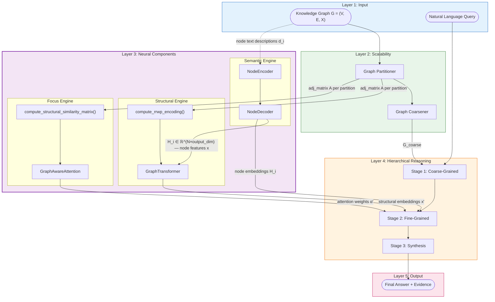
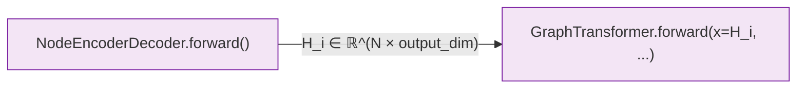
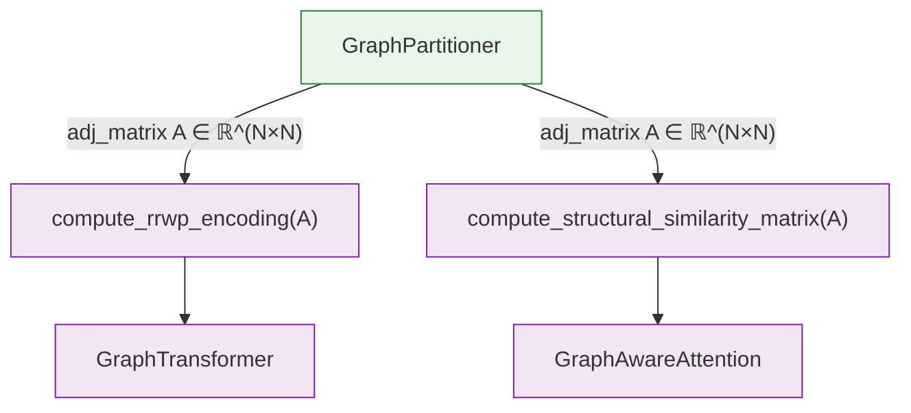
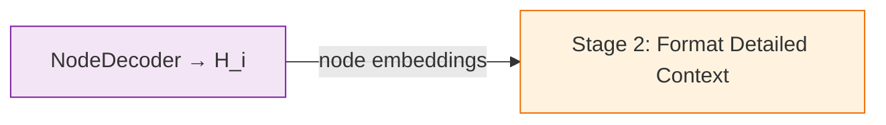
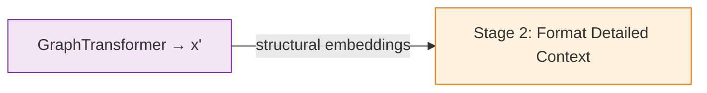
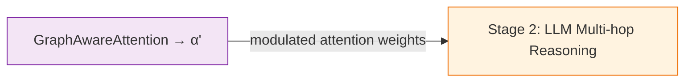
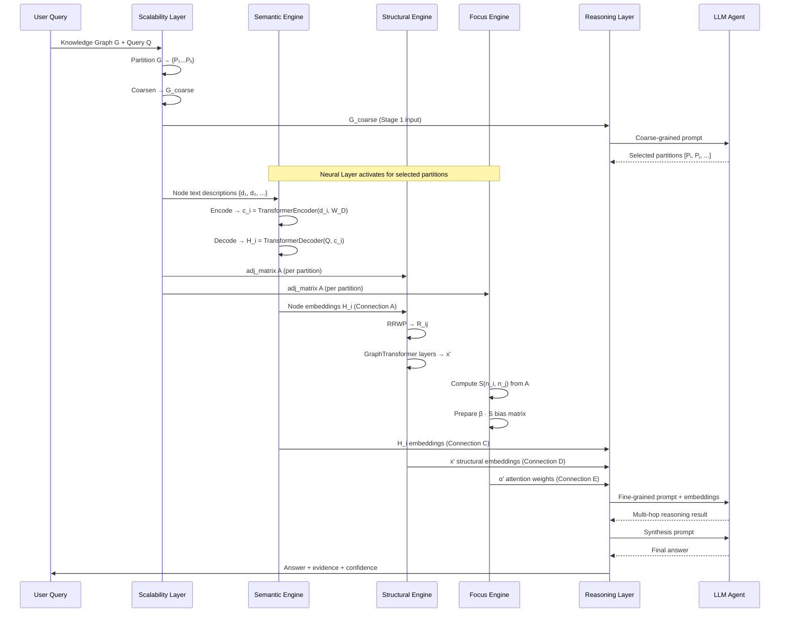

# Engine Integration — The Neural Layer Pipeline

> The three Neural Layer engines — the **Semantic Engine** (Node Encoder-Decoder), the **Structural Engine** (Graph Transformer / GRIT), and the **Focus Engine** (Graph-Aware Attention) — do not operate in isolation. They form a coordinated pipeline where data produced by one engine becomes the input or context for another, and all three converge during **Stage 2 (Fine-Grained Reasoning)** of the Hierarchical Reasoning Layer. This document traces every data flow between the engines, explains dimension alignment constraints, maps the shared configuration surface, and shows how the Scalability Layer (upstream) and the Reasoning Layer (downstream) bind the three engines into the end-to-end S-GraphLLM system. Understanding these connections is essential for modifying any single engine without breaking the pipeline.
>
> **See also**: [README.md — Architecture Overview](../../README.md), [Component Guide — Data Flow Summary](../component_guide.md), [Architecture Diagram — Complete Data Flow](../architecture_diagram.md).

---

## Architecture Overview

The S-GraphLLM four-layer stack is **Scalability → Neural → Reasoning → Output**. The Neural Layer contains the three engines, which receive data from the Scalability Layer and deliver their outputs to the Reasoning Layer. The diagram below shows every inter-engine and inter-layer data path.



The critical takeaway: the three engines are **parallel-then-convergent**. The Semantic and Structural Engines can run in sequence (Semantic first, then Structural consumes its output) or in parallel (each receiving independent inputs), but all three must complete before Stage 2 can proceed.

---

## Connection Breakdown

There are **five primary connections** between the engines and their surrounding layers. Each connection is documented below with exact tensor shapes, the code locations where the data is produced and consumed, and the dimensional constraints that must hold.

### Connection A: Semantic Engine → Structural Engine

> Node representations $H_i$ produced by the Node Encoder-Decoder become the initial node features $x$ for the Graph Transformer.



#### The Data

| Property | Value |
|----------|-------|
| **Producer** | `NodeEncoderDecoder.forward()` — `src/agents/node_encoder_decoder.py`, line 293 |
| **Consumer** | `GraphTransformer.forward(x, ...)` — `src/graph_processing/graph_transformer.py`, line 368 |
| **Tensor name** | `node_repr` (producer) → `x` (consumer) |
| **Shape** | `(N, output_dim)` → `(N, embed_dim)` |
| **dtype** | `torch.float32` |

#### Dimension Constraint

$$\text{NodeEncoderDecoder.output\_dim} = \text{GraphTransformer.embed\_dim}$$

The `NodeDecoder.output_projection` (line 178 in `node_encoder_decoder.py`) outputs tensors of dimension `output_dim`, and the `GraphTransformer` expects node features of dimension `embed_dim` (line 348 in `graph_transformer.py`). These **must match**.

| Config Source | Semantic Engine | Structural Engine | Default |
|---------------|----------------|-------------------|---------|
| `Config.hidden_dim` (`src/utils.py`, line 41) | Sets `output_dim` | Sets `embed_dim` | `1024` |
| Class default | `output_dim=512` (line 236) | `embed_dim=512` (inherited) | — |

#### The Math

The semantic-to-structural handoff implements the transition from Equation 5 to the GRIT input:

$$H_i = \text{NodeDecoder}(Q,\; \text{NodeEncoder}(d_i, W_D)) \quad \xrightarrow{\text{Connection A}} \quad x^{(0)}_i = H_i$$

After this handoff, the Graph Transformer refines $x^{(0)}$ through its layer stack:

$$x^{(l)}_i,\; e^{(l)} = \text{GraphTransformerLayer}_l(x^{(l-1)}_i,\; \text{edge\_index},\; e^{(l-1)})$$

#### Plain English

The Semantic Engine reads textual descriptions like *"Albert Einstein was a physicist who developed the theory of relativity"* and distills each into a 512-dimensional vector $H_i$. These vectors become the starting node features that the Structural Engine then enriches with graph topology information — which nodes are connected, how far apart they are, and what the random walk probabilities look like.

#### Python Perspective

```python
import torch
from src.agents.node_encoder_decoder import NodeEncoderDecoder
from src.graph_processing.graph_transformer import GraphTransformer

# Both engines must agree on the representation dimension
REPR_DIM = 512

# Semantic Engine
enc_dec = NodeEncoderDecoder(input_dim=768, hidden_dim=512, output_dim=REPR_DIM)

# Structural Engine
graph_transformer = GraphTransformer(embed_dim=REPR_DIM, num_layers=2, num_heads=8, rrwp_dim=8)

# --- Pipeline ---
# Step 1: Semantic encoding
node_embeddings = torch.randn(50, 32, 768)            # (N, seq_len, input_dim)
H = enc_dec(node_embeddings)                           # (50, 512) — node representations
# H.shape[1] == REPR_DIM ✓

# Step 2: Structural encoding (consumes H as initial node features)
edge_index = torch.randint(0, 50, (2, 200))            # (2, E)
adj_matrix = torch.zeros(50, 50)
adj_matrix[edge_index[0], edge_index[1]] = 1.0

x_structural = graph_transformer(x=H, edge_index=edge_index, adj_matrix=adj_matrix)
# x_structural.shape == torch.Size([50, 512])          # (N, embed_dim) — structure-enriched
```

---

### Connection B: Scalability Layer → Both Structural & Focus Engines (Shared Adjacency Matrix)

> The partitioned adjacency matrix $A$ produced by the Scalability Layer is consumed by **both** the Structural Engine (for RRWP computation) and the Focus Engine (for structural similarity computation). This is a fan-out connection.



#### The Data

| Property | RRWP Path (Structural Engine) | Similarity Path (Focus Engine) |
|----------|-------------------------------|-------------------------------|
| **Producer** | `GraphPartitioner` → NetworkX subgraph → `torch.tensor(nx.to_numpy_array(subgraph))` | `GraphPartitioner` → NetworkX subgraph → `nx.to_numpy_array(subgraph)` |
| **Consumer** | `compute_rrwp_encoding(adj_matrix, max_steps)` — `graph_transformer.py`, line 46 | `compute_structural_similarity_matrix(adj_matrix, seq_len, metric)` — `graph_aware_attention.py`, line 233 |
| **Shape** | `(N, N)` as `torch.Tensor` | `(N, N)` as `np.ndarray` |
| **dtype** | `torch.float32` | `np.float64` |

#### Why It Matters

Both engines extract structural information from the **same** adjacency matrix, but they encode it differently:

| Engine | Encoding Method | What It Captures |
|--------|----------------|------------------|
| Structural (RRWP) | Random walk powers $M^k$ | Multi-scale reachability probabilities — a probabilistic, per-edge encoding |
| Focus (Similarity) | Shortest path or Jaccard | Global pairwise similarity — a single scalar per node pair |

These are **complementary** representations of the same topology. The RRWP encoding is edge-level and feeds into sparse graph attention; the similarity matrix is node-pair-level and feeds into dense LLM attention.

#### The Math

From the same adjacency matrix $A$:

**Structural Engine path** (Equation 6):

$$M = D^{-1}A, \qquad R_{i,j} = [I_{i,j},\; M_{i,j},\; M^2_{i,j},\; \ldots,\; M^{C-1}_{i,j}]$$

**Focus Engine path** (shortest-path metric):

$$S(n_i, n_j) = \frac{1}{1 + d_A(n_i, n_j)}$$

where $d_A(n_i, n_j)$ is the shortest path distance in the graph defined by $A$.

Both encodings are deterministic given $A$ and can be computed in parallel.

---

### Connection C: Semantic Engine → Reasoning Layer (Stage 2)

> Node embeddings $H_i$ from the Node Encoder-Decoder are formatted into the fine-grained context that Stage 2 passes to the LLM.



#### The Data

| Property | Value |
|----------|-------|
| **Producer** | `NodeEncoderDecoder.forward()` — `src/agents/node_encoder_decoder.py`, line 293 |
| **Consumer** | Stage 2 context formatting in `HierarchicalReasoningOrchestrator.reason()` — `src/agents/orchestrator.py`, lines 162–176 |
| **Shape** | `(N, output_dim)` |
| **Format at consumer** | Currently, the orchestrator formats node features as text context via `format_graph_context()` (`src/utils.py`, lines 190–224). In a full integration, the raw embedding tensors would also be available for prefix tuning. |

#### Current Integration Status

In the current codebase, the orchestrator at `src/agents/orchestrator.py` formats node descriptions as **text** (lines 163–168) rather than consuming raw embedding tensors directly. The `NodeEncoderDecoder` is available as a module but is not yet wired into the orchestrator's `reason()` method. The workflow diagram (`docs/workflow.mermaid`, line 86) shows the intended connection: `ND -- "Node Embeddings" --> S2_Format`.

**Intended pipeline** (future integration):

```python
# Inside orchestrator.reason(), after subgraph extraction:
node_texts = [self.node_features[n]["description"] for n in fine_graph.nodes()]
H = self.node_encoder_decoder.encode_batch(node_texts, tokenizer, device=device)
# H would then be used as prefix embeddings for the LLM prompt
```

---

### Connection D: Structural Engine → Reasoning Layer (Stage 2)

> Structure-enriched node embeddings $x'$ from the Graph Transformer are formatted into the fine-grained context for Stage 2.



#### The Data

| Property | Value |
|----------|-------|
| **Producer** | `GraphTransformer.forward()` — `src/graph_processing/graph_transformer.py`, line 400 |
| **Consumer** | Stage 2 context formatting — `src/agents/orchestrator.py`, lines 162–176 |
| **Shape** | `(N, embed_dim)` |

#### Current Integration Status

Similar to Connection C, the Graph Transformer is implemented as a standalone module but not yet directly wired into the orchestrator. The workflow diagram (`docs/workflow.mermaid`, line 85) shows the intended connection: `GRIT -- "Structural Embeddings" --> S2_Format`.

**Intended pipeline** (future integration):

```python
# Inside orchestrator.reason(), after subgraph extraction:
adj = torch.tensor(nx.to_numpy_array(fine_graph), dtype=torch.float32)
edge_index = torch.tensor(list(fine_graph.edges())).t()
x_structural = self.graph_transformer(x=H, edge_index=edge_index, adj_matrix=adj)
# x_structural would augment the LLM's context with structural information
```

---

### Connection E: Focus Engine → Reasoning Layer (Stage 2 LLM)

> Graph-aware attention weights $\alpha'$ produced by the Focus Engine modulate the LLM's attention during Stage 2 multi-hop reasoning.



#### The Data

| Property | Value |
|----------|-------|
| **Producer** | `GraphAwareAttention.forward()` — `src/attention/graph_aware_attention.py`, line 159 |
| **Consumer** | Stage 2 LLM reasoning — `src/agents/orchestrator.py`, lines 178–185 |
| **Shape (output)** | `(batch_size, seq_len, hidden_dim)` and `(batch_size, num_heads, seq_len, seq_len)` |

#### How It Modulates the LLM

The Focus Engine does not replace the LLM's attention — it **augments** it. The structural similarity matrix $S$ is added as a bias term to the LLM's attention logits, scaled by the learnable $\beta$:

$$\text{LLM attention}_{ij}^{\text{modified}} = \text{softmax}\!\left(\frac{q_i^\top k_j}{\sqrt{d_k}} + \beta \cdot S(n_i, n_j)\right)$$

This means the LLM can still attend freely to any token, but tokens corresponding to graph-adjacent nodes receive a *boost* proportional to their structural similarity.

#### Current Integration Status

The workflow diagram (`docs/workflow.mermaid`, line 87) shows the intended connection: `GAA -- "Attention Weights" --> S2_LLM`. In the current codebase, the `GraphAwareAttention` module is fully implemented and tested, but the integration with an actual LLM (e.g., through prefix tuning or custom attention layers) is planned for a future release. See [README.md — Comparison with Original GraphLLM](../../README.md): "Prefix Tuning: Planned."

---

## Full Pipeline Walkthrough

Below is the complete sequence of operations when processing a query over a large knowledge graph, showing exactly where each engine activates and what it exchanges.



### Step-by-Step Execution Order

| Step | Component | Action | Output | Depends On |
|------|-----------|--------|--------|------------|
| 1 | Scalability Layer | Partition graph $G$ into $\{P_1, \ldots, P_k\}$ | Partition assignments, subgraphs | Input graph |
| 2 | Scalability Layer | Coarsen graph → $G_\text{coarse}$ | Coarse graph with super-nodes | Step 1 |
| 3 | Reasoning (Stage 1) | Coarse-grained partition selection | Selected partition IDs | Step 2, Query |
| 4a | Semantic Engine | Encode node texts → $H_i$ | `(N, output_dim)` tensor | Input text, Step 3 (partition selection) |
| 4b | Scalability Layer | Extract adjacency matrix $A$ for selected partitions | `(N, N)` tensor/array | Step 1, Step 3 |
| 5 | Structural Engine | RRWP + Graph Transformer on $H_i$ and $A$ | `(N, embed_dim)` tensor | Step 4a (Connection A), Step 4b |
| 6 | Focus Engine | Compute $S$ from $A$, prepare $\beta \cdot S$ | `(N, N)` similarity matrix | Step 4b (Connection B) |
| 7 | Reasoning (Stage 2) | Format context with $H_i$, $x'$, $\alpha'$ → LLM | Reasoning result | Steps 4a, 5, 6 (Connections C, D, E) |
| 8 | Reasoning (Stage 3) | Synthesize final answer | Final answer + confidence | Step 7 |

**Parallelism opportunities**: Steps 4a and 4b are independent and can run in parallel. Step 5 depends on 4a (Connection A) and 4b. Step 6 depends only on 4b and can run in parallel with Step 5.

---

## Dimension Alignment Map

The three engines communicate through tensors whose dimensions must be compatible. The table below maps every dimension constraint across the pipeline.

| Dimension Name | Semantic Engine | Structural Engine | Focus Engine | Config Field | Default |
|---------------|----------------|-------------------|--------------|-------------|---------|
| **input_dim** | `NodeEncoder.input_dim` (line 52) | — | — | `Config.embedding_dim` (line 40) | `768` |
| **hidden_dim** | `NodeEncoder.hidden_dim` (line 53) | — | — | `Config.hidden_dim` (line 41) | `1024` |
| **output_dim / embed_dim** | `NodeDecoder.output_dim` (line 158) | `GraphTransformer.embed_dim` (line 348) | `GraphAwareAttention.hidden_dim` (line 47) | `Config.hidden_dim` (line 41) | `1024` |
| **rrwp_dim** | — | `GraphTransformer.rrwp_dim` (line 350) | — | Hardcoded | `8` |
| **num_heads** | `NodeEncoder` num_heads (line 37) | `MultiHeadGraphAttention` num_heads (line 119) | `GraphAwareAttention` num_heads (line 48) | `Config.num_heads` (line 43) | `8` |
| **dropout** | All sub-layers | All sub-layers | Attention dropout | `Config.dropout` (line 44) | `0.1` |

### Critical Constraint

The **output_dim / embed_dim** row is the critical alignment point for Connection A:

$$\boxed{\text{NodeEncoderDecoder.output\_dim} = \text{GraphTransformer.embed\_dim}}$$

If these differ, the node embeddings from the Semantic Engine cannot be used as input to the Structural Engine without an additional projection layer.

### Secondary Constraint

For the Focus Engine to modulate LLM attention, its hidden dimension must match the LLM's hidden dimension:

$$\boxed{\text{GraphAwareAttention.hidden\_dim} = \text{LLM hidden dimension}}$$

In the current configuration, `GraphAwareAttentionConfig.hidden_dim` defaults to `768` (matching BERT-base or similar), while `Config.hidden_dim` is `1024`. These are reconciled through the `GraphAwareAttentionConfig` dataclass which allows independent configuration.

---

## Shared Configuration Surface

All three engines are parameterized through the same `Config` class (`src/utils.py`, lines 35–74) and `configs/model_config.yaml`. The table below shows which config fields are shared across multiple engines.

| Config Field | Line | Semantic | Structural | Focus | Effect |
|-------------|------|----------|------------|-------|--------|
| `embedding_dim` | 40 | `input_dim` | — | — | LLM embedding size → Semantic Engine entry point |
| `hidden_dim` | 41 | `hidden_dim`, `output_dim` | `embed_dim` | `hidden_dim` | Core representation dimension — **must match across engines for Connection A** |
| `num_layers` | 42 | `num_encoder_layers`, `num_decoder_layers` | `num_layers` | — | Depth of transformer stacks |
| `num_heads` | 43 | Encoder/decoder heads | Graph attention heads | Attention heads | All engines use multi-head attention |
| `dropout` | 44 | Encoder/decoder dropout | Attention/FFN dropout | Attention dropout | Regularization |
| `graph_aware_attention_beta` | 58 | — | — | `beta_init` | Structural bias strength |
| `similarity_metric` | 59 | — | — | `similarity_metric` | Focus Engine metric choice |

### YAML excerpt (`configs/model_config.yaml`):

```yaml
# Shared by all three engines
hidden_dim: 1024
num_heads: 8
dropout: 0.1

# Semantic Engine specific
embedding_dim: 768

# Focus Engine specific
graph_aware_attention_beta: 0.5
similarity_metric: "shortest_path"
```

---

## Complementary Structural Representations

A key design decision in S-GraphLLM is that the Structural Engine and the Focus Engine encode graph topology **differently** and for **different purposes**. They are not redundant — they are complementary.

| Aspect | Structural Engine (RRWP + Graph Transformer) | Focus Engine (Structural Similarity) |
|--------|----------------------------------------------|--------------------------------------|
| **Encoding granularity** | Per-edge: $R_{i,j} \in \mathbb{R}^C$ for each edge $(i,j)$ | Per-node-pair: $S(n_i, n_j) \in \mathbb{R}$ for all pairs |
| **Sparsity** | Sparse — computed only for existing edges | Dense — computed for all node pairs up to `seq_len` |
| **Learned components** | Q/K/V projections, edge bias/weight projections, $A_w$ | Learnable $\beta$ scalar only; similarity is deterministic |
| **What it captures** | Multi-hop random walk probabilities at $C$ scales | Global pairwise distance or neighborhood overlap |
| **Where it acts** | Graph attention within the Structural Engine | LLM attention within the Focus Engine |
| **Tensor output** | Updated node features $x' \in \mathbb{R}^{N \times d}$ | Modified attention weights $\alpha' \in \mathbb{R}^{B \times H \times L \times L}$ |
| **Paper origin** | GRIT / GraphLLM Section 3.3 | S-GraphLLM novel contribution |

### Mathematical Relationship

Both derive from the adjacency matrix $A$, but through different transformations:

**Structural Engine**:

$$A \xrightarrow{D^{-1}} M \xrightarrow{\text{powers}} [I, M, M^2, \ldots] \xrightarrow{W_{eb}, W_{ew}} \text{edge features} \xrightarrow{\text{attention}} x'$$

**Focus Engine**:

$$A \xrightarrow{\text{BFS}} d(n_i, n_j) \xrightarrow{1/(1+d)} S(n_i, n_j) \xrightarrow{\beta \cdot S} \text{attention bias} \xrightarrow{\text{softmax}} \alpha'$$

The Structural Engine produces a **rich, per-edge, multi-dimensional** encoding that is processed through learned layers. The Focus Engine produces a **simple, per-pair, scalar** bias that directly modulates existing attention patterns. Together, they ensure that graph topology influences the model at two different levels: within the graph neural network (Structural) and within the language model (Focus).

---

## Integration with the Orchestrator

The `HierarchicalReasoningOrchestrator` (`src/agents/orchestrator.py`, lines 33–318) coordinates the end-to-end pipeline. Currently, it directly manages the Scalability Layer (partitioning and coarsening) and the Reasoning Layer (three-stage reasoning with LLM). The Neural Layer engines are implemented as standalone modules.

### Current Wiring

```python
# src/agents/orchestrator.py — current __init__ (lines 38-65)
class HierarchicalReasoningOrchestrator:
    def __init__(self, graph, config, node_features=None):
        self.partitioner = GraphPartitioner(...)       # Scalability Layer ✓
        self.coarsener = GraphCoarsener()              # Scalability Layer ✓
        # Neural engines NOT yet instantiated here
```

### Intended Full Integration

When the Neural Layer is fully wired in, the orchestrator would instantiate all three engines and use them during Stage 2:

```python
# Intended future integration
class HierarchicalReasoningOrchestrator:
    def __init__(self, graph, config, node_features=None):
        # Scalability Layer
        self.partitioner = GraphPartitioner(...)
        self.coarsener = GraphCoarsener()

        # Neural Layer — The Three Engines
        self.node_encoder_decoder = NodeEncoderDecoder(
            input_dim=config.embedding_dim,            # 768
            hidden_dim=config.hidden_dim,              # 1024
            output_dim=config.hidden_dim,              # 1024 — must match embed_dim
            num_encoder_layers=config.num_layers,
            num_decoder_layers=config.num_layers,
            num_heads=config.num_heads,
            dropout=config.dropout
        )

        self.graph_transformer = GraphTransformer(
            embed_dim=config.hidden_dim,               # 1024 — must match output_dim
            num_layers=config.num_layers,
            num_heads=config.num_heads,
            rrwp_dim=8,
            dropout=config.dropout
        )

        attn_config = GraphAwareAttentionConfig(
            hidden_dim=config.hidden_dim,
            num_heads=config.num_heads,
            beta_init=config.graph_aware_attention_beta,
            similarity_metric=config.similarity_metric,
            dropout=config.dropout
        )
        self.graph_aware_attention = GraphAwareAttention(attn_config)
```

### Intended Stage 2 Usage

```python
def _fine_grained_with_neural(self, query, partition_ids, llm_agent):
    """Stage 2 with full Neural Layer integration."""
    for pid in partition_ids:
        subgraph = self.graph.subgraph(self.partitions[pid])
        adj = torch.tensor(nx.to_numpy_array(subgraph), dtype=torch.float32)
        edge_index = torch.tensor(list(subgraph.edges())).t()

        # --- Connection A: Semantic → Structural ---
        node_texts = [self.node_features[n]["description"] for n in subgraph.nodes()]
        H = self.node_encoder_decoder.encode_batch(node_texts, tokenizer)
        x_structural = self.graph_transformer(x=H, edge_index=edge_index, adj_matrix=adj)

        # --- Connection B: Shared adjacency → Focus Engine ---
        S = compute_structural_similarity_matrix(
            adj.numpy(), seq_len=len(subgraph),
            metric=self.config.similarity_metric
        )
        S_tensor = torch.from_numpy(S).float()

        # --- Connections C, D, E: All engines → LLM reasoning ---
        # H (semantic), x_structural (structural), S_tensor (focus)
        # would be combined into the LLM prompt / prefix tuning
```

---

## Cross-References

### Engine Documentation

- [**Node Encoder-Decoder (The Semantic Engine)**](engine_node_encoder_decoder.md) — Detailed documentation of the producer side of Connection A and C.
- [**Graph Transformer / GRIT (The Structural Engine)**](engine_graph_transformer.md) — Detailed documentation of the consumer side of Connection A and producer of Connection D.
- [**Graph-Aware Attention (The Focus Engine)**](engine_graph_aware_attention.md) — Detailed documentation of the producer side of Connection E.

### Project Documentation

- [**README.md — Architecture Overview**](../../README.md) — The high-level pipeline diagram showing all three engines within the GraphLLM Components block.
- [**README.md — Comparison with Original GraphLLM**](../../README.md) — Shows which components are from the paper vs. novel, and the planned prefix tuning integration.
- [**docs/component_guide.md — Data Flow Summary**](../component_guide.md) — ASCII diagram of the complete data flow with all five layers.
- [**docs/component_guide.md — § 3.1–3.5**](../component_guide.md) — Individual component descriptions showing input/output specifications.
- [**docs/architecture_diagram.md — Complete Data Flow**](../architecture_diagram.md) — Mermaid diagram showing all inter-component connections.
- [**docs/architecture_diagram.md — Component Interaction Matrix**](../architecture_diagram.md) — Table mapping every `From → To` data flow with tensor types.
- [**docs/workflow.mermaid**](../workflow.mermaid) — The full workflow diagram showing the neural component connections (lines 79–87): `ND → S2_Format`, `GRIT → S2_Format`, `GAA → S2_LLM`.
- [**docs/graph_partitioning_theory.md**](../graph_partitioning_theory.md) — Theory behind the Scalability Layer that produces the shared adjacency matrices consumed by Connection B.
- [**docs/hierarchical_reasoning_theory.md**](../hierarchical_reasoning_theory.md) — Theory behind the Reasoning Layer that consumes all three engine outputs via Connections C, D, and E.

---

**Document Version**: 1.0
**Last Updated**: February 2026
**Sources**: `src/agents/orchestrator.py` (318 lines), `src/main.py` (186 lines), `docs/workflow.mermaid` (97 lines), all three engine source files, `configs/model_config.yaml`, `src/utils.py`
