# Node Encoder-Decoder — The Semantic Engine

> The Node Encoder-Decoder is the **semantic backbone** of S-GraphLLM's Neural Layer. It converts raw textual descriptions of graph nodes into compact, task-relevant vector representations by implementing the textual transformer encoder-decoder described in **Section 3.2** of the GraphLLM paper (Equations 5a and 5b). In the four-layer architecture, this engine sits inside **Layer 3 (Neural Components)** and feeds its output — fixed-size node embeddings $H_i$ — into both the Graph Transformer (for structure-aware refinement) and the Hierarchical Reasoning Layer (for coarse-to-fine query answering). The key insight is that by first *compressing* high-dimensional token sequences through a learned down-projection and transformer encoder, and then *expanding* them via a learnable query and transformer decoder, the model produces representations that are simultaneously information-rich and dimension-efficient.
>
> **See also**: [README.md — Key Components § 2](../../README.md), [Component Guide — § 3.1–3.2](../component_guide.md).

---

## Architecture Overview

Within the S-GraphLLM four-layer stack (**Scalability → Neural → Reasoning → Output**), the Node Encoder-Decoder belongs to the **Neural Layer** and operates in two stages:

1. **Encoding** — A down-projection followed by a transformer encoder collapses a variable-length token sequence into a single fixed-size *context vector* $c_i$.
2. **Decoding** — A transformer decoder, driven by a learnable query embedding $Q$, cross-attends to the context vector and projects the result into the final node representation $H_i$.

```mermaid
flowchart LR
    subgraph NodeEncoderDecoder["Node Encoder-Decoder · Semantic Engine"]
        direction LR
        A["Token Embeddings\n(batch, seq len, input dim)"] --> B["Down-Projection W D"]
        B --> C["Transformer Encoder"]
        C --> D["Masked Mean Pooling"]
        D --> E["Layer Norm"]
        E --> F["Context Vector ci\n(batch, hidden dim)"]
        F --> G["Query Expansion Q"]
        G --> H["Transformer Decoder\n(cross-attention)"]
        H --> I["Output Projection"]
        I --> J["Layer Norm"]
        J --> K["Node Representation Hi\n(batch, output dim)"]
    end

    style NodeEncoderDecoder fill:#f3e5f5,stroke:#7b1fa2,stroke-width:2px
```



The encoder compresses semantics; the decoder distills them into a task-relevant fixed-size vector. This two-stage design mirrors the *encode-then-attend* paradigm common in sequence-to-one tasks and directly implements Equations 5a/5b of the GraphLLM paper.

---

## Components Breakdown

### 1. `NodeEncoder` — Textual Transformer Encoder

* **Location**: `src/agents/node_encoder_decoder.py`, lines 19–121
* **Purpose**: Receives pre-computed token embeddings for a node's text description, down-projects them to a lower-dimensional space, processes them through a stack of transformer encoder layers, and produces a single context vector $c_i$ via masked mean pooling.
* **Paper Reference**: Equation 5a — $c_i = \text{TransformerEncoder}(d_i, W_D)$.

#### The Math

**Equation 5a (Encoder)**:

$$c_i = \text{LayerNorm}\!\left(\text{MaskedMeanPool}\!\left(\text{TransformerEncoder}\!\left(W_D \cdot d_i\right)\right)\right)$$

| Symbol | Definition | Code counterpart |
|--------|-----------|------------------|
| $d_i \in \mathbb{R}^{L \times D_\text{in}}$ | Token embedding matrix of node $i$'s text description, where $L$ is the sequence length and $D_\text{in}$ is the input embedding dimension. | `node_embeddings` argument — shape `(batch_size, seq_len, input_dim)` |
| $W_D \in \mathbb{R}^{D_\text{in} \times D_h}$ | Learnable down-projection matrix that reduces the input dimension to the hidden dimension. | `self.down_projection` — `nn.Linear(input_dim, hidden_dim)`, initialized at **line 56** |
| $\text{TransformerEncoder}$ | A stack of $N_\text{enc}$ standard transformer encoder layers with multi-head self-attention and feed-forward sub-layers. | `self.transformer_encoder` — `nn.TransformerEncoder(encoder_layer, num_layers)`, initialized at **lines 59–69** |
| $\text{MaskedMeanPool}$ | Averages the encoded token representations over the sequence dimension, ignoring padding positions when an attention mask is provided. | Implemented inline in `forward()` at **lines 108–116** |
| $\text{LayerNorm}$ | Standard layer normalization applied to the pooled context vector. | `self.layer_norm` — `nn.LayerNorm(hidden_dim)`, initialized at **line 72** |
| $c_i \in \mathbb{R}^{D_h}$ | The resulting context vector — a compressed semantic summary of the node description. | Return value of `NodeEncoder.forward()` |

**Down-projection step**:

$$x = W_D \cdot d_i + b_D$$

where $b_D$ is the bias term of `self.down_projection`.

**Masked mean pooling** (when attention mask $m$ is provided):

$$c_i = \frac{\sum_{t=1}^{L} m_t \cdot \hat{x}_t}{\max\!\left(\sum_{t=1}^{L} m_t,\; \epsilon\right)}$$

where $\hat{x}_t$ is the transformer-encoded representation at position $t$ and $\epsilon = 10^{-9}$ prevents division by zero (line 112).

#### Plain English Input / Output

* **Input**:
  - `node_embeddings`: A tensor of shape `(batch_size, seq_len, input_dim)`, dtype `torch.float32`. These are token-level embeddings for each node's textual description, e.g. embeddings produced by a pre-trained language model for inputs like `["Albert Einstein was a physicist...", "Ulm is a city in Germany..."]`.
  - `attention_mask` *(optional)*: A binary tensor of shape `(batch_size, seq_len)`, dtype `torch.float32` or `torch.long`, where `1` marks real tokens and `0` marks padding positions.

* **Output**:
  - A tensor of shape `(batch_size, hidden_dim)`, dtype `torch.float32`. Each row is a context vector $c_i$ summarizing the semantic content of one node's description. For example, with default `hidden_dim=512`, a batch of 4 descriptions produces a `(4, 512)` tensor.

* **Side Effects / State**: None. No buffers or caches are registered.

#### Python Perspective

```python
import torch
from src.agents.node_encoder_decoder import NodeEncoder

encoder = NodeEncoder(input_dim=768, hidden_dim=512, num_layers=2, num_heads=4, dropout=0.1)

# Simulated token embeddings for 4 nodes, each with 32 tokens, each token 768-dim
node_embeddings = torch.randn(4, 32, 768)           # (batch_size, seq_len, input_dim)
attention_mask = torch.ones(4, 32)                    # (batch_size, seq_len) — all real tokens
attention_mask[:, 28:] = 0                            # last 4 positions are padding

context_vectors = encoder(node_embeddings, attention_mask)
# context_vectors.shape == torch.Size([4, 512])       # (batch_size, hidden_dim)
```

#### Internal Method Walkthrough

**`__init__(self, input_dim, hidden_dim, num_layers, num_heads, dropout)`** (lines 32–74)

1. Stores `input_dim` and `hidden_dim` as instance attributes (lines 52–53).
2. Creates the down-projection linear layer `self.down_projection = nn.Linear(input_dim, hidden_dim)` (line 56).
3. Builds a single `nn.TransformerEncoderLayer` with `d_model=hidden_dim`, `nhead=num_heads`, `dim_feedforward=hidden_dim * 4`, `dropout=dropout`, and `batch_first=True` (lines 59–65).
4. Wraps it in an `nn.TransformerEncoder` with `num_layers` repetitions (lines 66–69).
5. Creates `self.layer_norm = nn.LayerNorm(hidden_dim)` (line 72).
6. Logs initialization (line 74).

**`forward(self, node_embeddings, attention_mask=None)`** (lines 76–121)

1. **Down-project** (line 92): `x = self.down_projection(node_embeddings)` — maps `(batch, seq_len, input_dim)` → `(batch, seq_len, hidden_dim)`.
2. **Build padding mask** (lines 96–100): If `attention_mask` is provided, invert it to create `src_key_padding_mask` (True where tokens should be ignored). PyTorch's `TransformerEncoder` expects this inverted convention.
3. **Transformer encoding** (lines 102–105): `encoded = self.transformer_encoder(x, src_key_padding_mask=src_key_padding_mask)`.
4. **Masked mean pooling** (lines 108–116):
   - *With mask*: Expands the mask to match encoded dimensions, computes element-wise product, sums over the sequence dimension, and divides by the clamped mask sum (lines 110–113).
   - *Without mask*: Simple mean over the sequence dimension (line 116).
5. **Layer normalization** (line 119): `context = self.layer_norm(context)`.
6. **Return** the context vector (line 121).

---

### 2. `NodeDecoder` — Textual Transformer Decoder

* **Location**: `src/agents/node_encoder_decoder.py`, lines 124–221
* **Purpose**: Takes the context vector $c_i$ produced by the encoder and, using a learnable query embedding $Q$, decodes it into a final node representation $H_i$ through cross-attention in a transformer decoder.
* **Paper Reference**: Equation 5b — $H_i = \text{TransformerDecoder}(Q, c_i)$.

#### The Math

**Equation 5b (Decoder)**:

$$H_i = \text{LayerNorm}\!\left(W_O \cdot \text{TransformerDecoder}(Q,\; c_i)\right)$$

| Symbol | Definition | Code counterpart |
|--------|-----------|------------------|
| $Q \in \mathbb{R}^{1 \times 1 \times D_h}$ | A learnable query embedding that acts as the decoder's initial input. It is shared across all nodes and learned end-to-end. Initialized with Xavier normal distribution. | `self.query_embedding` — `nn.Parameter(torch.randn(1, 1, hidden_dim))`, initialized at **line 161**, Xavier init at **line 162** |
| $c_i \in \mathbb{R}^{D_h}$ | Context vector from the encoder, expanded to shape $(B, 1, D_h)$ for cross-attention. | `memory = context.unsqueeze(1)` at **line 206** |
| $\text{TransformerDecoder}$ | A stack of $N_\text{dec}$ standard transformer decoder layers. Each layer performs self-attention on the query, then cross-attention to the memory (context vector). | `self.transformer_decoder` — `nn.TransformerDecoder(decoder_layer, num_layers)`, initialized at **lines 164–175** |
| $W_O \in \mathbb{R}^{D_h \times D_\text{out}}$ | Output projection matrix that maps from hidden dimension to the desired output dimension. | `self.output_projection` — `nn.Linear(hidden_dim, output_dim)`, initialized at **line 178** |
| $\text{LayerNorm}$ | Final layer normalization on the output. | `self.layer_norm` — `nn.LayerNorm(output_dim)`, initialized at **line 181** |
| $H_i \in \mathbb{R}^{D_\text{out}}$ | The final node representation — a fixed-size vector capturing the task-relevant semantic content of node $i$. | Return value of `NodeDecoder.forward()` |

The full decoding pipeline:

$$\hat{Q} = Q.\text{expand}(B, 1, D_h)$$
$$\text{decoded} = \text{TransformerDecoder}(\text{tgt}=\hat{Q},\; \text{memory}=c_i.\text{unsqueeze}(1))$$
$$H_i = \text{LayerNorm}(W_O \cdot \text{decoded}.\text{squeeze}(1) + b_O)$$

#### Plain English Input / Output

* **Input**:
  - `context`: A tensor of shape `(batch_size, hidden_dim)`, dtype `torch.float32`. These are the context vectors produced by the `NodeEncoder`. For example, a batch of 4 nodes with `hidden_dim=512` gives a `(4, 512)` tensor.
  - `memory_mask` *(optional)*: Currently accepted but not used in the forward pass.

* **Output**:
  - A tensor of shape `(batch_size, output_dim)`, dtype `torch.float32`. Each row is a node representation $H_i$. With default `output_dim=512`, a batch of 4 nodes yields a `(4, 512)` tensor.

* **Side Effects / State**: The learnable `query_embedding` parameter is updated during training but introduces no runtime state or buffers.

#### Python Perspective

```python
import torch
from src.agents.node_encoder_decoder import NodeDecoder

decoder = NodeDecoder(hidden_dim=512, output_dim=256, num_layers=2, num_heads=4, dropout=0.1)

# Context vectors from the encoder
context = torch.randn(4, 512)                         # (batch_size, hidden_dim)

node_repr = decoder(context)
# node_repr.shape == torch.Size([4, 256])              # (batch_size, output_dim)
```

#### Internal Method Walkthrough

**`__init__(self, hidden_dim, output_dim, num_layers, num_heads, dropout)`** (lines 137–183)

1. Stores `hidden_dim` and `output_dim` (lines 157–158).
2. Creates the learnable query embedding `self.query_embedding = nn.Parameter(torch.randn(1, 1, hidden_dim))` (line 161) and initializes it with Xavier normal (line 162).
3. Builds a `nn.TransformerDecoderLayer` with `d_model=hidden_dim`, `nhead=num_heads`, `dim_feedforward=hidden_dim * 4`, `dropout=dropout`, and `batch_first=True` (lines 165–171).
4. Wraps it in a `nn.TransformerDecoder` with `num_layers` layers (lines 172–175).
5. Creates `self.output_projection = nn.Linear(hidden_dim, output_dim)` (line 178).
6. Creates `self.layer_norm = nn.LayerNorm(output_dim)` (line 181).
7. Logs initialization (line 183).

**`forward(self, context, memory_mask=None)`** (lines 185–221)

1. **Get batch size** (line 200): `batch_size = context.shape[0]`.
2. **Expand query** (line 203): `query = self.query_embedding.expand(batch_size, -1, -1)` — broadcasts the shared query to every sample in the batch, producing shape `(batch_size, 1, hidden_dim)`.
3. **Expand context** (line 206): `memory = context.unsqueeze(1)` — adds a sequence dimension so the context becomes shape `(batch_size, 1, hidden_dim)`, suitable for cross-attention.
4. **Transformer decoding** (lines 209–212): `decoded = self.transformer_decoder(tgt=query, memory=memory)` — the decoder layers perform self-attention on the query, then cross-attention to the memory (context vector).
5. **Remove sequence dimension** (line 215): `decoded = decoded.squeeze(1)` — reduces shape from `(batch_size, 1, hidden_dim)` to `(batch_size, hidden_dim)`.
6. **Output projection** (line 216): `output = self.output_projection(decoded)` — projects to `(batch_size, output_dim)`.
7. **Layer normalization** (line 219): `output = self.layer_norm(output)`.
8. **Return** the final node representation (line 221).

---

### 3. `NodeEncoderDecoder` — Complete Encoder-Decoder Module

* **Location**: `src/agents/node_encoder_decoder.py`, lines 224–340
* **Purpose**: A convenience wrapper that combines the `NodeEncoder` and `NodeDecoder` into a single module implementing the full Section 3.2 pipeline. Also provides an `encode_batch()` method for end-to-end processing from raw text strings.
* **Paper Reference**: Section 3.2 — combines Equation 5a (encoder) and Equation 5b (decoder).

#### The Math

The combined pipeline is:

$$c_i = \text{NodeEncoder}(d_i, W_D) \quad \text{(Eq. 5a)}$$

$$H_i = \text{NodeDecoder}(Q, c_i) \quad \text{(Eq. 5b)}$$

Or in one expression:

$$H_i = \text{NodeDecoder}\!\left(Q,\; \text{NodeEncoder}(d_i, W_D)\right)$$

| Symbol | Definition | Code counterpart |
|--------|-----------|------------------|
| $d_i$ | Token embeddings of node $i$'s text description. | `node_embeddings` argument |
| $W_D$ | Down-projection (owned by `NodeEncoder`). | `self.encoder.down_projection` |
| $Q$ | Learnable query (owned by `NodeDecoder`). | `self.decoder.query_embedding` |
| $c_i$ | Intermediate context vector. | `context` local variable in `forward()`, line 290 |
| $H_i$ | Final node representation. | `node_repr` local variable in `forward()`, line 293 |

#### Plain English Input / Output

* **Input** (via `forward()`):
  - `node_embeddings`: `(batch_size, seq_len, input_dim)` float tensor.
  - `attention_mask` *(optional)*: `(batch_size, seq_len)` binary tensor.

* **Input** (via `encode_batch()`):
  - `node_texts`: A plain Python list of strings, e.g. `["Albert Einstein was a physicist...", "Ulm is a city in Germany..."]`.
  - `tokenizer`: Any HuggingFace-compatible tokenizer.
  - `max_length`: Maximum sequence length (default 128).
  - `device`: Target device string (default `'cpu'`).

* **Output**: `(batch_size, output_dim)` float tensor of node representations.

* **Side Effects / State**: The `encode_batch()` method currently generates **placeholder random embeddings** (lines 330–335) in place of actual LLM embeddings. This is a development stub — in production, the tokenizer's embedding layer or the LLM's embedding layer would be used.

#### Python Perspective

```python
import torch
from src.agents.node_encoder_decoder import NodeEncoderDecoder

# Initialize with default hyperparameters
enc_dec = NodeEncoderDecoder(
    input_dim=768,        # e.g., BERT embedding dimension
    hidden_dim=512,
    output_dim=512,
    num_encoder_layers=2,
    num_decoder_layers=2,
    num_heads=4,
    dropout=0.1
)

# --- Via forward() ---
node_embeddings = torch.randn(4, 32, 768)          # (batch_size, seq_len, input_dim)
attention_mask = torch.ones(4, 32)                   # (batch_size, seq_len)
node_repr = enc_dec(node_embeddings, attention_mask)
# node_repr.shape == torch.Size([4, 512])            # (batch_size, output_dim)

# --- Via encode_batch() (requires a tokenizer) ---
from transformers import AutoTokenizer
tokenizer = AutoTokenizer.from_pretrained("bert-base-uncased")
texts = ["Albert Einstein was a physicist.", "Ulm is a city in Germany."]
node_repr = enc_dec.encode_batch(texts, tokenizer, max_length=128, device='cpu')
# node_repr.shape == torch.Size([2, 512])            # (num_texts, output_dim)
# NOTE: Uses placeholder embeddings internally (lines 330-335)
```

#### Internal Method Walkthrough

**`__init__(self, input_dim, hidden_dim, output_dim, num_encoder_layers, num_decoder_layers, num_heads, dropout)`** (lines 232–272)

1. Creates `self.encoder = NodeEncoder(input_dim, hidden_dim, num_encoder_layers, num_heads, dropout)` (lines 256–262). Calls `NodeEncoder.__init__()` at lines 32–74.
2. Creates `self.decoder = NodeDecoder(hidden_dim, output_dim, num_decoder_layers, num_heads, dropout)` (lines 264–270). Calls `NodeDecoder.__init__()` at lines 137–183.
3. Logs initialization (line 272).

**`forward(self, node_embeddings, attention_mask=None)`** (lines 274–295)

1. **Encode** (line 290): `context = self.encoder(node_embeddings, attention_mask)` — calls `NodeEncoder.forward()` (lines 76–121).
2. **Decode** (line 293): `node_repr = self.decoder(context)` — calls `NodeDecoder.forward()` (lines 185–221).
3. **Return** `node_repr` (line 295).

**`encode_batch(self, node_texts, tokenizer, max_length, device)`** (lines 297–340)

1. **Tokenize** (lines 317–323): Uses the provided tokenizer to convert the list of text strings into `input_ids` and `attention_mask` tensors, with padding and truncation to `max_length`.
2. **Move to device** (lines 325–326): Transfers `input_ids` and `attention_mask` to the specified device.
3. **Generate placeholder embeddings** (lines 330–335): Creates random embeddings of shape `(num_texts, seq_len, input_dim)`. This is a **placeholder** — in a production system, the LLM's embedding layer would provide real embeddings.
4. **Forward pass** (line 338): `node_repr = self.forward(embeddings, attention_mask)`.
5. **Return** `node_repr` (line 340).

---

## Helper / Utility Functions

The Node Encoder-Decoder engine primarily relies on PyTorch's built-in modules (`nn.TransformerEncoder`, `nn.TransformerDecoder`, `nn.Linear`, `nn.LayerNorm`). It does not directly call helper functions from other modules. However, the following utilities in the project are relevant to its operation:

| Function | Location | Relevance |
|----------|----------|-----------|
| `normalize_text(text)` | `src/utils.py`, lines 174–180 | Normalizes node text descriptions before tokenization (lowercasing, whitespace cleanup). |
| `truncate_text(text, max_length)` | `src/utils.py`, lines 183–187 | Truncates overly long descriptions before they are passed to `encode_batch()`. |
| `format_graph_context(nodes, edges, max_length)` | `src/utils.py`, lines 190–224 | Formats graph data as text context for the LLM — uses node descriptions that would first be processed by this engine. |
| `Config` | `src/utils.py`, lines 35–74 | Pydantic model holding system-wide configuration. Fields `embedding_dim` (line 40), `hidden_dim` (line 41), `num_layers` (line 42), `num_heads` (line 43), and `dropout` (line 44) directly parameterize this engine. |

---

## Configuration

The following fields from `configs/model_config.yaml` and the `Config` class (`src/utils.py`, lines 35–74) control the Node Encoder-Decoder's behavior:

| YAML Key | Config Field | Default | Type | Effect |
|----------|-------------|---------|------|--------|
| `embedding_dim` | `Config.embedding_dim` | `768` | `int` | Sets `input_dim` — the dimension of incoming token embeddings. Should match the pre-trained LLM's embedding size (e.g., 768 for BERT-base). |
| `hidden_dim` | `Config.hidden_dim` | `1024` | `int` | Sets both the encoder's hidden dimension and the decoder's input dimension. Controls the capacity of the transformer layers. |
| `num_layers` | `Config.num_layers` | `3` | `int` | Number of transformer layers in both the encoder and decoder stacks. More layers increase capacity but also computation cost. |
| `num_heads` | `Config.num_heads` | `8` | `int` | Number of attention heads in the transformer layers. Must evenly divide `hidden_dim`. |
| `dropout` | `Config.dropout` | `0.1` | `float` | Dropout rate applied within transformer layers and feed-forward sub-layers. |

**YAML excerpt** (`configs/model_config.yaml`, lines 3–9):

```yaml
# Model configuration
model_name: "gpt-4.1-mini"
embedding_dim: 768
hidden_dim: 1024
num_layers: 3
num_heads: 8
dropout: 0.1
```

**Note**: The `NodeEncoderDecoder` class provides its own defaults (`input_dim=768`, `hidden_dim=512`, `output_dim=512`, `num_encoder_layers=2`, `num_decoder_layers=2`, `num_heads=4`, `dropout=0.1`) at lines 233–240. When instantiated via the `Config` object, the config values override these defaults.

---

## Cross-References

### Other Engine Docs

- [**Graph Transformer / GRIT (The Structural Engine)**](engine_graph_transformer.md) — Receives node representations from this engine (or parallel graph features) and learns structural relationships using RRWP and sparse attention.
- [**Graph-Aware Attention (The Focus Engine)**](engine_graph_aware_attention.md) — Modulates LLM attention weights using structural similarity. The node representations produced here inform the attention patterns.

### Project Documentation

- [**README.md — Architecture Overview**](../../README.md) — High-level pipeline showing where the Node Encoder-Decoder fits.
- [**README.md — Key Components § 2**](../../README.md) — Usage example and paper references for the encoder-decoder.
- [**README.md — Validation Against Paper**](../../README.md) — Confirms that `NodeEncoder` (Eq. 5a) and `NodeDecoder` (Eq. 5b) are correctly implemented.
- [**docs/component_guide.md — § 3.1–3.2**](../component_guide.md) — Step-by-step explanation of the Node Encoder and Node Decoder components with theoretical basis.
- [**docs/architecture_diagram.md — Layer 3**](../architecture_diagram.md) — Mermaid diagrams showing the Node Encoder → Node Decoder data flow within the Neural Layer.
- [**docs/hierarchical_reasoning_theory.md — § Stage 2**](../hierarchical_reasoning_theory.md) — Describes how node embeddings produced by this engine feed into fine-grained reasoning within selected partitions.
- [**docs/graph_partitioning_theory.md**](../graph_partitioning_theory.md) — Covers the Scalability Layer that partitions the graph *before* this engine processes individual subgraph nodes.

---

**Document Version**: 1.0
**Last Updated**: February 2026
**Primary Source**: `src/agents/node_encoder_decoder.py` (341 lines)
**Paper**: Chai, Z., et al. (2025). *GraphLLM: Boosting Graph Reasoning Ability of Large Language Model.* IEEE Transactions on Big Data. [arXiv:2310.05845](https://arxiv.org/abs/2310.05845)
