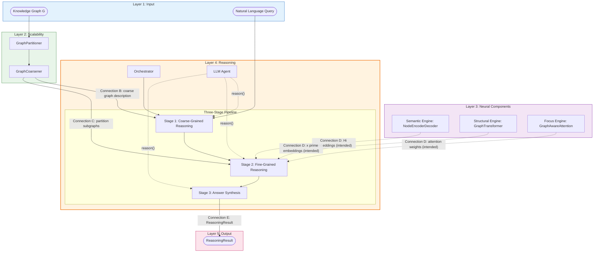
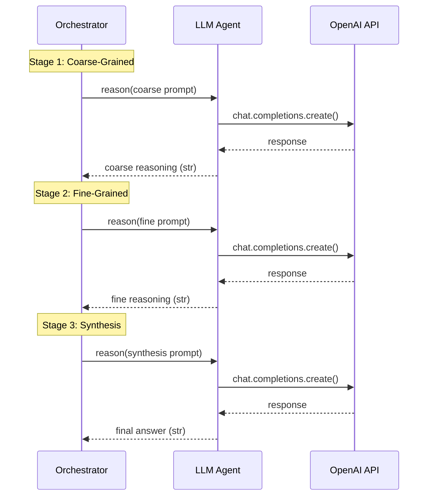
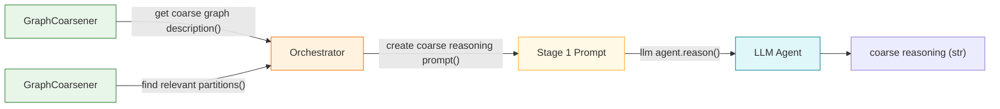
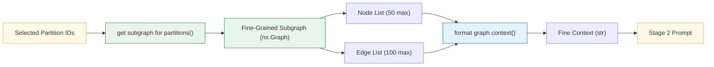
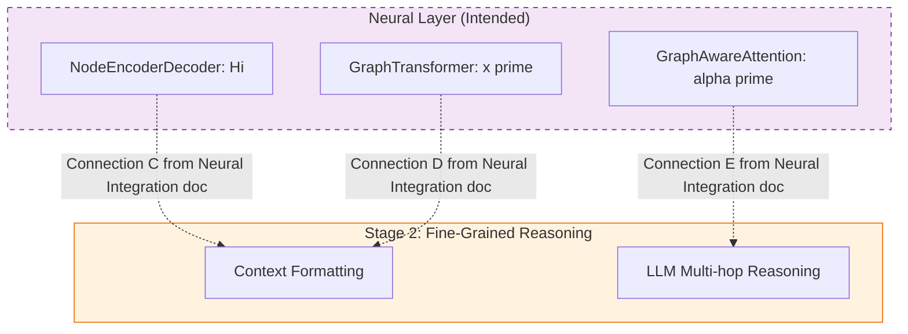
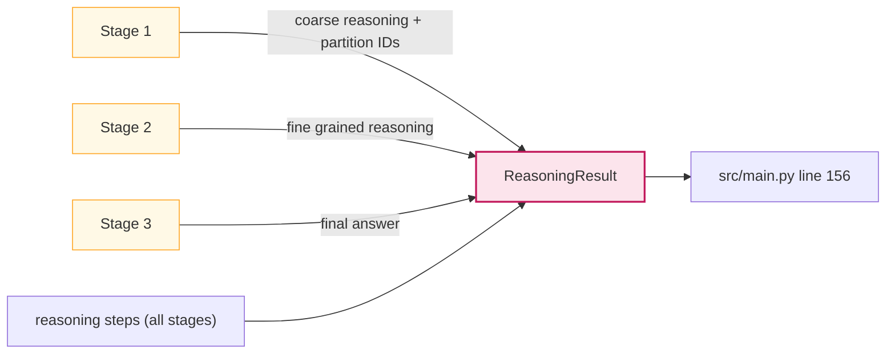

# Reasoning Layer Integration — The Intelligence Pipeline

> The two Reasoning Layer components — the **Hierarchical Reasoning Orchestrator** (the conductor) and the **LLM Agent** (the reasoner) — form a tightly coupled pipeline where the orchestrator constructs prompts and the agent executes reasoning. But the Reasoning Layer does not operate in isolation: it is the **consumer of all upstream layers** and the **producer of the system's final output**. The orchestrator draws the coarse graph $G\_\text{coarse}$ from the Scalability Layer for Stage 1, extracts fine-grained subgraphs from partitioned data for Stage 2, and — in the intended full integration — incorporates node embeddings $H_i$, structural embeddings $x'$, and attention weights $\alpha'$ from the Neural Layer into Stage 2 as well. Understanding these connections is essential for modifying any part of the reasoning pipeline, extending prompt templates, or wiring in the Neural Layer's embeddings.
>
> **See also**: [README.md — Architecture Overview](../../../README.md), [Component Guide — § 4.1–4.4](../../component_guide.md), [Neural Layer Integration — Connections C, D, E](../neural_layer/engine_integration.md), [Architecture Diagram — Complete Data Flow](../../architecture_diagram.md).

---

## Architecture Overview

The S-GraphLLM four-layer stack is **Scalability → Neural → Reasoning → Output**. The Reasoning Layer contains two components that interact across three stages, consuming data from both upstream layers to produce the final `ReasoningResult`.



The diagram shows **five primary connections** (A through E) that link the Reasoning Layer to its surroundings and internally. Solid lines represent currently wired connections; dashed lines represent intended future integrations.

---

## Connection Breakdown

### Connection A: Orchestrator → LLM Agent (Three-Stage Calls)

> The orchestrator calls `llm_agent.reason()` three times during a single reasoning invocation — once per stage. Each call passes a carefully constructed prompt and receives a natural language response.



#### Three Call Sites

| Stage | Call Site | Prompt Constructor | Line |
|-------|----------|-------------------|------|
| **Stage 1** | `orchestrator.py`, line 147 | `_create_coarse_reasoning_prompt()` (lines 216–233) | `coarse_reasoning = llm_agent.reason(coarse_prompt)` |
| **Stage 2** | `orchestrator.py`, line 185 | `_create_fine_reasoning_prompt()` (lines 235–254) | `fine_reasoning = llm_agent.reason(fine_prompt)` |
| **Stage 3** | `orchestrator.py`, line 197 | `_create_synthesis_prompt()` (lines 256–275) | `final_answer = llm_agent.reason(synthesis_prompt)` |

#### Data Flow per Call

For each stage, the data flow is:

$$\text{context data} \xrightarrow{\text{prompt constructor}} \text{prompt (str)} \xrightarrow{\texttt{llm}\_\texttt{agent}\texttt{.reason()}} \text{response (str)}$$

The orchestrator passes **no special parameters** to `reason()` — it uses the default `system_prompt=None` (which triggers `_get_default_system_prompt()` at line 77–80 of `llm_agent.py`) and `include_history=False`. This means each stage is **independent** — the LLM does not remember Stage 1's analysis when processing Stage 2. Instead, the orchestrator explicitly includes the previous stage's output in the next stage's prompt (e.g., `coarse_reasoning` is included in the Stage 2 prompt).

#### Why Independent Calls

Using independent calls (without history) ensures:
1. **Reproducibility**: Each stage produces the same output given the same prompt.
2. **Prompt clarity**: The LLM receives exactly the context it needs, not a growing conversation.
3. **Error isolation**: A failure in one stage doesn't pollute the history for subsequent stages.

---

### Connection B: Scalability Layer → Stage 1

> The coarse graph description flows from `GraphCoarsener.get_coarse_graph_description()` through the orchestrator into the Stage 1 prompt. This is the bridge between graph partitioning and LLM-based reasoning.



#### The Data Transformation Pipeline

| Step | Data Type | Producer | Consumer | Location |
|------|-----------|----------|----------|----------|
| 1. Raw coarse graph | `nx.Graph` | `GraphCoarsener.coarsen_graph()` | Stored as `self.coarse_graph` | `orchestrator.py`, lines 88–92 |
| 2. Text description | `str` | `GraphCoarsener.get_coarse_graph_description()` | `reason()` | `orchestrator.py`, line 124 |
| 3. Query keywords | `List[str]` | `query.lower().split()` | `find_relevant_partitions()` | `orchestrator.py`, line 128 |
| 4. Relevant partitions | `List[Tuple[int, float]]` | `GraphCoarsener.find_relevant_partitions()` | `reason()` | `orchestrator.py`, lines 131–136 |
| 5. Selected IDs | `List[int]` | List comprehension | `_create_coarse_reasoning_prompt()` | `orchestrator.py`, line 136 |
| 6. Coarse prompt | `str` | `_create_coarse_reasoning_prompt()` | `llm_agent.reason()` | `orchestrator.py`, lines 141–147 |
| 7. LLM response | `str` | `LLMAgent.reason()` | Stored as `coarse_reasoning` | `orchestrator.py`, line 147 |

#### Coarse Graph Description Format

The text description produced by `GraphCoarsener.get_coarse_graph_description()` (`coarsener.py`, lines 172–197) follows this structure:

```
Coarse-Grained Graph Structure:
Number of partitions: 5
Number of inter-partition connections: 8

Partition Details:
Partition 0: 12 nodes, key entities: [Node 0, Node 1, ...]
Partition 1: 8 nodes, key entities: [Node 12, Node 13, ...]
...

Inter-partition Connections:
Partition 0 <-> Partition 1 (weight: 3)
Partition 0 <-> Partition 3 (weight: 1)
...
```

This text is what the LLM "sees" in Stage 1 — it provides a high-level map of the graph's structure without exposing individual node details.

---

### Connection C: Scalability Layer → Stage 2

> Selected partition IDs from Stage 1 are used to extract fine-grained subgraphs from the original graph. The subgraph nodes and edges are then formatted into text context for the LLM.



#### The Data Transformation Pipeline

| Step | Data Type | Location | Description |
|------|-----------|----------|-------------|
| 1. Selected IDs | `List[int]` | `orchestrator.py`, line 136 | Partition IDs from Stage 1 |
| 2. Fine subgraph | `nx.Graph` | `orchestrator.py`, lines 154–158 | `self.coarsener.get_subgraph_for_partitions(self.graph, selected_partition_ids, include_neighbors=True)` |
| 3. Node list | `List[Dict]` | `orchestrator.py`, lines 163–168 | Up to 50 nodes with `id` and `description` from `node_features` |
| 4. Edge list | `List[Tuple]` | `orchestrator.py`, lines 170–173 | Up to 100 edges as `(src, dst, "related")` tuples |
| 5. Text context | `str` | `orchestrator.py`, line 175 | `format_graph_context(nodes_list, edges_list)` from `src/utils.py`, lines 190–224 |
| 6. Fine prompt | `str` | `orchestrator.py`, lines 179–183 | `_create_fine_reasoning_prompt(query, coarse_reasoning, fine_context)` |
| 7. LLM response | `str` | `orchestrator.py`, line 185 | `llm_agent.reason(fine_prompt)` |

#### Context Size Limits

The orchestrator enforces two levels of truncation:

1. **Node/edge limits** (lines 168, 173): Maximum 50 nodes and 100 edges from the subgraph.
2. **Text length limit** (`format_graph_context`, line 193): Maximum 2000 characters in the formatted context.

These limits prevent context window overflow when partitions contain many entities, at the cost of potentially omitting relevant nodes from very large partitions.

---

### Connection D: Neural Layer → Stage 2 (Intended Integration)

> The Neural Layer's three engines produce node embeddings $H_i$ (Semantic Engine), structural embeddings $x'$ (Structural Engine), and attention weights $\alpha'$ (Focus Engine) that are intended to enrich Stage 2's context. This integration is designed but not yet wired.



#### Current vs. Intended State

| Neural Engine | Output | Shape | Current Status | Intended Usage |
|--------------|--------|-------|----------------|----------------|
| **Semantic Engine** (NodeEncoderDecoder) | Node embeddings $H_i$ | `(N, output_dim)` | Module implemented in `src/agents/node_encoder_decoder.py`; not instantiated by orchestrator | Would encode node text descriptions into dense vectors for prefix tuning |
| **Structural Engine** (GraphTransformer) | Structural embeddings $x'$ | `(N, embed_dim)` | Module implemented in `src/graph_processing/graph_transformer.py`; not instantiated by orchestrator | Would enrich node representations with graph topology for richer context |
| **Focus Engine** (GraphAwareAttention) | Attention weights $\alpha'$ | `(B, H, L, L)` | Module implemented in `src/attention/graph_aware_attention.py`; not instantiated by orchestrator | Would modulate LLM attention during Stage 2 reasoning |

#### Intended Integration Code

The Neural Layer Integration doc (`docs/methodology/neural_layer/engine_integration.md`, § "Intended Full Integration") describes how the orchestrator would instantiate and use all three engines:

```python
# Intended future orchestrator.__init__() — adds Neural Layer engines
class HierarchicalReasoningOrchestrator:
    def __init__(self, graph, config, node_features=None):
        # Scalability Layer (currently wired)
        self.partitioner = GraphPartitioner(...)
        self.coarsener = GraphCoarsener()

        # Neural Layer (intended)
        self.node_encoder_decoder = NodeEncoderDecoder(
            input_dim=config.embedding_dim,      # 768
            hidden_dim=config.hidden_dim,         # 1024
            output_dim=config.hidden_dim          # 1024
        )
        self.graph_transformer = GraphTransformer(
            embed_dim=config.hidden_dim,          # 1024 — must match output_dim
            num_layers=config.num_layers,
            num_heads=config.num_heads
        )
        self.graph_aware_attention = GraphAwareAttention(
            GraphAwareAttentionConfig(
                hidden_dim=config.hidden_dim,
                num_heads=config.num_heads,
                beta_init=config.graph_aware_attention_beta
            )
        )
```

The intended Stage 2 usage (from `engine_integration.md`, § "Intended Stage 2 Usage"):

```python
# Intended future Stage 2 — incorporates Neural Layer outputs
def _fine_grained_with_neural(self, query, partition_ids, llm_agent):
    for pid in partition_ids:
        subgraph = self.graph.subgraph(self.partitions[pid])
        adj = torch.tensor(nx.to_numpy_array(subgraph), dtype=torch.float32)
        edge_index = torch.tensor(list(subgraph.edges())).t()

        # Semantic Engine → node embeddings Hi
        node_texts = [self.node_features[n]["description"] for n in subgraph.nodes()]
        H = self.node_encoder_decoder.encode_batch(node_texts, tokenizer)

        # Structural Engine → enriched embeddings x'
        x_structural = self.graph_transformer(x=H, edge_index=edge_index, adj_matrix=adj)

        # Focus Engine → attention bias
        S = compute_structural_similarity_matrix(adj.numpy(), seq_len=len(subgraph))
        # S would modulate the LLM's attention during reasoning
```

#### References to Neural Layer Docs

- **Connection C** (Semantic → Reasoning): `docs/methodology/neural_layer/engine_integration.md`, § "Connection C"
- **Connection D** (Structural → Reasoning): `docs/methodology/neural_layer/engine_integration.md`, § "Connection D"
- **Connection E** (Focus → Reasoning): `docs/methodology/neural_layer/engine_integration.md`, § "Connection E"
- **Workflow Diagram**: `docs/workflow.mermaid`, lines 85–87 show the intended connections: `GRIT → S2_Format`, `ND → S2_Format`, `GAA → S2_LLM`

---

### Connection E: Stage 3 → Output

> The `ReasoningResult` is assembled from the outputs of all three stages and returned to the caller. This is the final connection in the pipeline.



#### Field Provenance

| `ReasoningResult` Field | Populated By | Source Stage | Line in `orchestrator.py` |
|------------------------|-------------|-------------|---------------------------|
| `query` | Constructor argument | — (input) | 202 |
| `coarse_reasoning` | `llm_agent.reason(coarse_prompt)` | Stage 1 | 203, source at 147 |
| `selected_partitions` | `find_relevant_partitions()` + list comprehension | Stage 1 | 204, source at 136 |
| `fine_grained_reasoning` | `llm_agent.reason(fine_prompt)` | Stage 2 | 205, source at 185 |
| `final_answer` | `llm_agent.reason(synthesis_prompt)` | Stage 3 | 206, source at 197 |
| `confidence` | Hardcoded placeholder | Stage 3 | 207 (`0.8`) |
| `reasoning_steps` | Accumulated `List[str]` | All stages | 208, accumulated at lines 125, 138, 148, 160, 176, 186, 198 |

#### The Result in `src/main.py`

The calling code at `src/main.py` (lines 156–167) receives the `ReasoningResult` and prints each field:

```python
result = orchestrator.reason(args.query, llm_agent)        # line 156

print(f"\nQuery: {result.query}")                           # line 162
print(f"\nCoarse-Grained Reasoning:\n{result.coarse_reasoning}")  # line 163
print(f"\nSelected Partitions: {result.selected_partitions}")     # line 164
print(f"\nFine-Grained Reasoning:\n{result.fine_grained_reasoning}")  # line 165
print(f"\nFinal Answer:\n{result.final_answer}")            # line 166
print(f"\nConfidence: {result.confidence:.2f}")              # line 167
```

The result is then saved to disk via `orchestrator.save_reasoning_history()` (line 174).

---

## Data Flow Map

The comprehensive table below shows every data exchange in the Reasoning Layer pipeline, including both current wiring and intended future connections.

### Currently Wired Connections

| # | Input Type | Shape / Format | Producer | Consumer | Producer Location | Consumer Location |
|---|-----------|---------------|----------|----------|-------------------|-------------------|
| 1 | Coarse graph | `nx.Graph` | `GraphCoarsener.coarsen_graph()` | `orchestrator.setup()` | `coarsener.py` | `orchestrator.py`, lines 88–92 |
| 2 | Coarse description | `str` | `GraphCoarsener.get_coarse_graph_description()` | Stage 1 prompt construction | `coarsener.py`, line 172 | `orchestrator.py`, line 124 |
| 3 | Query keywords | `List[str]` | `query.lower().split()` | `find_relevant_partitions()` | `orchestrator.py`, line 128 | `coarsener.py`, line 200 |
| 4 | Relevant partitions | `List[Tuple[int, float]]` | `GraphCoarsener.find_relevant_partitions()` | Partition ID extraction | `coarsener.py`, line 200 | `orchestrator.py`, lines 131–136 |
| 5 | Coarse prompt | `str` | `_create_coarse_reasoning_prompt()` | `llm_agent.reason()` | `orchestrator.py`, lines 216–233 | `orchestrator.py`, line 147 |
| 6 | Coarse reasoning | `str` | `LLMAgent.reason()` | Stage 2 prompt and Stage 3 prompt | `llm_agent.py`, line 103 | `orchestrator.py`, lines 183, 193 |
| 7 | Fine subgraph | `nx.Graph` | `GraphCoarsener.get_subgraph_for_partitions()` | Node/edge list extraction | `coarsener.py`, line 245 | `orchestrator.py`, lines 154–158 |
| 8 | Fine context | `str` | `format_graph_context()` | Stage 2 prompt construction | `utils.py`, lines 190–224 | `orchestrator.py`, line 175 |
| 9 | Fine prompt | `str` | `_create_fine_reasoning_prompt()` | `llm_agent.reason()` | `orchestrator.py`, lines 235–254 | `orchestrator.py`, line 185 |
| 10 | Fine reasoning | `str` | `LLMAgent.reason()` | Stage 3 prompt | `llm_agent.py`, line 103 | `orchestrator.py`, line 194 |
| 11 | Synthesis prompt | `str` | `_create_synthesis_prompt()` | `llm_agent.reason()` | `orchestrator.py`, lines 256–275 | `orchestrator.py`, line 197 |
| 12 | Final answer | `str` | `LLMAgent.reason()` | `ReasoningResult` assembly | `llm_agent.py`, line 103 | `orchestrator.py`, line 206 |
| 13 | `ReasoningResult` | dataclass | `reason()` | `src/main.py` | `orchestrator.py`, lines 201–209 | `main.py`, line 156 |

### Intended Future Connections (Neural Layer)

| # | Input Type | Shape | Producer | Consumer | Status |
|---|-----------|-------|----------|----------|--------|
| 14 | Node embeddings $H_i$ | `(N, output_dim)` | `NodeEncoderDecoder.forward()` | Stage 2 context formatting | Planned — see Neural Layer Integration, Connection C |
| 15 | Structural embeddings $x'$ | `(N, embed_dim)` | `GraphTransformer.forward()` | Stage 2 context formatting | Planned — see Neural Layer Integration, Connection D |
| 16 | Attention weights $\alpha'$ | `(B, H, L, L)` | `GraphAwareAttention.forward()` | Stage 2 LLM attention modulation | Planned — see Neural Layer Integration, Connection E |

---

## Prompt Engineering Analysis

The three prompt templates are the core intellectual design of the Reasoning Layer. Each prompt is carefully structured to provide the right level of detail for its stage.

### Stage 1 Prompt: Coarse-Grained Reasoning

**Constructor**: `_create_coarse_reasoning_prompt()` — `orchestrator.py`, lines 216–233

**Structure**:

```
┌────────────────────────────────────────────────────┐
│ INSTRUCTION: Identify relevant partitions           │
├────────────────────────────────────────────────────┤
│ Query: {user's question}                            │
├────────────────────────────────────────────────────┤
│ {coarse graph description — partition sizes,        │
│  key entities, inter-partition connections}          │
├────────────────────────────────────────────────────┤
│ Pre-selected partitions: {keyword-matched IDs}      │
├────────────────────────────────────────────────────┤
│ REQUEST: Analyze and reason step by step            │
└────────────────────────────────────────────────────┘
```

**Information included**:
- The user's query in full
- The coarse graph description from `GraphCoarsener.get_coarse_graph_description()` — this gives the LLM a bird's-eye view of the graph structure
- Pre-selected partition IDs from keyword matching — the LLM validates or refines this selection

**What the LLM is asked to do**:
- Identify which partitions are most relevant
- Explain its reasoning step by step (chain-of-thought)

**Rationale**: By providing both the coarse graph and pre-selected partitions, the prompt gives the LLM a starting point (keyword matches) while allowing it to apply semantic understanding to refine the selection. The step-by-step instruction follows Wei, J., et al. (2022), "Chain-of-Thought Prompting."

### Stage 2 Prompt: Fine-Grained Reasoning

**Constructor**: `_create_fine_reasoning_prompt()` — `orchestrator.py`, lines 235–254

**Structure**:

```
┌────────────────────────────────────────────────────┐
│ INSTRUCTION: Perform multi-hop reasoning            │
├────────────────────────────────────────────────────┤
│ Query: {user's question}                            │
├────────────────────────────────────────────────────┤
│ Coarse-grained Analysis:                            │
│ {LLM's Stage 1 output — explains which partitions   │
│  are relevant and why}                              │
├────────────────────────────────────────────────────┤
│ Detailed Graph Structure:                           │
│ {formatted node descriptions and edge relationships │
│  from format_graph_context()}                       │
├────────────────────────────────────────────────────┤
│ REQUEST: Consider all paths, step-by-step reasoning │
└────────────────────────────────────────────────────┘
```

**Information included**:
- The user's query
- The coarse reasoning from Stage 1 — gives the LLM context about *why* these specific nodes were selected
- The detailed graph context from `format_graph_context()` — individual node descriptions and edge relationships

**What the LLM is asked to do**:
- Perform multi-hop reasoning through the graph
- Consider all relevant paths and relationships
- Provide step-by-step reasoning

**Rationale**: Including the Stage 1 output creates a **reasoning chain** where each stage builds on the previous. The detailed graph context provides the evidence the LLM needs for multi-hop reasoning. This mirrors how humans narrow their attention from broad context to specific details.

### Stage 3 Prompt: Answer Synthesis

**Constructor**: `_create_synthesis_prompt()` — `orchestrator.py`, lines 256–275

**Structure**:

```
┌────────────────────────────────────────────────────┐
│ INSTRUCTION: Synthesize final answer                │
├────────────────────────────────────────────────────┤
│ Query: {user's question}                            │
├────────────────────────────────────────────────────┤
│ Coarse-grained Reasoning:                           │
│ {LLM's Stage 1 output}                              │
├────────────────────────────────────────────────────┤
│ Fine-grained Reasoning:                             │
│ {LLM's Stage 2 output}                              │
├────────────────────────────────────────────────────┤
│ REQUEST: Clear, concise answer + confidence (0-1)   │
└────────────────────────────────────────────────────┘
```

**Information included**:
- The user's query
- The coarse reasoning from Stage 1
- The fine reasoning from Stage 2

**What the LLM is asked to do**:
- Synthesize insights from both stages into a clear, concise answer
- Provide a confidence score between 0 and 1

**Rationale**: The synthesis prompt presents the LLM with the complete evidence trail — from coarse structure to fine details — and asks it to produce a unified answer. The confidence score request enables downstream quality filtering. **Note**: Currently the orchestrator uses a hardcoded `confidence=0.8` (line 207) rather than parsing the LLM's confidence from the response.

### Prompt Modification Guidelines

When modifying any prompt template:
1. **Preserve the query**: Always include the original query — the LLM needs the full question.
2. **Maintain the chain**: Stage 2 should include Stage 1's output; Stage 3 should include both.
3. **Keep step-by-step instructions**: Chain-of-thought instructions significantly improve reasoning quality.
4. **Respect context limits**: The total prompt size (all sections combined) must fit within the LLM's context window. Currently managed by node/edge limits in Stage 2 and `format_graph_context()`'s `max_length` parameter.
5. **Test with `tests/test_reasoning.py`**: Lines 74–99 test the full reasoning pipeline with mocked LLM responses.

---

## Shared Configuration Surface

Both Reasoning Layer components share configuration fields from `Config` (`src/utils.py`, lines 35–74) and `LLMConfig` (`src/agents/llm_agent.py`, lines 15–22). The table below shows which fields affect which component.

### LLM Behavior Fields

| Field | Source | Orchestrator | LLM Agent | Effect |
|-------|--------|-------------|-----------|--------|
| `model_name` / `model` | `Config.model_name` (line 39) → `LLMConfig.model` (line 18) | — | Determines which model processes all three stage prompts | Model capability |
| `temperature` | `Config.temperature` (line 54) → `LLMConfig.temperature` (line 19) | — | Controls sampling randomness in `reason()` (line 97) | Reasoning diversity |
| `context_window` / `max_tokens` | `Config.context_window` (line 53) → `LLMConfig.max_tokens` (line 20) | — | Maximum response length in `reason()` (line 98) | Response completeness |
| `top_p` | `LLMConfig.top_p` (line 21) | — | Nucleus sampling threshold in `reason()` (line 99) | Response quality |

### Reasoning Behavior Fields

| Field | Source | Orchestrator | LLM Agent | Effect |
|-------|--------|-------------|-----------|--------|
| `max_hops` | `Config.max_hops` (line 52) | — | Used by `multi_hop_reasoning()` (line 232) | Depth of multi-hop reasoning |
| `top_k` | `Config.top_k` (line 55) | Controls `top_k` in `find_relevant_partitions()` (line 134) | — | Number of partitions selected in Stage 1 |

### Graph Configuration Fields

| Field | Source | Orchestrator | LLM Agent | Effect |
|-------|--------|-------------|-----------|--------|
| `max_nodes_per_partition` | `Config.max_nodes_per_partition` (line 47) | Controls `GraphPartitioner` (line 58) | — | Partition granularity; affects Stage 2 subgraph size |
| `num_partitions` | `Config.num_partitions` (line 49) | Auto-computed in `setup()` (lines 72–77) | — | Number of partitions; affects Stage 1 coarse graph size |

### YAML Configuration (`configs/model_config.yaml`)

```yaml
# Affects LLM Agent behavior
model_name: "gpt-4.1-mini"       # Which model processes prompts
temperature: 0.7                  # Reasoning diversity
context_window: 4096              # Maximum response tokens

# Affects Orchestrator behavior
max_nodes_per_partition: 10000    # Partition size → Stage 2 context size
num_partitions: null              # Auto-computed if null
max_hops: 3                      # Multi-hop reasoning depth
top_k: 50                        # Partition selection breadth
```

---

## Orchestrator as System Facade

The `HierarchicalReasoningOrchestrator` acts as the **single entry point** that hides all layer complexity from calling code. From the perspective of `src/main.py`, the entire S-GraphLLM system is just two calls: `setup()` and `reason()`.

### Call Chain from `src/main.py`

The main entry point (`src/main.py`, lines 134–167) demonstrates the facade pattern:

```python
# 1. Initialize orchestrator (line 136-140)
orchestrator = HierarchicalReasoningOrchestrator(
    graph=graph,                    # nx.Graph — the knowledge graph
    config=config,                  # Config — all system configuration
    node_features=node_features     # Dict[int, Dict] — node text descriptions
)

# 2. Set up (partitioning + coarsening) (line 143)
orchestrator.setup()
# Internally: GraphPartitioner.partition_graph() + GraphCoarsener.coarsen_graph()

# 3. Initialize LLM agent (lines 147-152)
llm_config = LLMConfig(
    model=config.model_name,
    temperature=config.temperature,
    max_tokens=config.context_window
)
llm_agent = LLMAgent(llm_config)

# 4. Perform reasoning (line 156)
result = orchestrator.reason(args.query, llm_agent)
# Internally: Stage 1 → Stage 2 → Stage 3 → ReasoningResult

# 5. Use result (lines 162-167)
print(f"Final Answer: {result.final_answer}")
print(f"Confidence: {result.confidence:.2f}")

# 6. Save history (line 174)
orchestrator.save_reasoning_history(str(output_path))
```

### What the Facade Hides

The calling code never sees:
- Graph partitioning strategy selection
- Coarse graph construction
- Keyword extraction and partition relevance matching
- Subgraph extraction for selected partitions
- Node/edge list construction and truncation
- Context formatting via `format_graph_context()`
- Three separate prompt templates
- Three separate LLM API calls
- Reasoning step accumulation

All of this is encapsulated within the `reason()` method (lines 100–214), which returns a single `ReasoningResult` containing the complete output.

### Facade Benefits

1. **Simplicity**: Consumers need to understand only two methods (`setup()`, `reason()`).
2. **Encapsulation**: Internal pipeline changes (e.g., wiring in the Neural Layer) require no changes to calling code.
3. **Testability**: The orchestrator can be tested end-to-end with a mocked `LLMAgent` (see `tests/test_reasoning.py`, lines 101–115).
4. **Extensibility**: New reasoning stages or prompt strategies can be added inside `reason()` without affecting the public API.

---

## Cross-References

### Component Docs (This Folder)

- [**Hierarchical Reasoning Orchestrator — The Conductor**](orchestrator.md) — Full documentation of the orchestrator with method walkthroughs and prompt templates.
- [**LLM Agent — The Reasoner**](llm_agent.md) — Full documentation of the LLM agent with conversation management and specialized methods.

### Scalability Layer (Upstream)

- [**Graph Partitioner**](../scalability_layer/graph_partitioner.md) — Produces the partitions consumed by `setup()`.
- [**Graph Coarsener**](../scalability_layer/graph_coarsener.md) — Produces the coarse graph for Stage 1 and subgraphs for Stage 2.
- [**Scalability Layer Integration**](../scalability_layer/layer_integration.md) — How the Scalability Layer prepares data for the Reasoning Layer.

### Neural Layer (Intended Integration)

- [**Node Encoder-Decoder (Semantic Engine)**](../neural_layer/engine_node_encoder_decoder.md) — Produces $H_i$ for Connection D.
- [**Graph Transformer (Structural Engine)**](../neural_layer/engine_graph_transformer.md) — Produces $x'$ for Connection D.
- [**Graph-Aware Attention (Focus Engine)**](../neural_layer/engine_graph_aware_attention.md) — Produces $\alpha'$ for Connection D.
- [**Neural Layer Integration**](../neural_layer/engine_integration.md) — Documents Connections C, D, E from Neural → Reasoning, including intended code and dimension constraints.

### Theory and Architecture

- [**Hierarchical Reasoning Theory**](../../hierarchical_reasoning_theory.md) — Cognitive science foundations, coarse-to-fine paradigm, divide-and-conquer analysis, and complexity comparison.
- [**Component Guide**](../../component_guide.md) — End-to-end component descriptions, especially § 4.1–4.4 (Reasoning Layer components) and the Data Flow Summary diagram.
- [**Architecture Diagram**](../../architecture_diagram.md) — Mermaid diagrams including Layer 4 stage-by-stage data flow (sequence diagrams for Stages 1, 2, 3) and the Component Interaction Matrix.
- [**Workflow Diagram**](../../workflow.mermaid) — Full pipeline workflow showing the orchestrator's three stages (lines 26–51) and Neural Layer connections (lines 85–87).
- [**README.md**](../../../README.md) — Architecture overview, performance targets (95%+ accuracy on HotpotQA, <10s for 3-hop reasoning), and comparison with original GraphLLM.

---

**Document Version**: 1.0
**Last Updated**: February 2026
**Primary Sources**: `src/agents/orchestrator.py` (318 lines), `src/agents/llm_agent.py` (280 lines), `src/utils.py` (lines 190–224), `src/main.py` (lines 134–167)
