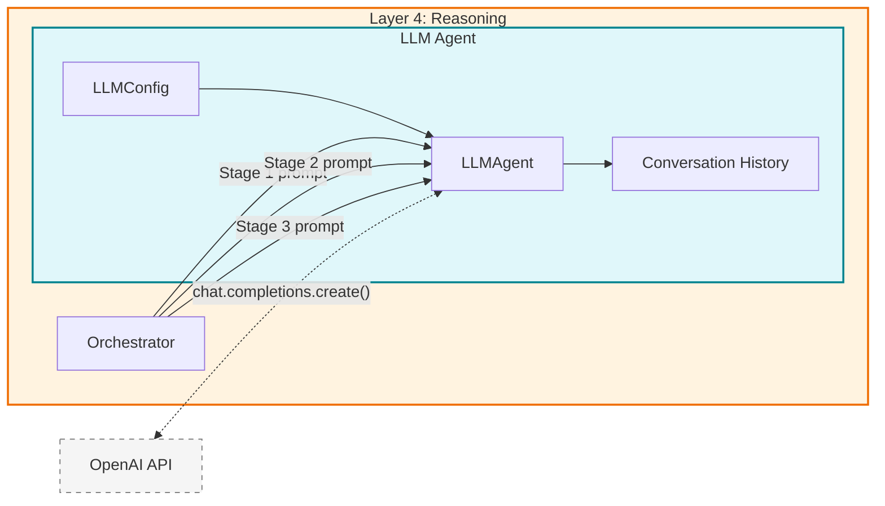

# LLM Agent — The Reasoner

> The **LLM Agent** (`LLMAgent`) is the reasoning engine of S-GraphLLM's Reasoning Layer. It wraps the OpenAI API behind a stateful interface that manages conversation history, constructs task-specific prompts, and provides specialized methods for entity extraction, relationship extraction, question answering, and multi-hop reasoning over knowledge graphs. The orchestrator calls `LLMAgent.reason()` at each of the three hierarchical reasoning stages — coarse-grained analysis, fine-grained multi-hop reasoning, and answer synthesis — making it the component where natural language understanding meets graph-structured evidence. The agent's design follows the **LLM-as-reasoner** paradigm established by Brown, T., et al. (2020), "Language Models are Few-Shot Learners," and the **chain-of-thought prompting** strategy from Wei, J., et al. (2022), "Chain-of-Thought Prompting Elicits Reasoning in Large Language Models."
>
> **See also**: [README.md — Key Components](../../../README.md), [Component Guide — § 4.5](../../component_guide.md), [Hierarchical Reasoning Theory](../../hierarchical_reasoning_theory.md).

---

## Architecture Overview

The LLM Agent sits within **Layer 4 (Reasoning Layer)** of the S-GraphLLM stack: **Scalability → Neural → Reasoning → Output**. It is a service component — it does not manage graph data or orchestration logic. Instead, it receives prompts from the `HierarchicalReasoningOrchestrator` and returns natural language reasoning results.



The agent maintains a **conversation history** that can optionally be included in subsequent calls, enabling multi-turn reasoning sessions where the LLM can reference its own prior analysis. However, in the current orchestrator pipeline, each stage call uses `include_history=False` (default), keeping the three stages independent.

---

## Components Breakdown

### 1. `LLMConfig` — The Configuration Container

* **Location**: `src/agents/llm_agent.py`, lines 15–22
* **Purpose**: A dataclass that encapsulates all configuration parameters for the LLM agent. Separating configuration from behavior follows the **configuration-as-data** pattern, allowing different agent instances with different settings without modifying code.
* **Paper Reference**: Configuration of LLM parameters (temperature, top-p, max tokens) follows best practices from Brown, T., et al. (2020), NeurIPS, where generation hyperparameters significantly affect reasoning quality.

#### The Design

`LLMConfig` is a `@dataclass` with five fields that map directly to OpenAI API parameters and `configs/model_config.yaml` keys:

| Field | Type | Default | YAML Key | OpenAI API Parameter |
|-------|------|---------|----------|---------------------|
| `model` | `str` | `"gpt-4.1-mini"` | `model_name` | `model` |
| `temperature` | `float` | `0.7` | `temperature` | `temperature` |
| `max_tokens` | `int` | `2000` | `context_window` | `max_tokens` |
| `top_p` | `float` | `0.9` | — | `top_p` |
| `api_key` | `Optional[str]` | `None` | — | Constructor arg for `OpenAI(api_key=...)` |

#### Plain English Input / Output

* **Input**: Created by the caller — typically `src/main.py` (lines 147–151) which maps `Config` fields to `LLMConfig` fields:

```python
llm_config = LLMConfig(
    model=config.model_name,         # "gpt-4.1-mini"
    temperature=config.temperature,   # 0.7
    max_tokens=config.context_window  # 4096
)
```

* **Output**: Consumed by `LLMAgent.__init__()` to configure the OpenAI client and set generation parameters.
* **Side Effects / State**: None — pure configuration data.

#### Python Perspective

```python
from dataclasses import dataclass
from typing import Optional

@dataclass
class LLMConfig:
    """Configuration for LLM agent."""
    model: str = "gpt-4.1-mini"         # str — OpenAI model identifier
    temperature: float = 0.7             # float in [0, 2] — sampling randomness
    max_tokens: int = 2000               # int — maximum response length
    top_p: float = 0.9                   # float in [0, 1] — nucleus sampling threshold
    api_key: Optional[str] = None        # Optional[str] — if None, reads OPENAI_API_KEY env var
```

---

### 2. `LLMAgent` — The Reasoning Engine

* **Location**: `src/agents/llm_agent.py`, lines 25–280
* **Purpose**: Wraps the OpenAI API with conversation history management, specialized prompt templates for graph reasoning tasks, and error handling. It is the **single interface** through which the orchestrator interacts with the language model.
* **Paper Reference**: Implements the LLM-as-reasoner paradigm from Brown, T., et al. (2020), "Language Models are Few-Shot Learners," NeurIPS; the chain-of-thought approach from Wei, J., et al. (2022), "Chain-of-Thought Prompting Elicits Reasoning in Large Language Models," NeurIPS; and the deliberate problem-solving strategy from Yao, S., et al. (2023), "Tree of Thoughts: Deliberate Problem Solving with Large Language Models."

#### The Design

The LLM Agent follows a **stateful wrapper** pattern:

1. **Initialization**: Creates an `OpenAI` client with the configured API key and model parameters.
2. **Reasoning**: Constructs a messages array (system prompt + optional history + user prompt), sends it to the API, and appends the exchange to conversation history.
3. **History Management**: Maintains a rolling window of the last 20 messages (10 exchanges) to keep context manageable.
4. **Specialized Methods**: Provides task-specific prompt templates for entity extraction, relationship extraction, question answering, and multi-hop reasoning.

The conversation flow follows the OpenAI Chat Completions format:

$$\text{messages} = [\text{system}\_\text{prompt},\; (\text{history}),\; \text{user}\_\text{prompt}] \xrightarrow{\text{API}} \text{response}$$

#### Plain English Input / Output

* **Input** (constructor): An `LLMConfig` instance.
* **Input** (`reason()`): A `prompt` string, an optional `system_prompt`, and an `include_history` boolean.
* **Output** (`reason()`): The LLM's response as a string.
* **Side Effects / State**:
  - `self.conversation_history` (`List[Dict[str, str]]`, line 47): Accumulates user/assistant message pairs. Capped at 20 entries (line 116–117).
  - `self.client` (`OpenAI`, line 44): The OpenAI API client instance.
  - `self.config` (`LLMConfig`, line 37): Stored configuration.

#### Python Perspective

```python
from src.agents.llm_agent import LLMAgent, LLMConfig

# Initialize with configuration
config = LLMConfig(model="gpt-4.1-mini", temperature=0.7, max_tokens=2000)
agent = LLMAgent(config)
# agent.client: OpenAI — initialized with api_key from config or OPENAI_API_KEY env var
# agent.conversation_history: List[Dict[str, str]] — initially []

# Core reasoning
response = agent.reason(
    prompt="Analyze this graph structure...",         # str — the reasoning task
    system_prompt=None,                               # Optional[str] — uses default if None
    include_history=False                             # bool — whether to include prior exchanges
)
# response: str — "Based on the graph structure, I can identify..."

# Specialized methods
entities = agent.extract_entities("Albert Einstein developed relativity.")
# entities: List[str] — ["Albert Einstein", "relativity"]

relationships = agent.extract_relationships("Einstein worked at Princeton.")
# relationships: List[Dict[str, str]] — [{"source": "Einstein", "relationship": "worked at", "target": "Princeton"}]

answer = agent.answer_question("Who developed relativity?", context="Einstein developed...")
# answer: str — "Albert Einstein developed the theory of relativity."

multi_hop = agent.multi_hop_reasoning("How are A and C connected?", graph_context="...", max_hops=3)
# multi_hop: str — "Hop 1: A -> B via 'works_with'. Hop 2: B -> C via 'advises'. ..."
```

#### Internal Method Walkthrough

##### 2.1. `__init__(self, config)` — lines 30–49

Initializes the LLM agent with the provided configuration.

**Step-by-step**:
1. Stores the config (line 37): `self.config = config`.
2. Resolves the API key (line 40): `api_key = config.api_key or os.getenv("OPENAI_API_KEY")`. Raises `ValueError` if no key is found (lines 41–42).
3. Creates the OpenAI client (line 44): `self.client = OpenAI(api_key=api_key)`.
4. Initializes empty conversation history (line 47): `self.conversation_history: List[Dict[str, str]] = []`.

##### 2.2. `reason(self, prompt, system_prompt, include_history)` — lines 51–124

**The core reasoning method**. Called by the orchestrator at each of the three reasoning stages.

**Step-by-step**:
1. **Build messages array** (lines 68–90):
   - Start with an empty list (line 68).
   - Add system prompt (lines 70–80): If `system_prompt` is provided, use it; otherwise call `_get_default_system_prompt()`.
   - If `include_history=True`, extend with `self.conversation_history` (lines 83–84).
   - Append the current user prompt (lines 87–90).

2. **Call OpenAI API** (lines 92–100):
   ```python
   response = self.client.chat.completions.create(
       model=self.config.model,
       messages=messages,
       temperature=self.config.temperature,
       max_tokens=self.config.max_tokens,
       top_p=self.config.top_p
   )
   ```

3. **Extract response** (line 103): `answer = response.choices[0].message.content`.

4. **Update conversation history** (lines 106–113): Appends both the user prompt and the assistant response as separate entries.

5. **Trim history** (lines 116–117): If history exceeds 20 entries, keeps only the last 20: `self.conversation_history = self.conversation_history[-20:]`.

6. **Error handling** (lines 122–124): Catches all exceptions, logs them, and re-raises. This allows the orchestrator to handle failures at its level.

**How `include_history` affects behavior**: When `False` (default), the LLM sees only the system prompt and the current user prompt — each call is independent. When `True`, the LLM also receives all prior exchanges (up to 20), enabling multi-turn reasoning where it can reference its own earlier analysis.

##### 2.3. `batch_reason(self, prompts, system_prompt)` — lines 126–146

Processes multiple prompts sequentially, each as an independent `reason()` call (no shared history).

**Step-by-step**:
1. Iterates over `prompts` (line 142).
2. Calls `self.reason(prompt, system_prompt=system_prompt, include_history=False)` for each (line 143).
3. Collects and returns all responses (lines 141, 144, 146).

**Note**: This is sequential, not parallel. True parallel batching would require async API calls.

##### 2.4. `extract_entities(self, text)` — lines 148–166

Extracts named entities from text using a specialized prompt.

**Prompt template**:

```
Extract all named entities (people, places, organizations, etc.) from the 
following text. Return them as a comma-separated list.

Text: {text}

Entities:
```

**Step-by-step**:
1. Constructs the entity extraction prompt (lines 158–162).
2. Calls `self.reason(prompt, include_history=False)` (line 164).
3. Parses the response by splitting on commas and stripping whitespace (line 165).

**Returns**: `List[str]` — e.g., `["Albert Einstein", "Princeton University", "Nobel Prize"]`.

##### 2.5. `extract_relationships(self, text)` — lines 168–198

Extracts relationships between entities using a structured prompt.

**Prompt template**:

```
Extract all relationships from the following text. For each relationship, 
provide the source entity, relationship type, and target entity in the format: 
source -> [relationship] -> target

Text: {text}

Relationships:
```

**Step-by-step**:
1. Constructs the relationship extraction prompt (lines 178–182).
2. Calls `self.reason(prompt, include_history=False)` (line 184).
3. Parses each line containing `"->"` (lines 188–197):
   - Splits on `"->"` to get 3 parts.
   - Creates a dictionary with `source`, `relationship`, and `target` keys.

**Returns**: `List[Dict[str, str]]` — e.g., `[{"source": "Einstein", "relationship": "worked at", "target": "Princeton"}]`.

##### 2.6. `answer_question(self, question, context)` — lines 200–225

Answers a question based on provided context, with a safeguard for missing information.

**Prompt template**:

```
Based on the following context, answer the question. If the answer cannot be 
found in the context, say "I don't know".

Context:
{context}

Question: {question}

Answer:
```

**Step-by-step**:
1. Constructs the QA prompt (lines 215–222).
2. Calls `self.reason(prompt, include_history=False)` (line 224).

**Returns**: `str` — the answer or "I don't know".

##### 2.7. `multi_hop_reasoning(self, question, graph_context, max_hops)` — lines 227–259

**Critical for Stage 2 of the hierarchical pipeline**. Performs multi-hop reasoning over graph context, asking the LLM to trace paths through the graph.

**Prompt template**:

```
Perform multi-hop reasoning to answer the following question. Show your 
reasoning step by step, considering up to {max_hops} hops through the graph.

Graph Context:
{graph_context}

Question: {question}

Please provide:
1. The reasoning path(s) through the graph
2. Intermediate conclusions at each hop
3. The final answer

Reasoning:
```

**Step-by-step**:
1. Constructs the multi-hop reasoning prompt (lines 244–256), incorporating `max_hops` to guide the depth of reasoning.
2. Calls `self.reason(prompt, include_history=False)` (line 258).

**Returns**: `str` — a structured reasoning trace with paths, intermediate conclusions, and the final answer.

**Paper reference**: The multi-hop structure follows Lin, X. V., et al. (2018), "Multi-Hop Knowledge Graph Reasoning with Reward Shaping," EMNLP, adapted for LLM-based reasoning.

##### 2.8. `clear_history(self)` — lines 261–264

Resets the conversation history to an empty list.

**Step-by-step**:
1. Sets `self.conversation_history = []` (line 263).
2. Logs the action (line 264).

**Use case**: Called between independent reasoning sessions to prevent context leakage.

##### 2.9. `_get_default_system_prompt(self)` — lines 266–279

Returns the default system prompt that defines the agent's persona and reasoning behavior.

**Full prompt text**:

```
You are an expert AI assistant specialized in reasoning over knowledge graphs. 
Your task is to answer questions by analyzing graph structures, identifying 
relevant entities and relationships, and performing multi-hop reasoning when 
necessary. 

When reasoning:
1. Identify the relevant entities and relationships in the graph
2. Trace paths through the graph to find connections
3. Consider multiple possible paths and relationships
4. Provide clear, step-by-step reasoning
5. State your confidence in the answer

Be precise, logical, and thorough in your reasoning.
```

**Design rationale**: The system prompt establishes the agent as a **graph reasoning specialist** rather than a general assistant. The five-point reasoning framework guides the LLM to produce structured, traceable outputs. Point 5 (confidence) aligns with the synthesis stage's confidence scoring goal.

---

## Helper / Utility Functions

The LLM Agent has minimal external dependencies, operating primarily through the OpenAI API:

| Dependency | Location | Description |
|------------|----------|-------------|
| `OpenAI` | `openai` package (line 10) | The OpenAI Python client for API interaction |
| `os.getenv()` | `os` module (line 40) | Reads the `OPENAI_API_KEY` environment variable as fallback |
| `logging.getLogger()` | `logging` module (line 12) | Logger for debug/error messages |

The agent does not import any S-GraphLLM utility functions — it is intentionally decoupled from the graph processing pipeline to maintain the separation between **reasoning** (LLM Agent) and **orchestration** (Orchestrator).

---

## Configuration

The LLM Agent is configured through `LLMConfig` (`src/agents/llm_agent.py`, lines 15–22), which maps to `configs/model_config.yaml` keys via `src/main.py`:

| `LLMConfig` Field | `Config` Field | YAML Key | Default | Effect on Agent Behavior |
|-------------------|---------------|----------|---------|-------------------------|
| `model` | `model_name` (line 39) | `model_name` | `"gpt-4.1-mini"` | Which LLM model processes the prompts |
| `temperature` | `temperature` (line 54) | `temperature` | `0.7` | Higher values produce more diverse/creative responses; lower values produce more deterministic reasoning |
| `max_tokens` | `context_window` (line 53) | `context_window` | `4096` (`LLMConfig` default: `2000`) | Maximum number of tokens in the LLM response |
| `top_p` | — | — | `0.9` | Nucleus sampling: only consider tokens in the top 90% probability mass |
| `api_key` | — | — | `None` (env var) | OpenAI API key; if `None`, reads `OPENAI_API_KEY` from environment |

### Configuration mapping in `src/main.py` (lines 147–152):

```python
llm_config = LLMConfig(
    model=config.model_name,          # Config.model_name → LLMConfig.model
    temperature=config.temperature,    # Config.temperature → LLMConfig.temperature
    max_tokens=config.context_window   # Config.context_window → LLMConfig.max_tokens
)
llm_agent = LLMAgent(llm_config)
```

### Conversation History Limits

The agent enforces a hard limit of 20 entries (10 exchanges) in `conversation_history` (line 116–117). This prevents unbounded memory growth during long reasoning sessions while keeping enough context for multi-turn reasoning.

---

## Cross-References

### Within Reasoning Layer

- [**Hierarchical Reasoning Orchestrator — The Conductor**](orchestrator.md) — The primary consumer that calls `reason()` at each of the three stages.
- [**Reasoning Layer Integration**](layer_integration.md) — How the LLM Agent connects to the orchestrator and the data flows across stages.

### Upstream Layers

- [**Scalability Layer Integration**](../scalability_layer/layer_integration.md) — The Scalability Layer produces the data (coarse graph, subgraphs) that the orchestrator formats into prompts for the LLM Agent.
- [**Neural Layer Integration**](../neural_layer/engine_integration.md) — The Neural Layer produces embeddings (Connections C, D, E) intended to enrich the LLM Agent's context in Stage 2.

### Theory and Architecture

- [**Hierarchical Reasoning Theory**](../../hierarchical_reasoning_theory.md) — Theoretical foundation for the coarse-to-fine reasoning that the LLM Agent executes.
- [**Component Guide — § 4.5**](../../component_guide.md) — High-level description of the LLM Agent component.
- [**Architecture Diagram — Layer 4**](../../architecture_diagram.md) — Shows the LLM Agent's connections to all three reasoning stages.
- [**README.md — Architecture Overview**](../../../README.md) — High-level pipeline and LLM backend comparison (OpenAI API vs. fine-tuned LLaMA-2).

---

**Document Version**: 1.0
**Last Updated**: February 2026
**Primary Source**: `src/agents/llm_agent.py` (280 lines)
