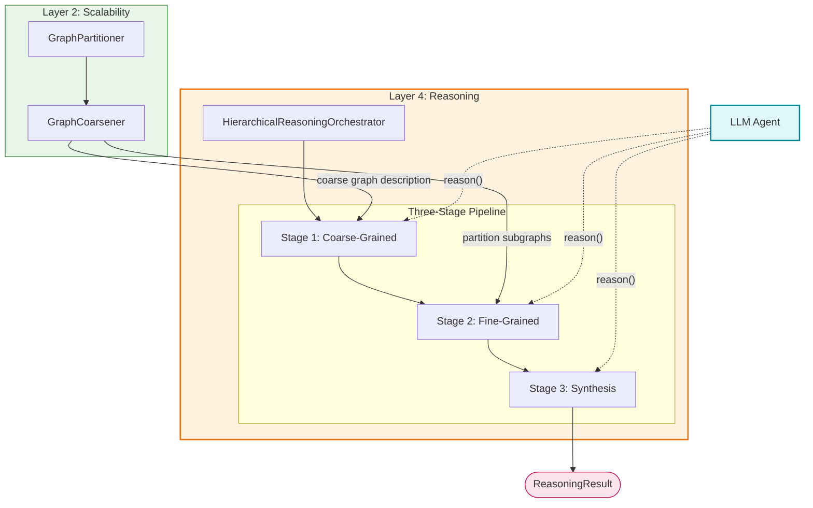

# Hierarchical Reasoning Orchestrator — The Conductor

> The **Hierarchical Reasoning Orchestrator** (`HierarchicalReasoningOrchestrator`) is the central coordination component of the Reasoning Layer in S-GraphLLM. It implements a **three-stage coarse-to-fine reasoning pipeline** — Coarse-Grained Reasoning → Fine-Grained Reasoning → Answer Synthesis — that progressively narrows focus from the entire graph down to specific nodes and relationships, guided by an LLM agent. Inspired by the cognitive science principle that human reasoning naturally operates at multiple levels of abstraction (Collins & Quillian, 1969), the orchestrator acts as a **facade** that hides the complexity of graph partitioning, coarsening, subgraph extraction, and prompt engineering behind a single `reason()` call. It consumes outputs from the **Scalability Layer** (coarse graph and partition subgraphs) and, in the intended full integration, from the **Neural Layer** (node embeddings, structural embeddings, and attention weights) to produce a `ReasoningResult` containing the final answer, confidence score, and complete reasoning trace.
>
> **See also**: [README.md — Hierarchical Reasoning](../../../README.md), [Component Guide — § 4.1–4.4](../../component_guide.md), [Hierarchical Reasoning Theory](../../hierarchical_reasoning_theory.md).

---

## Architecture Overview

The Orchestrator sits at the heart of **Layer 4 (Reasoning Layer)** in the S-GraphLLM four-layer stack: **Scalability → Neural → Reasoning → Output**. It bridges the upstream data-preparation layers and the downstream output by coordinating three sequential reasoning stages, each of which calls the LLM Agent with a carefully constructed prompt.



The orchestrator instantiates `GraphPartitioner` and `GraphCoarsener` during initialization, runs partitioning and coarsening during `setup()`, and then executes the three-stage pipeline on every call to `reason()`. This makes it the **single entry point** for any code that needs to ask a question over a large knowledge graph.

---

## Components Breakdown

### 1. `ReasoningResult` — The Pipeline Output Container

* **Location**: `src/agents/orchestrator.py`, lines 21–30
* **Purpose**: A frozen dataclass that captures the complete output of a single hierarchical reasoning invocation. Every field is populated during one of the three stages, giving downstream consumers (and human inspectors) full visibility into the reasoning process.
* **Paper Reference**: This structure embodies the multi-stage output trace recommended by Wang, G., et al. (2025), "Hierarchical Reasoning Model," arXiv:2506.21734, where each reasoning level produces an intermediate result that feeds into the next.

#### The Design

`ReasoningResult` is a Python `@dataclass` with seven fields, each corresponding to a specific phase of the pipeline:

| Field | Type | Populated During | Description |
|-------|------|------------------|-------------|
| `query` | `str` | Initialization | The original natural language question |
| `coarse_reasoning` | `str` | Stage 1 | LLM's analysis of the coarse graph — which partitions are relevant and why |
| `selected_partitions` | `List[int]` | Stage 1 | IDs of partitions selected for detailed analysis |
| `fine_grained_reasoning` | `str` | Stage 2 | LLM's multi-hop reasoning over the fine-grained subgraph |
| `final_answer` | `str` | Stage 3 | The synthesized answer combining coarse and fine evidence |
| `confidence` | `float` | Stage 3 | Confidence score in $[0, 1]$ for the final answer |
| `reasoning_steps` | `List[str]` | All stages | Ordered log of what happened at each step of the pipeline |

#### Plain English Input / Output

* **Input**: `ReasoningResult` is not created by external callers — it is assembled inside `reason()` (lines 201–209) from the outputs of all three stages.
* **Output**: An immutable record of the entire reasoning session. Example:

```python
ReasoningResult(
    query="What is the relationship between Albert Einstein and the theory of relativity?",
    coarse_reasoning="Partition 3 contains entities related to physics and scientists...",
    selected_partitions=[3, 7],
    fine_grained_reasoning="Albert Einstein (Node 42) is connected to 'Theory of Relativity' (Node 88) via 'developed' edge...",
    final_answer="Albert Einstein developed the theory of relativity, published in 1905 (special) and 1915 (general).",
    confidence=0.92,
    reasoning_steps=[
        "Generated coarse graph context with 5 partitions",
        "Selected 2 relevant partitions",
        "Completed coarse-grained reasoning",
        "Extracted fine-grained subgraph with 23 nodes",
        "Formatted fine-grained graph context",
        "Completed fine-grained reasoning",
        "Synthesized final answer"
    ]
)
```

* **Side Effects / State**: None. `ReasoningResult` is a pure data container. However, each result is appended to the orchestrator's `reasoning_history` list (line 211).

#### Python Perspective

```python
from dataclasses import dataclass, asdict
from typing import List

@dataclass
class ReasoningResult:
    """Result of hierarchical reasoning."""
    query: str                            # str — the user's question
    coarse_reasoning: str                 # str — LLM output from Stage 1
    selected_partitions: List[int]        # List[int] — partition IDs chosen in Stage 1
    fine_grained_reasoning: str           # str — LLM output from Stage 2
    final_answer: str                     # str — LLM output from Stage 3
    confidence: float                     # float in [0, 1] — confidence from Stage 3
    reasoning_steps: List[str]            # List[str] — ordered log of pipeline steps

# Convert to dictionary for JSON serialization
result_dict = asdict(result)   # used by save_reasoning_history()
```

---

### 2. `HierarchicalReasoningOrchestrator` — The Conductor

* **Location**: `src/agents/orchestrator.py`, lines 33–318
* **Purpose**: Orchestrates the complete hierarchical reasoning pipeline. It is the **facade** that hides all complexity of graph partitioning, coarsening, subgraph extraction, context formatting, prompt construction, and LLM interaction behind a simple `setup()` → `reason()` interface. The calling code (e.g., `src/main.py`, lines 134–167) never needs to know about the three stages or the underlying Scalability Layer.
* **Paper Reference**: Implements the hierarchical reasoning approach from Chai, Z., et al. (2025), *GraphLLM*, IEEE Transactions on Big Data, Section 3, combined with the coarse-to-fine paradigm from Nguyen, B. X., et al. (2022), "Coarse-to-Fine Reasoning for Visual Question Answering," CVPR Workshop, and the cognitive science foundation from Collins, A. M. & Quillian, M. R. (1969), "Retrieval time from semantic memory."

#### The Design

The orchestrator follows a **three-stage coarse-to-fine reasoning pattern**:

1. **Stage 1 — Coarse-Grained Reasoning**: Use the coarse graph $G\_\text{coarse}$ to identify which partitions are most relevant to the query. This stage reduces the search space from the entire graph (potentially billions of nodes) to a handful of partitions.

2. **Stage 2 — Fine-Grained Reasoning**: Extract detailed subgraphs from the selected partitions, format them as rich text context, and have the LLM perform multi-hop reasoning over the evidence.

3. **Stage 3 — Answer Synthesis**: Combine the coarse-grained context and fine-grained evidence into a final answer with a confidence score.

This mirrors the cognitive science principle of **spreading activation** in semantic networks: start with a broad activation pattern (coarse), focus on the most promising regions (fine), and synthesize a coherent response (synthesis).

**Complexity reduction**:

$$\text{Without hierarchy}: O(|V| \cdot |E|) \quad \xrightarrow{\text{partitioning}} \quad \text{With hierarchy}: O\!\left(k \cdot |E_c| + k' \cdot \frac{|V| + |E|}{k}\right)$$

where $k$ is the number of partitions, $|E_c|$ is the number of coarse edges, and $k'$ is the number of selected partitions ($k' \ll k$).

#### Plain English Input / Output

* **Input** (constructor): A NetworkX graph `graph`, a `Config` object `config`, and optional `node_features` dictionary.
* **Input** (`reason()`): A natural language `query` string and an `LLMAgent` instance.
* **Output** (`reason()`): A `ReasoningResult` containing the final answer, confidence, and complete reasoning trace.
* **Side Effects / State**: The orchestrator maintains mutable state:
  - `self.partitions` (`Dict[int, set]`, line 63) — partition assignments after `setup()`
  - `self.coarse_graph` (`nx.Graph`, line 64) — the coarsened graph after `setup()`
  - `self.reasoning_history` (`List[ReasoningResult]`, line 65) — accumulates results from each `reason()` call

#### Python Perspective

```python
import networkx as nx
from src.agents.orchestrator import HierarchicalReasoningOrchestrator
from src.agents.llm_agent import LLMAgent, LLMConfig
from src.utils import Config

# Create a knowledge graph
graph = nx.karate_club_graph()                        # nx.Graph — 34 nodes, 78 edges
node_features = {n: {"description": f"Node {n}"} for n in graph.nodes()}

# Configure and initialize
config = Config(max_nodes_per_partition=10, max_hops=3)
orchestrator = HierarchicalReasoningOrchestrator(
    graph=graph,                                       # nx.Graph
    config=config,                                     # Config
    node_features=node_features                        # Dict[int, Dict]
)

# Set up (partitioning + coarsening)
orchestrator.setup()
# orchestrator.partitions: Dict[int, set] — e.g., {0: {0, 1, 2, ...}, 1: {10, 11, ...}, ...}
# orchestrator.coarse_graph: nx.Graph — super-nodes representing partitions

# Initialize the LLM agent
llm_agent = LLMAgent(LLMConfig(model="gpt-4.1-mini", temperature=0.7))

# Perform hierarchical reasoning
result = orchestrator.reason("Who is the most connected person?", llm_agent)
# result.final_answer: str — "Node 33 is the most connected with degree 17..."
# result.confidence: float — 0.8
# result.reasoning_steps: List[str] — 7 entries tracking the pipeline
```

#### Internal Method Walkthrough

##### 2.1. `__init__(self, graph, config, node_features)` — lines 38–65

Initializes the orchestrator with the input graph, configuration, and optional node features.

**Step-by-step**:
1. Stores `graph` (line 52), `config` (line 53), and `node_features` (line 54, defaults to `{}`).
2. Creates a `GraphPartitioner` instance (lines 57–59) from `src/graph_processing/partitioner.py`, configured with `config.max_nodes_per_partition`.
3. Creates a `GraphCoarsener` instance (line 60) from `src/graph_processing/coarsener.py`.
4. Initializes state variables:
   - `self.partitions: Optional[Dict[int, set]] = None` (line 63) — populated by `setup()`
   - `self.coarse_graph: Optional[nx.Graph] = None` (line 64) — populated by `setup()`
   - `self.reasoning_history: List[ReasoningResult] = []` (line 65) — accumulates reasoning results

##### 2.2. `setup(self)` — lines 67–98

**Bridge to the Scalability Layer**. Partitions the graph and creates the coarse graph. Must be called before `reason()`.

**Step-by-step**:
1. **Compute number of partitions** (lines 72–77): If `config.num_partitions` is `None`, auto-computes as `max(1, len(graph.nodes()) // config.max_nodes_per_partition)`.
2. **Partition the graph** (lines 79–83): Calls `self.partitioner.partition_graph(graph, num_partitions, method="metis_like")` — this delegates to `GraphPartitioner.partition_graph()` in `src/graph_processing/partitioner.py`.
3. **Create the coarse graph** (lines 88–92): Calls `self.coarsener.coarsen_graph(graph, partitions, node_features)` — this delegates to `GraphCoarsener.coarsen_graph()` in `src/graph_processing/coarsener.py`.
4. **Log partition statistics** (lines 97–98): Calls `self.partitioner.get_partition_stats()` for diagnostics.

##### 2.3. `reason(self, query, llm_agent)` — lines 100–214

**The main reasoning pipeline**. This is the most important method — it implements the three-stage hierarchical reasoning process.

**Step-by-step**:

1. **Validation** (lines 117–118): Checks that `setup()` has been called by verifying `self.coarse_graph is not None`.

2. **Stage 1: Coarse-Grained Reasoning** (lines 122–148):
   - Gets a text description of the coarse graph by calling `self.coarsener.get_coarse_graph_description()` (line 124) — this produces a formatted string describing partition contents and inter-partition connections.
   - Extracts keywords from the query via simple whitespace splitting (line 128): `query_keywords = query.lower().split()`.
   - Finds relevant partitions by calling `self.coarsener.find_relevant_partitions(query_keywords, node_features, top_k)` (lines 131–135) — this performs keyword-based matching against partition contents.
   - Constructs the coarse reasoning prompt by calling `_create_coarse_reasoning_prompt()` (lines 141–145).
   - Sends the prompt to the LLM by calling `llm_agent.reason(coarse_prompt)` (line 147).

3. **Stage 2: Fine-Grained Reasoning** (lines 150–186):
   - Extracts the subgraph for selected partitions by calling `self.coarsener.get_subgraph_for_partitions(graph, selected_partition_ids, include_neighbors=True)` (lines 154–158).
   - Builds node and edge lists (lines 163–173), limiting to 50 nodes and 100 edges for context window management.
   - Formats the graph context by calling `format_graph_context(nodes_list, edges_list)` from `src/utils.py`, lines 190–224.
   - Constructs the fine reasoning prompt by calling `_create_fine_reasoning_prompt()` (lines 179–183).
   - Sends the prompt to the LLM by calling `llm_agent.reason(fine_prompt)` (line 185).

4. **Stage 3: Answer Synthesis** (lines 188–213):
   - Constructs the synthesis prompt by calling `_create_synthesis_prompt()` (lines 191–195), combining the coarse and fine reasoning results.
   - Sends the prompt to the LLM by calling `llm_agent.reason(synthesis_prompt)` (line 197).
   - Assembles the `ReasoningResult` (lines 201–209), setting `confidence=0.8` as a placeholder.
   - Appends the result to `self.reasoning_history` (line 211).

##### 2.4. `_create_coarse_reasoning_prompt(self, query, coarse_context, selected_partitions)` — lines 216–233

Constructs the **Stage 1 prompt**. This prompt provides the LLM with the coarse graph description and asks it to analyze which partitions are most relevant.

**Full prompt template**:

```
Given the following query and coarse-grained graph structure, identify which 
partitions are most relevant for answering the query.

Query: {query}

{coarse_context}

Selected partitions for detailed analysis: {selected_partitions}

Please analyze the query and explain which partitions contain the most relevant 
information for answering it. Provide your reasoning step by step.
```

**Design rationale**: The prompt supplies both the query and a structured summary of the coarse graph (generated by `GraphCoarsener.get_coarse_graph_description()`). The pre-selected partitions (from keyword matching) are included so the LLM can validate or refine the selection. The step-by-step instruction encourages chain-of-thought reasoning.

##### 2.5. `_create_fine_reasoning_prompt(self, query, coarse_reasoning, fine_context)` — lines 235–254

Constructs the **Stage 2 prompt**. This prompt provides the LLM with both the coarse analysis (from Stage 1) and the detailed graph structure (from subgraph extraction) to perform multi-hop reasoning.

**Full prompt template**:

```
Based on the coarse-grained analysis and the detailed graph structure below, 
perform multi-hop reasoning to answer the query.

Query: {query}

Coarse-grained Analysis:
{coarse_reasoning}

Detailed Graph Structure:
{fine_context}

Please perform detailed reasoning over the graph to answer the query. Consider 
all relevant paths and relationships. Provide step-by-step reasoning.
```

**Design rationale**: By including the coarse reasoning, the LLM has context about *why* these specific nodes were selected, helping it focus on the most promising reasoning paths. The fine context (from `format_graph_context()`) provides node descriptions and edge relationships. The multi-hop instruction aligns with Wei, J., et al. (2022), "Chain-of-Thought Prompting."

##### 2.6. `_create_synthesis_prompt(self, query, coarse_reasoning, fine_reasoning)` — lines 256–275

Constructs the **Stage 3 prompt**. This prompt combines the coarse-grained and fine-grained reasoning into a synthesis request with confidence scoring.

**Full prompt template**:

```
Based on the hierarchical reasoning process, synthesize a final answer to the query.

Query: {query}

Coarse-grained Reasoning:
{coarse_reasoning}

Fine-grained Reasoning:
{fine_reasoning}

Please provide a clear, concise final answer to the query, synthesizing the 
insights from both the coarse and fine-grained reasoning stages. Also provide 
a confidence score (0-1) for your answer.
```

**Design rationale**: The synthesis prompt presents both levels of analysis to the LLM, asking for a unified answer. The confidence score request enables downstream systems to filter or flag uncertain answers. Currently, the orchestrator uses a placeholder `confidence=0.8` (line 207) rather than parsing the LLM's confidence from the response — this is a future improvement point.

##### 2.7. `get_reasoning_trace(self, index)` — lines 277–291

Returns the reasoning trace for a specific query as a dictionary.

**Step-by-step**:
1. Validates that `reasoning_history` is not empty (lines 287–288).
2. Retrieves the result at the given `index` (default `-1` for most recent) (line 290).
3. Converts the `ReasoningResult` dataclass to a dictionary using `dataclasses.asdict()` (line 291).

**Called by**: External consumers needing to inspect reasoning traces programmatically.

##### 2.8. `save_reasoning_history(self, output_path)` — lines 293–298

Serializes the complete reasoning history to a JSON file.

**Step-by-step**:
1. Converts all `ReasoningResult` instances to dictionaries using `asdict()` (line 295).
2. Writes the list as JSON to `output_path` (lines 296–297).

**Called by**: `src/main.py`, line 174: `orchestrator.save_reasoning_history(str(output_path))`.

##### 2.9. `get_partition_info(self, partition_id)` — lines 300–317

Returns diagnostic information about a specific partition.

**Step-by-step**:
1. Validates that `setup()` has been called (lines 302–303).
2. Validates that the requested partition exists (lines 305–306).
3. Extracts the node set and computes subgraph statistics (lines 308–316):
   - `num_nodes`: number of nodes in the partition
   - `num_edges`: number of edges in the partition subgraph
   - `avg_degree`: average node degree within the partition
   - `sample_nodes`: first 10 node IDs for inspection

**Returns**: A dictionary with keys `partition_id`, `num_nodes`, `num_edges`, `avg_degree`, `sample_nodes`.

---

## Helper / Utility Functions

The orchestrator depends on the following helper functions from other modules:

| Function | Location | Called From | Description |
|----------|----------|-------------|-------------|
| `format_graph_context()` | `src/utils.py`, lines 190–224 | `reason()`, line 175 | Formats a list of nodes and edges into a text string suitable for LLM context. Truncates at `max_length=2000` characters. |
| `Config` | `src/utils.py`, lines 35–74 | `__init__()`, line 53 | Pydantic `BaseModel` that holds all system configuration, including graph partitioning and reasoning parameters. |
| `GraphPartitioner` | `src/graph_processing/partitioner.py` | `__init__()`, lines 57–59 | Partitions the input graph using METIS-like spectral clustering. |
| `GraphCoarsener` | `src/graph_processing/coarsener.py` | `__init__()`, line 60 | Creates the coarse graph and provides methods for partition description, relevance matching, and subgraph extraction. |

### `format_graph_context()` — Detail

This utility (lines 190–224 in `src/utils.py`) converts structured node/edge data into a text format the LLM can consume:

```
Graph Context:
Nodes:
- Node 42: Albert Einstein was a physicist...
- Node 88: Theory of relativity is a framework...
...

Relationships:
- 42 --[related]--> 88
- 88 --[related]--> 95
...
```

The function enforces a `max_length` limit (default 2000 characters) by truncating with `"...\n"` when the accumulated text exceeds the threshold. This prevents context window overflow when partitions contain many nodes.

---

## Configuration

The orchestrator's behavior is controlled through the `Config` class (`src/utils.py`, lines 35–74) and `configs/model_config.yaml`. The relevant fields are:

### Graph Configuration

| Field | Line (`src/utils.py`) | YAML Key | Default | Effect on Orchestrator |
|-------|----------------------|----------|---------|----------------------|
| `max_nodes_per_partition` | 47 | `max_nodes_per_partition` | `10000` | Maximum nodes per partition; controls `GraphPartitioner` granularity and Stage 2 subgraph size |
| `max_edges_per_partition` | 48 | `max_edges_per_partition` | `50000` | Maximum edges per partition |
| `num_partitions` | 49 | `num_partitions` | `null` (auto) | If `null`, auto-computed as `max(1, num_nodes // max_nodes_per_partition)` in `setup()` (lines 72–77) |

### Reasoning Configuration

| Field | Line (`src/utils.py`) | YAML Key | Default | Effect on Orchestrator |
|-------|----------------------|----------|---------|----------------------|
| `max_hops` | 52 | `max_hops` | `3` | Maximum reasoning hops (used by `LLMAgent.multi_hop_reasoning()`) |
| `context_window` | 53 | `context_window` | `4096` | Maximum context size; indirectly controls `format_graph_context()` truncation |
| `temperature` | 54 | `temperature` | `0.7` | LLM sampling temperature; affects reasoning diversity |
| `top_k` | 55 | `top_k` | `50` | Number of candidates considered during partition selection |

### Model Configuration

| Field | Line (`src/utils.py`) | YAML Key | Default | Effect on Orchestrator |
|-------|----------------------|----------|---------|----------------------|
| `model_name` | 39 | `model_name` | `"gpt-4.1-mini"` | LLM model used by the agent across all three stages |

---

## Cross-References

### Within Reasoning Layer

- [**LLM Agent — The Reasoner**](llm_agent.md) — The reasoning engine called by the orchestrator at each of the three stages.
- [**Reasoning Layer Integration**](layer_integration.md) — How the orchestrator and LLM agent connect to each other and to upstream layers.

### Upstream Layers

- [**Graph Partitioner**](../scalability_layer/graph_partitioner.md) — Produces the partitions consumed by `setup()`.
- [**Graph Coarsener**](../scalability_layer/graph_coarsener.md) — Produces the coarse graph consumed by Stage 1 and provides subgraph extraction for Stage 2.
- [**Scalability Layer Integration**](../scalability_layer/layer_integration.md) — How the Scalability Layer prepares data for the Reasoning Layer.

### Neural Layer (Intended Integration)

- [**Node Encoder-Decoder (Semantic Engine)**](../neural_layer/engine_node_encoder_decoder.md) — Produces node embeddings $H_i$ intended for Stage 2 context enrichment.
- [**Graph Transformer (Structural Engine)**](../neural_layer/engine_graph_transformer.md) — Produces structural embeddings $x'$ intended for Stage 2.
- [**Graph-Aware Attention (Focus Engine)**](../neural_layer/engine_graph_aware_attention.md) — Produces attention weights $\alpha'$ intended for Stage 2 LLM modulation.
- [**Neural Layer Integration**](../neural_layer/engine_integration.md) — Documents Connections C, D, and E from the Neural Layer to Stage 2.

### Theory and Architecture

- [**Hierarchical Reasoning Theory**](../../hierarchical_reasoning_theory.md) — Cognitive science foundations, coarse-to-fine paradigm, and complexity analysis.
- [**Component Guide — § 4.1–4.4**](../../component_guide.md) — High-level descriptions of the Reasoning Layer components.
- [**Architecture Diagram — Layer 4**](../../architecture_diagram.md) — Mermaid diagrams showing the three-stage pipeline and LLM Agent connections.
- [**Workflow Diagram**](../../workflow.mermaid) — End-to-end workflow showing the orchestrator's position in the pipeline (lines 24–51).
- [**README.md — Architecture Overview**](../../../README.md) — High-level pipeline diagram and performance targets.

---

**Document Version**: 1.0
**Last Updated**: February 2026
**Primary Source**: `src/agents/orchestrator.py` (318 lines)
