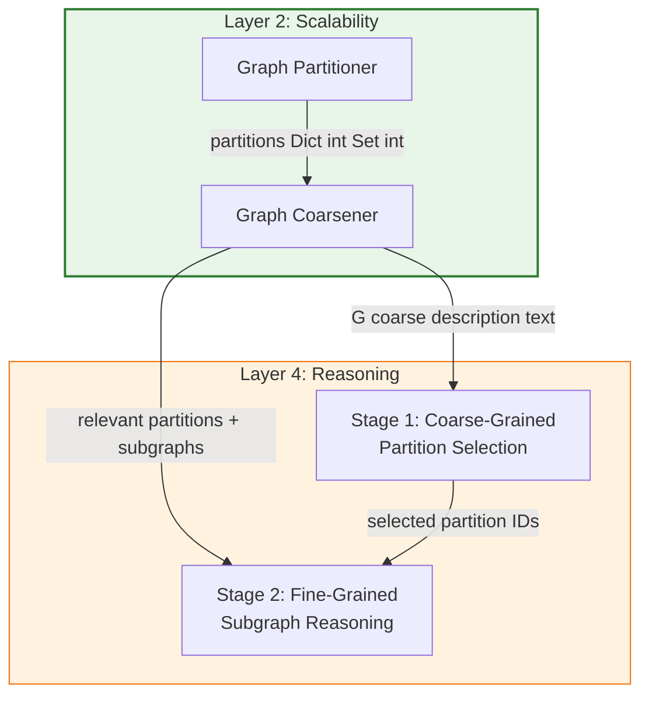

# Graph Coarsener — The Summarize Engine

> The Graph Coarsener is the **second component** of the S-GraphLLM Scalability Layer (Layer 2). After the Graph Partitioner divides the knowledge graph $G = (V, E)$ into $k$ disjoint partitions $\{P_1, P_2, \ldots, P_k\}$, the Coarsener creates a **coarsened summary graph** $G_\text{coarse} = (V^*, E^*)$ where each super-node $v^*_i$ represents an entire partition $P_i$ and each super-edge encodes inter-partition connectivity. The coarse graph serves as the **bridge to the Reasoning Layer**: its natural-language description is fed to the LLM during Stage 1 (Coarse-Grained Reasoning) for efficient top-level partition selection, and its relevance-scoring and subgraph-extraction methods are used during Stage 2 (Fine-Grained Reasoning) to drill into selected partitions. The coarsening concept draws from the multilevel paradigm of METIS (Karypis & Kumar, 1998) and multilevel graph algorithms (Hendrickson & Leland, 1995).
>
> **See also**: [README.md — Key Components § 3](../../README.md), [Component Guide — § 2.2 Graph Coarsener](../component_guide.md), [Graph Partitioning Theory — Hierarchical Graph Coarsening](../../graph_partitioning_theory.md).

---

## Architecture Overview

Within the S-GraphLLM four-layer stack (**Scalability → Neural → Reasoning → Output**), the Graph Coarsener sits **downstream of the Graph Partitioner** and is the primary interface between the Scalability Layer and the Reasoning Layer. Its outputs fan out in two directions:

1. **To Reasoning Layer Stage 1** — the coarse graph description (natural-language text from `get_coarse_graph_description()`) feeds the LLM prompt for coarse-grained partition selection.
2. **To Reasoning Layer Stage 2** — `find_relevant_partitions()` scores partitions by query relevance, and `get_subgraph_for_partitions()` extracts the fine-grained subgraphs for detailed multi-hop reasoning.



Like the Partitioner, the Coarsener runs once during the **setup phase** (called by the orchestrator's `setup()` method, `src/agents/orchestrator.py`, lines 88–92) and its results are reused for all subsequent queries.

---

## Components Breakdown

### 1. `GraphCoarsener` — Main Coarsening Class

* **Location**: `src/graph_processing/coarsener.py`, lines 14–283
* **Purpose**: Creates and manages the coarsened graph $G_\text{coarse}$, computes per-partition summaries, provides relevance-based partition selection, and extracts fine-grained subgraphs. It is the sole public class in the coarsener module.
* **Paper Reference**: Implements a partition-based coarsening approach inspired by the coarsening phase of the METIS multilevel paradigm: Karypis, G., & Kumar, V. (1998), "A Fast and High Quality Multilevel Scheme for Partitioning Irregular Graphs," *SIAM Journal on Scientific Computing*, 20(1), 359–392. Also draws from Hendrickson, B., & Leland, R. (1995), "A Multilevel Algorithm for Partitioning Graphs," *Supercomputing*.

#### Instance Variables

| Variable | Type | Line | Description |
|----------|------|------|-------------|
| `self.coarse_graph` | `Optional[nx.Graph]` | 22 | The coarsened graph with super-nodes and super-edges. `None` until `coarsen_graph()` is called. |
| `self.partition_mapping` | `Dict[int, Set[int]]` | 23 | Maps coarse node (partition ID) → set of fine-grained node IDs. Copied from the input `partitions` dictionary. |
| `self.node_summaries` | `Dict[int, Dict]` | 24 | Maps coarse node (partition ID) → summary dictionary containing statistics and sample descriptions. |

---

### 2. `__init__` — Initialization

* **Location**: `src/graph_processing/coarsener.py`, lines 20–24
* **Purpose**: Initializes the three internal stores to empty/`None` state. The coarsener is stateless until `coarsen_graph()` is called.

#### Plain English Input / Output

* **Input**: None (no parameters).
* **Output**: A `GraphCoarsener` instance with `self.coarse_graph = None`, `self.partition_mapping = {}`, `self.node_summaries = {}`.
* **Side Effects / State**: Sets all three instance variables to their empty initial state.

#### Python Perspective

```python
from src.graph_processing.coarsener import GraphCoarsener

coarsener = GraphCoarsener()
# coarsener.coarse_graph: Optional[nx.Graph] = None
# coarsener.partition_mapping: Dict[int, Set[int]] = {}
# coarsener.node_summaries: Dict[int, Dict] = {}
```

---

### 3. `coarsen_graph` — Main Coarsening Method

* **Location**: `src/graph_processing/coarsener.py`, lines 26–72
* **Purpose**: The primary public method. Takes the original graph, partition assignments (from the Graph Partitioner), and optional node features, and constructs the coarsened graph $G_\text{coarse}$. Each partition becomes a super-node; edges between partitions become super-edges.

#### The Math

**Super-node definition** — each partition collapses into a single node in the coarse graph:

$$v^*_i = P_i \quad \text{for } i = 1, 2, \ldots, k$$

- $v^*_i$ — the super-node representing partition $P_i$, added to `self.coarse_graph` at line 48.
- $P_i$ — the set of original nodes in partition $i$, from `partitions[partition_id]`.

**Super-edge definition** — two super-nodes are connected if any edge crosses the partition boundary:

$$E^* = \{(v^*_i, v^*_j) \mid \exists\, (u, v) \in E \text{ with } u \in P_i,\; v \in P_j,\; i \neq j\}$$

- $E^*$ — the edge set of $G_\text{coarse}$, built at lines 57–67.
- The implementation uses a `cut_edges_set` (line 57) to deduplicate: edges are stored as sorted tuples `(min(src_partition, dst_partition), max(...))` at line 63.

**Super-edge weight** (the number of cross-partition edges between two partitions):

$$w(v^*_i, v^*_j) = |E(P_i, P_j)| = |\{(u, v) \in E \mid u \in P_i,\; v \in P_j\}|$$

Note: The current implementation at lines 66–67 adds unweighted edges to $G_\text{coarse}$. The weight is implicitly captured by the existence of the edge; an extension could store explicit counts as edge attributes.

#### Plain English Input / Output

* **Input**:
  - `graph: nx.Graph` — the original fine-grained graph (e.g., a 50,000-node Wikidata subgraph).
  - `partitions: Dict[int, Set[int]]` — partition assignments produced by `GraphPartitioner.partition_graph()`. Example: `{0: {0, 1, ..., 9999}, 1: {10000, ..., 19999}, ...}`.
  - `node_features: Optional[Dict[int, Dict]]` (default `None`) — optional dictionary mapping node IDs to feature dictionaries. Each feature dict may contain a `"description"` key with the node's text description.
* **Output**: `nx.Graph` — the coarsened graph with `k` super-nodes and inter-partition edges.
* **Side Effects / State**: Sets `self.partition_mapping = partitions`, creates and stores `self.coarse_graph`, and populates `self.node_summaries` via `_create_partition_summary()` for each partition.

#### Python Perspective

```python
import networkx as nx
from src.graph_processing.partitioner import GraphPartitioner
from src.graph_processing.coarsener import GraphCoarsener

# Step 1: Partition the graph
G = nx.erdos_renyi_graph(1000, 0.01)                # 1000-node random graph
partitioner = GraphPartitioner(max_nodes_per_partition=200)
partitions = partitioner.partition_graph(G, method="metis_like")
# partitions: Dict[int, Set[int]] — 5 partitions

# Step 2: Coarsen the graph
coarsener = GraphCoarsener()
node_features = {i: {"description": f"Entity {i}"} for i in G.nodes()}
G_coarse = coarsener.coarsen_graph(G, partitions, node_features)
# G_coarse: nx.Graph with 5 super-nodes and inter-partition edges
# G_coarse.nodes(): [0, 1, 2, 3, 4]
# G_coarse.edges(): e.g., [(0, 1), (0, 2), (1, 3), ...]
```

#### Internal Method Walkthrough

| Step | Lines | Action |
|------|-------|--------|
| 1 | 43 | Store partition mapping: `self.partition_mapping = partitions`. |
| 2 | 44 | Create a fresh `nx.Graph()` for the coarse graph. |
| 3 | 47–54 | For each partition ID, add a node to `self.coarse_graph` and call `_create_partition_summary()` to compute statistics. |
| 4 | 57–64 | Iterate over all edges in the original graph. For each edge, look up source and destination partitions via `_find_node_partition()`. If they differ, add the sorted pair to `cut_edges_set` to deduplicate. |
| 5 | 66–67 | For each unique cross-partition pair in `cut_edges_set`, add an edge to `self.coarse_graph`. |
| 6 | 69–70 | Log the coarse graph size (nodes and edges). |
| 7 | 72 | Return `self.coarse_graph`. |

---

### 4. `_find_node_partition` — Partition Lookup Helper

* **Location**: `src/graph_processing/coarsener.py`, lines 74–79
* **Purpose**: Given a node ID, finds which partition it belongs to by linear search over the partition mapping. Used internally during edge analysis in `coarsen_graph()`.

#### Plain English Input / Output

* **Input**:
  - `node: int` — the node ID to look up.
  - `partitions: Dict[int, Set[int]]` — the partition mapping.
* **Output**: `Optional[int]` — the partition ID containing the node, or `None` if the node is not in any partition.

#### Internal Method Walkthrough

| Step | Lines | Action |
|------|-------|--------|
| 1 | 76–78 | Iterate over all `(partition_id, nodes)` pairs. If `node in nodes`, return `partition_id`. |
| 2 | 79 | If no partition contains the node, return `None`. |

---

### 5. `_create_partition_summary` — Per-Partition Statistics

* **Location**: `src/graph_processing/coarsener.py`, lines 81–124
* **Purpose**: Computes a comprehensive summary dictionary for a single partition, including node count, edge count, degree statistics, and sample node descriptions. These summaries are stored in `self.node_summaries` and are used by `get_coarse_graph_description()` to build the LLM prompt.

#### The Math

**Partition density** (a measure of how tightly connected the nodes within a partition are):

$$\rho_i = \frac{2 |E(P_i)|}{|P_i| (|P_i| - 1)}$$

- $|E(P_i)|$ — number of internal edges in partition $P_i$, from `len(subgraph.edges())` (line 105).
- $|P_i|$ — number of nodes in the partition, from `len(nodes)` (line 99).

Note: The density formula is not explicitly computed in the current implementation but can be derived from the stored values `num_nodes` and `num_edges`. The summary stores the building blocks.

**Average degree**:

$$\bar{d}_i = \frac{1}{|P_i|} \sum_{v \in P_i} \deg(v)$$

- $\deg(v)$ — degree of node $v$ in the **original** graph (not the subgraph), computed via `graph.degree(node)` (line 109).
- Stored as `summary["avg_degree"]` via `np.mean(degrees)` (line 110).

**Maximum degree**:

$$d_{\max,i} = \max_{v \in P_i} \deg(v)$$

- Stored as `summary["max_degree"]` via `max(degrees)` (line 111).

#### Plain English Input / Output

* **Input**:
  - `partition_id: int` — ID of the partition.
  - `nodes: Set[int]` — set of node IDs in the partition.
  - `graph: nx.Graph` — the original graph (used for degree computation).
  - `node_features: Optional[Dict[int, Dict]]` — optional node features for extracting descriptions.
* **Output**: None (stores the summary in `self.node_summaries[partition_id]`).
* **Side Effects / State**: Populates `self.node_summaries[partition_id]` with a dictionary.

#### Summary Dictionary Structure

| Key | Type | Source Line | Description |
|-----|------|-------------|-------------|
| `"partition_id"` | `int` | 98 | The partition ID. |
| `"num_nodes"` | `int` | 99 | Number of nodes: $|P_i|$. |
| `"node_ids"` | `List[int]` | 100 | List of all node IDs in the partition. |
| `"num_edges"` | `int` | 105 | Number of internal edges: $|E(P_i)|$. |
| `"avg_degree"` | `float` | 110 | Average node degree: $\bar{d}_i$. |
| `"max_degree"` | `int` | 111 | Maximum node degree: $d_{\max,i}$. |
| `"sample_descriptions"` | `List[str]` | 122 | Up to 5 node descriptions (if `node_features` provided). |

#### Internal Method Walkthrough

| Step | Lines | Action |
|------|-------|--------|
| 1 | 97–100 | Initialize summary dict with `partition_id`, `num_nodes`, and `node_ids`. |
| 2 | 104–105 | Extract the induced subgraph and count internal edges. |
| 3 | 108–114 | Compute degree statistics. If partition is non-empty, compute `avg_degree` (via `np.mean`) and `max_degree`. Otherwise, set both to `0`. |
| 4 | 117–122 | If `node_features` is provided, extract descriptions for up to 5 nodes (line 119: `list(nodes)[:5]`). Falls back to `f"Node {node}"` if no description is available. |
| 5 | 124 | Store the summary: `self.node_summaries[partition_id] = summary`. |

---

### 6. `get_coarse_node_summary` — Retrieve Partition Summary

* **Location**: `src/graph_processing/coarsener.py`, lines 126–138
* **Purpose**: Returns the pre-computed summary dictionary for a specific partition. Used for inspecting individual partitions or building custom descriptions.

#### Plain English Input / Output

* **Input**: `partition_id: int` — the partition to retrieve.
* **Output**: `Dict` — the summary dictionary (see structure in § 5 above).
* **Side Effects / State**: None. Raises `ValueError` if `partition_id` is not in `self.node_summaries`.

#### Python Perspective

```python
summary = coarsener.get_coarse_node_summary(partition_id=0)
# summary: Dict — e.g.:
# {
#     "partition_id": 0,
#     "num_nodes": 200,
#     "node_ids": [0, 1, 2, ...],
#     "num_edges": 1847,
#     "avg_degree": 18.47,
#     "max_degree": 42,
#     "sample_descriptions": ["Entity 0", "Entity 1", ...]
# }
```

---

### 7. `get_fine_nodes_for_coarse_node` — Partition Membership Lookup

* **Location**: `src/graph_processing/coarsener.py`, lines 140–152
* **Purpose**: Returns the set of original (fine-grained) node IDs that a coarse super-node represents. Used during Stage 2 to determine which nodes to include when extracting a fine-grained subgraph.

#### Plain English Input / Output

* **Input**: `partition_id: int` — the coarse node (partition) to query.
* **Output**: `Set[int]` — the set of fine-grained node IDs belonging to that partition.
* **Side Effects / State**: None. Raises `ValueError` if `partition_id` is not in `self.partition_mapping`.

#### Python Perspective

```python
nodes = coarsener.get_fine_nodes_for_coarse_node(partition_id=0)
# nodes: Set[int] — e.g., {0, 1, 2, ..., 199}
# These are the original node IDs from the full graph
```

---

### 8. `get_neighboring_partitions` — Coarse Graph Adjacency Query

* **Location**: `src/graph_processing/coarsener.py`, lines 154–170
* **Purpose**: Returns the list of partition IDs that are adjacent to a given partition in $G_\text{coarse}$. Used to expand the search scope in Stage 2 by including neighboring partitions.

#### The Math

$$\mathcal{N}(v^*_i) = \{v^*_j \mid (v^*_i, v^*_j) \in E^*\}$$

- $\mathcal{N}(v^*_i)$ — the neighbors of super-node $v^*_i$ in the coarse graph.
- Computed via `self.coarse_graph.neighbors(partition_id)` (line 170).

#### Plain English Input / Output

* **Input**: `partition_id: int` — the partition whose neighbors to find.
* **Output**: `List[int]` — list of neighboring partition IDs.
* **Side Effects / State**: None. Raises `ValueError` if `self.coarse_graph` is `None` or if `partition_id` is not in the coarse graph.

#### Python Perspective

```python
neighbors = coarsener.get_neighboring_partitions(partition_id=0)
# neighbors: List[int] — e.g., [1, 3, 4]
# These are the partitions connected to partition 0 via cut edges
```

---

### 9. `get_coarse_graph_description` — Natural-Language Graph Summary

* **Location**: `src/graph_processing/coarsener.py`, lines 172–198
* **Purpose**: Generates a human-readable (and LLM-readable) text description of the entire coarse graph. This is the **critical bridge** between the Scalability Layer and the Reasoning Layer: the returned string is directly embedded in the coarse-grained reasoning prompt (see `_create_coarse_reasoning_prompt()` in `src/agents/orchestrator.py`, lines 216–233).

#### Plain English Input / Output

* **Input**: None (uses internal state: `self.coarse_graph` and `self.node_summaries`).
* **Output**: `str` — a formatted multi-line string. Example output:

```
Coarse-Grained Graph Structure:
Number of partitions: 5
Number of inter-partition connections: 8

Partition Details:

Partition 0:
  - Number of nodes: 200
  - Number of edges: 1847
  - Average degree: 18.47
  - Connected to partitions: [1, 3]

Partition 1:
  - Number of nodes: 198
  - Number of edges: 1723
  - Average degree: 17.40
  - Connected to partitions: [0, 2, 4]
...
```

* **Side Effects / State**: None. Raises `ValueError` if `self.coarse_graph` is `None`.

#### Python Perspective

```python
description = coarsener.get_coarse_graph_description()
# description: str — multi-line text suitable for LLM prompts
print(description)
# Output:
# Coarse-Grained Graph Structure:
# Number of partitions: 5
# Number of inter-partition connections: 8
#
# Partition Details:
#
# Partition 0:
#   - Number of nodes: 200
#   - Number of edges: 1847
#   - Average degree: 18.47
#   - Connected to partitions: [1, 3]
# ...
```

#### Internal Method Walkthrough

| Step | Lines | Action |
|------|-------|--------|
| 1 | 179–180 | Validate that `self.coarse_graph` is not `None`. |
| 2 | 182–184 | Write the header: total partitions and inter-partition connections. |
| 3 | 187–196 | For each partition (sorted by ID), append: node count, edge count, average degree, and list of neighboring partitions (via `get_neighboring_partitions()`). |
| 4 | 198 | Return the complete description string. |

---

### 10. `find_relevant_partitions` — Query-Based Partition Scoring

* **Location**: `src/graph_processing/coarsener.py`, lines 200–243
* **Purpose**: Given a set of query keywords and node features, scores each partition by counting keyword occurrences in node descriptions, normalizes by partition size, and returns the top-$k$ most relevant partitions. This is used during Stage 1 to pre-filter partitions before LLM reasoning.

#### The Math

**Raw relevance score** for partition $P_i$ given query $Q$:

$$\text{score}\_\text{raw}(P_i, Q) = \sum_{n \in P_i} \sum_{w \in \text{keywords}(Q)} \mathbb{1}[w \in \text{desc}(n)]$$

- $\text{keywords}(Q)$ — list of query keywords, passed as `query_keywords` (lowercased at line 226).
- $\text{desc}(n)$ — the description string of node $n$, from `node_features[node].get("description", "").lower()` (line 225).
- $\mathbb{1}[\cdot]$ — indicator function; `1` if the keyword appears in the description, `0` otherwise (line 227).

**Normalized relevance score** (prevents large partitions from dominating):

$$\text{score}(P_i, Q) = \frac{\text{score}\_\text{raw}(P_i, Q)}{|P_i|}$$

- $|P_i|$ — number of nodes in partition $i$, from `len(nodes)` (line 231).
- Normalization at lines 231–232: `score /= len(nodes)`.

#### Plain English Input / Output

* **Input**:
  - `query_keywords: List[str]` — keywords extracted from the user's query. Example: `["einstein", "physics", "nobel"]`.
  - `node_features: Dict[int, Dict]` — node feature dictionary (same format as `coarsen_graph()`).
  - `top_k: int` (default `5`) — number of top partitions to return.
* **Output**: `List[Tuple[int, float]]` — list of `(partition_id, relevance_score)` tuples, sorted descending by score. Example: `[(3, 0.42), (7, 0.31), (1, 0.15), ...]`.
* **Side Effects / State**: None (reads `self.partition_mapping`).

#### Python Perspective

```python
# After coarsening
query_keywords = ["einstein", "physics", "relativity"]
node_features = {i: {"description": f"Entity about physics topic {i}"} for i in G.nodes()}

relevant = coarsener.find_relevant_partitions(
    query_keywords=query_keywords,
    node_features=node_features,
    top_k=3
)
# relevant: List[Tuple[int, float]]
# [(2, 0.85), (0, 0.72), (4, 0.31)]  — partition IDs with relevance scores
```

#### Internal Method Walkthrough

| Step | Lines | Action |
|------|-------|--------|
| 1 | 217 | Initialize empty `partition_scores: Dict[int, float]`. |
| 2 | 219–228 | For each partition, iterate over its nodes. For each node, check if any query keyword appears in the node's description. Increment score for each match. |
| 3 | 231–232 | Normalize score by partition size (if non-empty). |
| 4 | 234 | Store the score in `partition_scores[partition_id]`. |
| 5 | 237–240 | Sort partitions by score (descending) and return the top-$k$ entries. |

---

### 11. `get_subgraph_for_partitions` — Fine-Grained Subgraph Extraction

* **Location**: `src/graph_processing/coarsener.py`, lines 245–283
* **Purpose**: Extracts a subgraph from the original graph that contains all nodes from the specified partitions and optionally their neighboring partitions. This is the final step before Stage 2 reasoning — the returned subgraph is formatted into context for the LLM.

#### The Math

**Node set with neighbors**:

$$V_\text{sub} = \left(\bigcup_{i \in S} P_i\right) \cup \left(\bigcup_{i \in S} \bigcup_{j \in \mathcal{N}(v^*_i)} P_j\right)$$

- $S$ — the set of selected partition IDs, from `partition_ids`.
- $\mathcal{N}(v^*_i)$ — neighbors of partition $i$ in $G_\text{coarse}$, from `get_neighboring_partitions()` (line 273).
- The second union is included only when `include_neighbors=True` (lines 270–278).

**Without neighbors** (when `include_neighbors=False`):

$$V_\text{sub} = \bigcup_{i \in S} P_i$$

The extracted subgraph is:

$$G_\text{sub} = G[V_\text{sub}] = (V_\text{sub},\; \{(u,v) \in E \mid u \in V_\text{sub} \wedge v \in V_\text{sub}\})$$

#### Plain English Input / Output

* **Input**:
  - `graph: nx.Graph` — the original fine-grained graph.
  - `partition_ids: List[int]` — list of partition IDs to include. Example: `[3, 7, 12]`.
  - `include_neighbors: bool` (default `True`) — whether to also include nodes from neighboring partitions in $G_\text{coarse}$.
* **Output**: `nx.Graph` — a **copy** of the induced subgraph (line 281 uses `.copy()`). For 3 selected partitions of ~200 nodes each with neighbors, this might produce a subgraph with ~1,500 nodes.
* **Side Effects / State**: None (reads `self.partition_mapping` and `self.coarse_graph`).

#### Python Perspective

```python
# After coarsening and selecting relevant partitions
selected_ids = [3, 7, 12]

# With neighbors (default) — includes boundary context
fine_graph = coarsener.get_subgraph_for_partitions(
    graph=G,
    partition_ids=selected_ids,
    include_neighbors=True
)
# fine_graph: nx.Graph — subgraph containing selected partitions + neighbors
# fine_graph.number_of_nodes(): ~1500 (3 partitions + their neighbors)

# Without neighbors — strict partition boundaries
fine_graph_strict = coarsener.get_subgraph_for_partitions(
    graph=G,
    partition_ids=selected_ids,
    include_neighbors=False
)
# fine_graph_strict.number_of_nodes(): ~600 (3 partitions only)
```

#### Internal Method Walkthrough

| Step | Lines | Action |
|------|-------|--------|
| 1 | 262 | Initialize empty `nodes_to_include: Set[int]`. |
| 2 | 265–267 | For each requested partition, add its nodes from `self.partition_mapping`. |
| 3 | 270–278 | If `include_neighbors=True`, find all neighboring partitions via `get_neighboring_partitions()`, collect their partition IDs, and add their nodes to `nodes_to_include`. |
| 4 | 281 | Extract the induced subgraph and return a copy: `graph.subgraph(nodes_to_include).copy()`. |

---

## Helper / Utility Functions

The `GraphCoarsener` relies on the following external utilities:

### From `src/utils.py`

| Function | Lines | Role |
|----------|-------|------|
| `Config` class | 35–74 | Provides `max_nodes_per_partition` and `num_partitions` which indirectly control the coarsener (they determine partition count and sizes via the Graph Partitioner). |
| `format_graph_context()` | 190–224 | Used by the orchestrator (`src/agents/orchestrator.py`, lines 163–175) to convert the subgraphs extracted by `get_subgraph_for_partitions()` into text context for Stage 2. |

### From `src/graph_processing/__init__.py`

| Export | Line | Role |
|--------|------|------|
| `GraphCoarsener` | 4 | Re-exported at the package level so consumers can import via `from src.graph_processing import GraphCoarsener`. |

### From External Libraries

| Library | Function | Used At | Role |
|---------|----------|---------|------|
| `numpy.mean` | `np.mean(degrees)` | Line 110 | Computes average degree for partition summaries. |
| `networkx.Graph.subgraph` | `graph.subgraph(nodes)` | Lines 104, 281 | Extracts induced subgraphs for partition analysis and fine-grained reasoning. |

---

## Configuration

The Graph Coarsener does not have direct configuration parameters in `configs/model_config.yaml`. Instead, its behavior is **indirectly controlled** through the Graph Partitioner's configuration, since the partition count and sizes determine the coarse graph's structure.

| Config Field | Type | Default | YAML Line | Effect on Coarsener |
|-------------|------|---------|-----------|---------------------|
| `max_nodes_per_partition` | `int` | `10000` | 12 | Determines $k$ (partition count), which equals the number of super-nodes in $G_\text{coarse}$. Fewer, larger partitions → fewer super-nodes → coarser summary. |
| `num_partitions` | `Optional[int]` | `null` | 14 | Directly sets $k$ if provided, overriding the auto-computation. |
| `top_k` | `int` | `50` | 20 | Used by the orchestrator when calling `find_relevant_partitions()` — determines how many partitions are selected for Stage 2. |

### How the Orchestrator Wires Config to Coarsener

In `src/agents/orchestrator.py`:
- **Line 60**: `self.coarsener = GraphCoarsener()` — no config parameters needed at init.
- **Lines 88–92**: `self.coarse_graph = self.coarsener.coarsen_graph(self.graph, self.partitions, self.node_features)` — the partition structure (determined by config) shapes the coarse graph.
- **Lines 131–135**: `self.coarsener.find_relevant_partitions(query_keywords, self.node_features, top_k=min(5, len(self.partitions)))` — the `top_k` is hardcoded to `min(5, len(self.partitions))` in the orchestrator.

---

## Cross-References

### Within the Scalability Layer

- [**Graph Partitioner — The Divide Engine**](graph_partitioner.md) — Produces the partition assignments that are the primary input to `coarsen_graph()`.
- [**Scalability Layer Integration**](layer_integration.md) — Documents the Partitioner → Coarsener pipeline and all connections to downstream layers.

### Downstream Layers

- [**Neural Layer — Engine Integration**](../neural_layer/engine_integration.md) — Documents Connection B (Scalability Layer → Neural Layer), where the Coarsener's partition information helps determine which subgraphs the Neural Layer processes.
- [**Neural Layer — Graph Transformer (The Structural Engine)**](../neural_layer/engine_graph_transformer.md) — Consumes adjacency matrices from partitioned subgraphs.
- [**Neural Layer — Graph-Aware Attention (The Focus Engine)**](../neural_layer/engine_graph_aware_attention.md) — Consumes adjacency matrices for structural similarity computation.

### Reasoning Layer

- The orchestrator's `reason()` method (`src/agents/orchestrator.py`, lines 100–214) directly calls:
  - `get_coarse_graph_description()` at line 124 for Stage 1.
  - `find_relevant_partitions()` at lines 131–135 for Stage 1 scoring.
  - `get_subgraph_for_partitions()` at lines 154–158 for Stage 2 subgraph extraction.

### Project Documentation

- [**README.md — Architecture Overview**](../../README.md) — High-level pipeline showing the coarsening step between partitioning and reasoning.
- [**README.md — Novel Contributions**](../../README.md) — Lists Graph Coarsening as a novel contribution with status.
- [**docs/component_guide.md — § 2.2 Graph Coarsener**](../../component_guide.md) — End-to-end description with super-node/super-edge construction.
- [**docs/architecture_diagram.md — Layer 2: Scalability Layer**](../../architecture_diagram.md) — Mermaid diagram of the Partitioner → Coarsener flow.
- [**docs/graph_partitioning_theory.md — Hierarchical Graph Coarsening**](../../graph_partitioning_theory.md) — Theoretical background on multilevel coarsening, matching strategies, and weight aggregation.

---

**Document Version**: 1.0
**Last Updated**: February 2026
**Primary Source**: `src/graph_processing/coarsener.py` (283 lines)
