# Graph Partitioner — The Divide Engine

> The Graph Partitioner is the **entry gate** of the S-GraphLLM Scalability Layer (Layer 2). Its job is to take a knowledge graph $G = (V, E)$ that may contain millions or billions of nodes and divide it into $k$ disjoint partitions $\{P_1, P_2, \ldots, P_k\}$ while minimizing the number of edges that cross partition boundaries (cut edges). This divide-and-conquer strategy is what makes it possible for the downstream Neural and Reasoning Layers to process real-world knowledge graphs within memory and compute budgets. The partitioner implements three strategies — **METIS-like spectral clustering**, **community detection (Louvain)**, and **balanced round-robin partitioning** — and exposes partition statistics, subgraph extraction, and optional visualization. The theoretical foundations draw from the METIS multilevel paradigm (Karypis & Kumar, 1998), spectral graph theory (Fiedler, 1973; Pothen et al., 1990), and modularity-based community detection (Blondel et al., 2008).
>
> **See also**: [README.md — Key Components § 3](../../README.md), [Component Guide — § 2.1 Graph Partitioner](../component_guide.md), [Graph Partitioning Theory](../../graph_partitioning_theory.md).

---

## Architecture Overview

Within the S-GraphLLM four-layer stack (**Scalability → Neural → Reasoning → Output**), the Graph Partitioner is the **first component** to touch the raw knowledge graph. It sits at the top of the Scalability Layer and feeds its outputs into two directions:

1. **To the Graph Coarsener** (also in the Scalability Layer) — the partition dictionary `Dict[int, Set[int]]` is the input for building the coarse graph $G_\text{coarse}$.
2. **To the Neural Layer** — partitioned subgraphs are converted into adjacency matrices $A$ that feed RRWP Encoding and Structural Similarity computation.

```mermaid
flowchart TD
    subgraph InputLayer["Layer 1: Input"]
        KG(["Knowledge Graph G = V, E"])
    end

    subgraph ScalabilityLayer["Layer 2: Scalability"]
        direction TB
        GP["Graph Partitioner"]
        GC["Graph Coarsener"]
        GP -- "partitions Dict int Set int" --> GC
    end

    subgraph NeuralLayer["Layer 3: Neural Components"]
        RRWP["RRWP Encoding"]
        SIM["Structural Similarity"]
    end

    subgraph ReasoningLayer["Layer 4: Reasoning"]
        S1["Stage 1: Coarse-Grained"]
    end

    KG --> GP
    GP -- "subgraph adjacency A" --> RRWP
    GP -- "subgraph adjacency A" --> SIM
    GC -- "G coarse" --> S1

    style InputLayer fill:#e3f2fd,stroke:#1565c0
    style ScalabilityLayer fill:#e8f5e9,stroke:#2e7d32,stroke-width:2px
    style NeuralLayer fill:#f3e5f5,stroke:#7b1fa2
    style ReasoningLayer fill:#fff3e0,stroke:#ef6c00
```



The partitioner does **not** run during inference on every query. It runs once during the **setup phase** (called by the orchestrator's `setup()` method) and the partition assignments are reused for all subsequent queries.

---

## Components Breakdown

### 1. `GraphPartitioner` — Main Partitioning Class

* **Location**: `src/graph_processing/partitioner.py`, lines 15–275
* **Purpose**: Provides a complete graph partitioning toolkit with three interchangeable strategies, cut-edge analysis, subgraph extraction, and statistics. It is the sole public class in the partitioner module.
* **Paper Reference**: Implements a simplified METIS-like approach based on Karypis & Kumar (1998), "A Fast and High Quality Multilevel Scheme for Partitioning Irregular Graphs," *SIAM Journal on Scientific Computing*, 20(1), 359–392. Also implements community-based partitioning inspired by Blondel et al. (2008), "Fast unfolding of communities in large networks."

#### Instance Variables

| Variable | Type | Line | Description |
|----------|------|------|-------------|
| `self.max_nodes_per_partition` | `int` | 30 | Upper bound on partition size; used to auto-compute $k$ when `num_partitions` is `None`. |
| `self.partitions` | `Dict[int, Set[int]]` | 31 | Maps partition ID → set of node IDs. Populated after `partition_graph()`. |
| `self.partition_edges` | `Dict[int, List[Tuple[int, int]]]` | 32 | Maps partition ID → list of edges within that partition. |
| `self.cut_edges` | `List[Tuple[int, int, int, int]]` | 33 | List of cross-partition edges as `(src, dst, src_partition, dst_partition)` tuples. Populated by `_compute_cut_edges()`. |

---

### 2. `__init__` — Initialization

* **Location**: `src/graph_processing/partitioner.py`, lines 23–33
* **Purpose**: Stores the configurable partition-size ceiling and initializes empty data structures for partitions, partition edges, and cut edges.

#### The Math

The parameter $\text{max}\_\text{nodes}\_\text{per}\_\text{partition}$ defines the balance constraint for auto-computation of $k$:

$$k = \max\!\left(1,\; \left\lfloor \frac{|V|}{\text{max}\_\text{nodes}\_\text{per}\_\text{partition}} \right\rfloor\right)$$

- $|V|$ — total number of nodes in the graph, obtained via `len(graph.nodes())`.
- $\text{max}\_\text{nodes}\_\text{per}\_\text{partition}$ — the ceiling per partition, passed as the `max_nodes_per_partition` argument (default `10000`).

#### Plain English Input / Output

* **Input**: `max_nodes_per_partition: int` (default `10000`) — the maximum number of nodes allowed in a single partition. For a Wikidata subset with 1,000,000 nodes and `max_nodes_per_partition=10000`, this would auto-compute $k = 100$ partitions.
* **Output**: A fully initialized `GraphPartitioner` instance with empty `self.partitions`, `self.partition_edges`, and `self.cut_edges`.
* **Side Effects / State**: Sets `self.max_nodes_per_partition`, `self.partitions = {}`, `self.partition_edges = {}`, `self.cut_edges = []`.

#### Python Perspective

```python
from src.graph_processing.partitioner import GraphPartitioner

# Initialize with a ceiling of 200 nodes per partition
partitioner = GraphPartitioner(max_nodes_per_partition=200)
# partitioner.max_nodes_per_partition: int = 200
# partitioner.partitions: Dict[int, Set[int]] = {}
# partitioner.partition_edges: Dict[int, List[Tuple[int, int]]] = {}
# partitioner.cut_edges: List[Tuple[int, int, int, int]] = []
```

---

### 3. `partition_graph` — Main Entry Point

* **Location**: `src/graph_processing/partitioner.py`, lines 35–70
* **Purpose**: The primary public method. Accepts a NetworkX graph and dispatches to one of three partitioning strategies based on the `method` parameter. Auto-computes the number of partitions if not provided. After partitioning, calls `_compute_cut_edges()` to analyze cross-partition connectivity.

#### The Math

The cut minimization objective that all three strategies aim to satisfy:

$$\text{minimize} \quad \text{cut}(P_1, P_2, \ldots, P_k) = \frac{1}{2} \sum_{i=1}^{k} |E(P_i, \bar{P}_i)|$$

- $P_i$ — the $i$-th partition (a subset of $V$), stored in `self.partitions[i]`.
- $\bar{P}_i = V \setminus P_i$ — all nodes not in partition $i$.
- $E(P_i, \bar{P}_i)$ — edges with one endpoint in $P_i$ and the other outside it.
- $k$ — number of partitions, passed as `num_partitions` or auto-computed as $\max(1, |V| / \text{max}\_\text{nodes}\_\text{per}\_\text{partition})$.

The balance constraint (soft, not enforced in all strategies):

$$|P_i| \leq \left\lceil \frac{|V|}{k} \right\rceil \cdot (1 + \epsilon)$$

where $\epsilon$ is an implicit tolerance (varies by strategy).

#### Plain English Input / Output

* **Input**:
  - `graph: nx.Graph` — a NetworkX graph object. Example: a 50,000-node subgraph of Wikidata loaded via `nx.read_edgelist()`.
  - `num_partitions: Optional[int]` (default `None`) — desired number of partitions. If `None`, computed from `self.max_nodes_per_partition`.
  - `method: str` (default `"metis_like"`) — one of `"metis_like"`, `"community"`, or `"balanced"`.
* **Output**: `Dict[int, Set[int]]` — partition ID to set of node IDs. Example: `{0: {0, 1, 2, ...}, 1: {200, 201, ...}, ...}`.
* **Side Effects / State**: Stores result in `self.partitions`. Calls `_compute_cut_edges()` which populates `self.cut_edges`.

#### Python Perspective

```python
import networkx as nx
from src.graph_processing.partitioner import GraphPartitioner

G = nx.erdos_renyi_graph(1000, 0.01)                # 1000-node random graph
partitioner = GraphPartitioner(max_nodes_per_partition=200)

# Auto-compute num_partitions: 1000 // 200 = 5
partitions = partitioner.partition_graph(G, method="metis_like")
# partitions: Dict[int, Set[int]] — e.g., {0: {0, 1, ...}, 1: {200, 201, ...}, ...}
# len(partitions) == 5

# Explicit num_partitions
partitions = partitioner.partition_graph(G, num_partitions=3, method="community")
# len(partitions) == 3
```

#### Internal Method Walkthrough

| Step | Lines | Action |
|------|-------|--------|
| 1 | 52–53 | If `num_partitions is None`, compute it as `max(1, len(graph.nodes()) // self.max_nodes_per_partition)`. |
| 2 | 55 | Log the partitioning operation with node count and target partition count. |
| 3 | 57–64 | Dispatch to the appropriate strategy method based on `method` string. Raises `ValueError` for unknown methods. |
| 4 | 66–67 | Call `self._compute_cut_edges(graph)` to identify cross-partition edges. |
| 5 | 69–70 | Log the number of cut edges and return `self.partitions`. |

---

### 4. `_metis_like_partition` — METIS-Like Spectral Clustering

* **Location**: `src/graph_processing/partitioner.py`, lines 72–117
* **Purpose**: Implements a METIS-like partitioning strategy using scikit-learn's `SpectralClustering` on the adjacency matrix. This is a simplified version that uses spectral clustering as a heuristic for the METIS multilevel paradigm. Falls back to `_balanced_partition` if scikit-learn is unavailable.
* **Paper Reference**: Karypis, G., & Kumar, V. (1998). "A Fast and High Quality Multilevel Scheme for Partitioning Irregular Graphs." *SIAM Journal on Scientific Computing*, 20(1), 359–392. Spectral foundations from Pothen, A., Simon, H. D., & Liou, K. P. (1990). "Partitioning Sparse Matrices with Eigenvectors of Graphs." *SIAM Journal on Matrix Analysis and Applications*, 11(3), 430–452.

#### The Math

**Graph Laplacian** (the theoretical basis for spectral clustering):

$$L = D - A$$

- $L$ — the graph Laplacian matrix, of shape $(|V|, |V|)$.
- $D$ — the degree matrix (diagonal), where $D_{ii} = \deg(v_i)$.
- $A$ — the adjacency matrix of the graph, obtained via `nx.to_scipy_sparse_array(graph)` (line 94) and stored as `adj_matrix`.

**Normalized Laplacian** (used internally by `SpectralClustering`):

$$\mathcal{L} = I - D^{-1/2} A D^{-1/2}$$

**Fiedler vector**: The second-smallest eigenvector of $L$ (or $\mathcal{L}$) defines the partition boundary for bisection. For $k$-way partitioning, the $k$ smallest eigenvectors are used:

$$\mathcal{L} v_i = \lambda_i v_i, \quad i = 1, 2, \ldots, k$$

**K-Means on eigenvector matrix**: After computing the $k$ smallest eigenvectors, nodes are clustered by applying K-Means to the $n \times k$ eigenvector matrix. The cluster assignments become partition assignments. This is computed via `SpectralClustering.fit_predict(adj_matrix)` (line 103), which returns `labels` — an array mapping each node index to its cluster (partition) ID.

**Cheeger's Inequality** (relates spectral gap to cut quality):

$$\frac{\lambda_2}{2} \leq h(G) \leq \sqrt{2 \lambda_2}$$

- $\lambda_2$ — second smallest eigenvalue of $\mathcal{L}$ (the algebraic connectivity).
- $h(G)$ — conductance (normalized cut) of the graph.

#### Plain English Input / Output

* **Input**:
  - `graph: nx.Graph` — the NetworkX graph to partition.
  - `num_partitions: int` — desired number of partitions $k$.
* **Output**: `Dict[int, Set[int]]` — partition assignments. Example for a 34-node Karate Club graph with $k=2$: `{0: {0, 1, 2, 3, 7, 9, ...}, 1: {4, 5, 6, 10, ...}}`.
* **Side Effects / State**: None beyond the returned dictionary.

#### Python Perspective

```python
import networkx as nx
from src.graph_processing.partitioner import GraphPartitioner

G = nx.karate_club_graph()                           # 34-node, 78-edge graph
partitioner = GraphPartitioner(max_nodes_per_partition=20)

# Uses SpectralClustering from scikit-learn internally
partitions = partitioner._metis_like_partition(G, num_partitions=2)
# partitions: Dict[int, Set[int]]
# {0: {0, 1, 2, 3, ...}, 1: {32, 33, ...}}
```

#### Internal Method Walkthrough

| Step | Lines | Action |
|------|-------|--------|
| 1 | 84–86 | **Base case**: if `num_partitions == 1`, return all nodes in partition 0. |
| 2 | 89–91 | Import `SpectralClustering` from `sklearn.cluster` inside a `try` block. |
| 3 | 93–94 | Convert graph to a SciPy sparse adjacency matrix via `nx.to_scipy_sparse_array(graph)`. |
| 4 | 97–102 | Instantiate `SpectralClustering` with `n_clusters=num_partitions`, `affinity='precomputed'` (uses the adjacency as the affinity matrix), `random_state=42` for reproducibility, and `assign_labels='kmeans'`. |
| 5 | 103 | Call `clustering.fit_predict(adj_matrix)` to produce `labels: np.ndarray` of shape `(|V|,)`. |
| 6 | 106–110 | Iterate over nodes and their labels, grouping nodes into partition sets. |
| 7 | 112–115 | **Fallback**: if `sklearn` is not installed, log a warning and delegate to `self._balanced_partition()` (line 115). |

---

### 5. `_community_partition` — Community Detection (Louvain-Like)

* **Location**: `src/graph_processing/partitioner.py`, lines 119–148
* **Purpose**: Uses NetworkX's `greedy_modularity_communities()` (a Louvain-like algorithm) to detect natural community structure in the graph and uses the detected communities as partitions.
* **Paper Reference**: Blondel, V. D., Guillaume, J. L., Lambiotte, R., & Lefebvre, E. (2008). "Fast unfolding of communities in large networks." *Journal of Statistical Mechanics: Theory and Experiment*, P10008.

#### The Math

**Modularity** — the objective maximized by the Louvain algorithm:

$$Q = \frac{1}{2m} \sum_{i,j} \left[ A_{ij} - \frac{k_i k_j}{2m} \right] \delta(c_i, c_j)$$

- $Q$ — modularity score in $[-1/2, 1]$; higher is better.
- $m = |E|$ — total number of edges in the graph.
- $A_{ij}$ — adjacency matrix entry; `1` if edge $(i,j)$ exists, `0` otherwise.
- $k_i = \deg(v_i)$ — degree of node $i$.
- $c_i$ — community assignment of node $i$.
- $\delta(c_i, c_j)$ — Kronecker delta; `1` if $c_i = c_j$, `0` otherwise.

#### Plain English Input / Output

* **Input**:
  - `graph: nx.Graph` — the graph to partition by community structure.
  - `num_partitions: int` — maximum number of partitions to keep from the detected communities (takes the first `num_partitions` communities).
* **Output**: `Dict[int, Set[int]]` — community-based partition assignments. The number of returned partitions may be less than `num_partitions` if fewer communities are detected.
* **Side Effects / State**: None beyond the returned dictionary.

#### Python Perspective

```python
import networkx as nx
from src.graph_processing.partitioner import GraphPartitioner

G = nx.karate_club_graph()
partitioner = GraphPartitioner(max_nodes_per_partition=20)

partitions = partitioner._community_partition(G, num_partitions=3)
# partitions: Dict[int, Set[int]]
# Communities detected by greedy modularity optimization
```

#### Internal Method Walkthrough

| Step | Lines | Action |
|------|-------|--------|
| 1 | 127–128 | Import `networkx.algorithms.community` and call `greedy_modularity_communities(graph)` to detect communities (line 131). Returns a list of frozensets. |
| 2 | 133–135 | Take the first `num_partitions` communities and store them as partition sets. |
| 3 | 138–142 | If fewer communities than requested exist, find remaining unassigned nodes and add them to the largest existing partition. |
| 4 | 144–146 | **Fallback**: if community detection fails (any exception), log a warning and delegate to `self._balanced_partition()`. |

---

### 6. `_balanced_partition` — Round-Robin Balanced Split

* **Location**: `src/graph_processing/partitioner.py`, lines 150–167
* **Purpose**: A simple deterministic partitioning strategy that splits nodes into roughly equal-sized groups based on node ordering. This is the fallback strategy when spectral or community methods are unavailable, and also serves as a baseline for partition quality comparison.

#### The Math

**Partition size**: Each partition receives approximately $\lfloor |V| / k \rfloor$ nodes:

$$|P_i| = \begin{cases} \lfloor |V| / k \rfloor & \text{if } i < k - 1 \\ |V| - (k-1) \cdot \lfloor |V| / k \rfloor & \text{if } i = k - 1 \end{cases}$$

- $|V|$ — total node count, from `len(nodes)` (line 158).
- $k$ — number of partitions, passed as `num_partitions`.
- $\lfloor |V| / k \rfloor$ — base partition size, computed as `partition_size = len(nodes) // num_partitions` (line 159).

The last partition absorbs any remainder nodes, ensuring all nodes are assigned exactly once.

#### Plain English Input / Output

* **Input**:
  - `graph: nx.Graph` — the graph whose nodes will be split.
  - `num_partitions: int` — number of partitions $k$.
* **Output**: `Dict[int, Set[int]]` — balanced partition assignments. For 50 nodes and $k=3$: `{0: {0..15}, 1: {16..31}, 2: {32..49}}` (the last partition may be slightly larger).
* **Side Effects / State**: None beyond the returned dictionary.

#### Python Perspective

```python
import networkx as nx
from src.graph_processing.partitioner import GraphPartitioner

G = nx.path_graph(50)                                # 50-node path graph
partitioner = GraphPartitioner(max_nodes_per_partition=20)

partitions = partitioner._balanced_partition(G, num_partitions=3)
# partitions: Dict[int, Set[int]]
# {0: {0, 1, ..., 15}, 1: {16, 17, ..., 31}, 2: {32, 33, ..., 49}}
# Sizes: 16, 16, 18 (last absorbs remainder)
```

#### Internal Method Walkthrough

| Step | Lines | Action |
|------|-------|--------|
| 1 | 158 | Convert graph nodes to a list: `nodes = list(graph.nodes())`. |
| 2 | 159 | Compute base partition size: `partition_size = len(nodes) // num_partitions`. |
| 3 | 162–165 | Loop over `range(num_partitions)`. For each partition $i$, compute `start_idx = i * partition_size` and `end_idx = (i + 1) * partition_size` (or `len(nodes)` for the last partition). Slice `nodes[start_idx:end_idx]` into a set. |

---

### 7. `_compute_cut_edges` — Cross-Partition Edge Analysis

* **Location**: `src/graph_processing/partitioner.py`, lines 169–187
* **Purpose**: After partitioning, this method identifies every edge that crosses a partition boundary and stores it in `self.cut_edges`. Cut edges are critical for evaluating partition quality and for building the coarse graph in the downstream Graph Coarsener.

#### The Math

**Cut edge definition**:

$$E_\text{cut} = \{(u, v) \in E \mid \pi(u) \neq \pi(v)\}$$

- $E_\text{cut}$ — the set of cut edges, stored in `self.cut_edges` (line 33).
- $(u, v)$ — an edge in the original graph.
- $\pi(u)$ — the partition assignment of node $u$, looked up via `node_to_partition[u]` (line 183).

Each entry in `self.cut_edges` is a 4-tuple `(src, dst, src_partition, dst_partition)` providing full traceability.

#### Plain English Input / Output

* **Input**: `graph: nx.Graph` — the original graph whose edges are checked against `self.partitions`.
* **Output**: None (return type is `None`).
* **Side Effects / State**: Populates `self.cut_edges` with a list of `(src, dst, src_partition, dst_partition)` tuples.

#### Python Perspective

```python
import networkx as nx
from src.graph_processing.partitioner import GraphPartitioner

G = nx.karate_club_graph()                           # 34 nodes, 78 edges
partitioner = GraphPartitioner(max_nodes_per_partition=20)
partitioner.partition_graph(G, num_partitions=2)

# _compute_cut_edges() was already called internally by partition_graph()
print(len(partitioner.cut_edges))
# e.g., 10 — number of cross-partition edges
# Each entry: (src: int, dst: int, src_partition: int, dst_partition: int)
print(partitioner.cut_edges[0])
# e.g., (0, 31, 0, 1)
```

#### Internal Method Walkthrough

| Step | Lines | Action |
|------|-------|--------|
| 1 | 173 | Reset `self.cut_edges = []`. |
| 2 | 176–179 | Build a reverse mapping `node_to_partition: Dict[int, int]` from `self.partitions`. For each `(partition_id, nodes)` pair, map every node to its partition ID. |
| 3 | 182–187 | Iterate over all edges `(src, dst)` in `graph.edges()`. Look up both endpoints' partition IDs. If they differ, append `(src, dst, src_partition, dst_partition)` to `self.cut_edges`. |

---

### 8. `get_partition_subgraph` — Subgraph Extraction

* **Location**: `src/graph_processing/partitioner.py`, lines 189–209
* **Purpose**: Extracts a NetworkX subgraph containing only the nodes belonging to a single partition. This is a critical method for the downstream Neural Layer, which needs adjacency matrices $A$ per partition to compute RRWP encoding and structural similarity.

#### The Math

$$G_i = G[P_i] = (P_i,\; \{(u,v) \in E \mid u \in P_i \wedge v \in P_i\})$$

- $G_i$ — the induced subgraph for partition $i$.
- $G[P_i]$ — NetworkX notation for the subgraph induced by node set $P_i$.
- $P_i$ — the set of nodes in partition $i$, from `self.partitions[partition_id]` (line 207).

The adjacency matrix consumed by the Neural Layer is then:

$$A_i = \text{nx.to}\_\text{numpy}\_\text{array}(G_i) \in \mathbb{R}^{|P_i| \times |P_i|}$$

#### Plain English Input / Output

* **Input**:
  - `graph: nx.Graph` — the original (full) graph.
  - `partition_id: int` — the ID of the partition to extract.
* **Output**: `nx.Graph` — a **copy** of the induced subgraph (line 208 uses `.copy()` so modifications to the subgraph do not affect the original graph).
* **Side Effects / State**: None. Raises `ValueError` if `partition_id` is not in `self.partitions`.

#### Python Perspective

```python
import networkx as nx
import numpy as np
from src.graph_processing.partitioner import GraphPartitioner

G = nx.karate_club_graph()                           # 34 nodes, 78 edges
partitioner = GraphPartitioner(max_nodes_per_partition=20)
partitions = partitioner.partition_graph(G, num_partitions=2)

# Extract subgraph for partition 0
subgraph_0 = partitioner.get_partition_subgraph(G, partition_id=0)
# subgraph_0: nx.Graph — contains only nodes from partition 0

# Convert to adjacency matrix for Neural Layer
adj_matrix = np.array(nx.to_numpy_array(subgraph_0))
# adj_matrix.shape: (|P_0|, |P_0|) — e.g., (17, 17)
```

#### Internal Method Walkthrough

| Step | Lines | Action |
|------|-------|--------|
| 1 | 204–205 | Validate that `partition_id` exists in `self.partitions`. Raise `ValueError` if not found. |
| 2 | 207 | Retrieve the node set: `nodes = self.partitions[partition_id]`. |
| 3 | 208 | Create an induced subgraph and return a copy: `graph.subgraph(nodes).copy()`. |

---

### 9. `get_cut_edge_ratio` — Partition Quality Metric

* **Location**: `src/graph_processing/partitioner.py`, lines 211–221
* **Purpose**: Returns the ratio of cut edges to total edges as a scalar quality metric. Lower ratios indicate better partitions (fewer edges cross boundaries).

#### The Math

$$r_\text{cut} = \frac{|E_\text{cut}|}{|E_\text{total}|}$$

- $|E_\text{cut}|$ — number of cross-partition edges, from `len(self.cut_edges)` (line 221).
- $|E_\text{total}|$ — total edge count. Note: the implementation at line 218 computes `total_edges` as the sum of partition sizes (node counts), which serves as a normalization denominator; the ratio is `len(self.cut_edges) / total_edges`.

#### Plain English Input / Output

* **Input**: None (uses internal state).
* **Output**: `float` — cut edge ratio in $[0, 1]$. A ratio of `0.0` means no cut edges (perfect partitioning); `1.0` means all edges are cut (worst case). Returns `0.0` if there are no edges.
* **Side Effects / State**: None (reads `self.cut_edges` and `self.partitions`).

#### Python Perspective

```python
partitioner.partition_graph(G, num_partitions=2, method="metis_like")
ratio = partitioner.get_cut_edge_ratio()
# ratio: float — e.g., 0.15 (15% of edges are cut)
print(f"Cut edge ratio: {ratio:.4f}")
```

---

### 10. `get_partition_stats` — Comprehensive Statistics

* **Location**: `src/graph_processing/partitioner.py`, lines 223–240
* **Purpose**: Returns a dictionary of partition statistics including count, sizes, min/max/average partition size, number of cut edges, and the cut edge ratio. Used by the orchestrator to log diagnostics during setup.

#### Plain English Input / Output

* **Input**: None (uses internal state).
* **Output**: `Dict[str, Any]` with the following keys:

| Key | Type | Description | Line |
|-----|------|-------------|------|
| `"num_partitions"` | `int` | Number of partitions $k$. | 233 |
| `"partition_sizes"` | `Dict[int, int]` | Maps partition ID to node count. | 230 |
| `"min_partition_size"` | `int` | Smallest partition size. | 235 |
| `"max_partition_size"` | `int` | Largest partition size. | 236 |
| `"avg_partition_size"` | `float` | Average partition size $|V| / k$. | 237 |
| `"num_cut_edges"` | `int` | Total number of cut edges. | 238 |
| `"cut_edge_ratio"` | `float` | Result of `get_cut_edge_ratio()`. | 239 |

* **Side Effects / State**: None.

#### Python Perspective

```python
partitioner.partition_graph(G, num_partitions=3, method="metis_like")
stats = partitioner.get_partition_stats()
# stats: Dict[str, Any]
# {
#     "num_partitions": 3,
#     "partition_sizes": {0: 12, 1: 11, 2: 11},
#     "min_partition_size": 11,
#     "max_partition_size": 12,
#     "avg_partition_size": 11.33,
#     "num_cut_edges": 18,
#     "cut_edge_ratio": 0.23
# }
```

---

### 11. `visualize_partitions` — Optional Visualization

* **Location**: `src/graph_processing/partitioner.py`, lines 242–275
* **Purpose**: Generates a matplotlib scatter plot showing nodes grouped by their partition assignment. Primarily useful for debugging and presentations with small graphs. Falls back gracefully if matplotlib is not installed.

#### Plain English Input / Output

* **Input**: `output_path: str` (default `"partitions.png"`) — file path to save the PNG image.
* **Output**: None (saves a file to disk).
* **Side Effects / State**: Writes a PNG file at `output_path`. Logs the file path on success.

#### Python Perspective

```python
from src.graph_processing.partitioner import GraphPartitioner
import networkx as nx

G = nx.karate_club_graph()
partitioner = GraphPartitioner(max_nodes_per_partition=20)
partitioner.partition_graph(G, num_partitions=2)

# Save partition visualization as PNG
partitioner.visualize_partitions(output_path="my_partitions.png")
# Writes: my_partitions.png (12x8 inch scatter plot at 150 DPI)
```

#### Internal Method Walkthrough

| Step | Lines | Action |
|------|-------|--------|
| 1 | 249–251 | Import `matplotlib.pyplot` and `matplotlib.patches` inside a `try` block. |
| 2 | 254 | Create a figure with `figsize=(12, 8)`. |
| 3 | 256 | Generate a colormap with one color per partition using `plt.cm.tab20`. |
| 4 | 258–265 | For each partition, scatter-plot its nodes (x = node index within partition, y = partition ID) with the corresponding color. |
| 5 | 267–271 | Add axis labels (`"Node Index"`, `"Partition ID"`), title (`"Graph Partitions"`), legend, and save to `output_path` at 150 DPI. |
| 6 | 274–275 | **Fallback**: if matplotlib is not available, log a warning. |

---

## Helper / Utility Functions

The `GraphPartitioner` relies on the following external utilities:

### From `src/utils.py`

| Function | Lines | Role |
|----------|-------|------|
| `Config` class | 35–74 | Provides `max_nodes_per_partition`, `max_edges_per_partition`, and `num_partitions` configuration fields. The orchestrator reads these to initialize the partitioner. |
| `format_graph_context()` | 190–224 | Used downstream by the orchestrator to convert partition subgraphs into text context for the LLM. Not called directly by the partitioner, but processes its output. |
| `setup_logger()` | 16–29 | Logging setup used throughout the codebase. The partitioner uses `logging.getLogger(__name__)` (line 12) which follows the same pattern. |

### From `src/graph_processing/__init__.py`

| Export | Line | Role |
|--------|------|------|
| `GraphPartitioner` | 3 | Re-exported at the package level so consumers can import via `from src.graph_processing import GraphPartitioner`. |

### From External Libraries

| Library | Function | Used At | Role |
|---------|----------|---------|------|
| `sklearn.cluster.SpectralClustering` | `fit_predict()` | Line 91, 103 | Spectral clustering for METIS-like partitioning. |
| `networkx.algorithms.community.greedy_modularity_communities` | — | Line 131 | Community detection for Louvain-like partitioning. |
| `networkx.to_scipy_sparse_array` | — | Line 94 | Converts graph to sparse adjacency matrix for spectral clustering. |
| `matplotlib.pyplot` | `subplots()`, `savefig()` | Lines 250, 271 | Partition visualization. |

---

## Configuration

The following configuration fields from `configs/model_config.yaml` and the `Config` class (`src/utils.py`, lines 35–74) affect the Graph Partitioner's behavior:

| Config Field | Type | Default | YAML Line | Config Line | Effect on Partitioner |
|-------------|------|---------|-----------|-------------|----------------------|
| `max_nodes_per_partition` | `int` | `10000` | 12 | 47 | Passed to `GraphPartitioner.__init__()` as the partition size ceiling. Controls auto-computation of $k$. |
| `max_edges_per_partition` | `int` | `50000` | 13 | 48 | Reserved for future edge-count constraints. Not currently enforced by the partitioner. |
| `num_partitions` | `Optional[int]` | `null` / `None` | 14 | 49 | If set, overrides auto-computation. Passed directly to `partition_graph()`. If `null`, $k$ is computed from `max_nodes_per_partition`. |

### YAML Excerpt

```yaml
# Graph configuration — affects Scalability Layer
max_nodes_per_partition: 10000   # Ceiling per partition → auto-computes k
max_edges_per_partition: 50000   # Reserved for future use
num_partitions: null             # null = auto-compute from node ceiling
```

### How the Orchestrator Passes Config to Partitioner

In `src/agents/orchestrator.py`:
- **Line 57–58**: `self.partitioner = GraphPartitioner(max_nodes_per_partition=config.max_nodes_per_partition)`.
- **Lines 72–77**: If `config.num_partitions` is `None`, auto-compute from graph size and `config.max_nodes_per_partition`.
- **Lines 79–83**: Call `self.partitioner.partition_graph(self.graph, num_partitions=num_partitions, method="metis_like")`.

---

## Cross-References

### Within the Scalability Layer

- [**Graph Coarsener — The Summarize Engine**](graph_coarsener.md) — Consumes the partitions dictionary produced by this component to build $G_\text{coarse}$.
- [**Scalability Layer Integration**](layer_integration.md) — Documents how the Partitioner and Coarsener connect to each other and to downstream layers.

### Upstream / Downstream Layers

- [**Neural Layer — Engine Integration**](../neural_layer/engine_integration.md) — Documents Connection B (Scalability Layer → Neural Layer), where partitioned adjacency matrices feed RRWP Encoding and Structural Similarity.
- [**Neural Layer — Graph Transformer (The Structural Engine)**](../neural_layer/engine_graph_transformer.md) — Consumes adjacency matrices via `compute_rrwp_encoding()` (line 46 in `graph_transformer.py`).
- [**Neural Layer — Graph-Aware Attention (The Focus Engine)**](../neural_layer/engine_graph_aware_attention.md) — Consumes adjacency matrices via `compute_structural_similarity_matrix()` (line 233 in `graph_aware_attention.py`).

### Project Documentation

- [**README.md — Architecture Overview**](../../README.md) — High-level pipeline showing the Scalability Layer's position.
- [**README.md — Novel Contributions**](../../README.md) — Lists Graph Partitioning as a novel contribution with status.
- [**docs/component_guide.md — § 2.1 Graph Partitioner**](../../component_guide.md) — End-to-end description with three partitioning strategies.
- [**docs/architecture_diagram.md — Layer 2: Scalability Layer**](../../architecture_diagram.md) — Mermaid diagram of the Partitioner → Coarsener flow.
- [**docs/graph_partitioning_theory.md**](../../graph_partitioning_theory.md) — Comprehensive theoretical background covering METIS (three-phase multilevel approach), spectral graph partitioning (Laplacian, Fiedler vector), balance and quality metrics, and complexity analysis.

### Tests

- [**tests/test_partitioning.py**](../../../tests/test_partitioning.py) — 118 lines of unit tests covering:
  - `TestGraphPartitioner`: Basic partitioning, partition count, cut edges, partition stats, subgraph extraction (lines 10–67).
  - `TestPartitioningMethods`: METIS-like, balanced, and community partitioning with quality assertions (lines 69–113).

---

**Document Version**: 1.0
**Last Updated**: February 2026
**Primary Source**: `src/graph_processing/partitioner.py` (276 lines)
