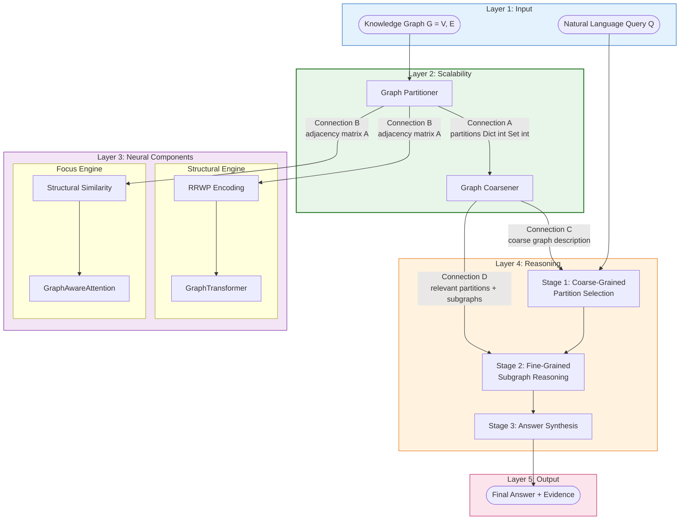
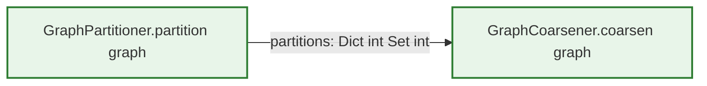
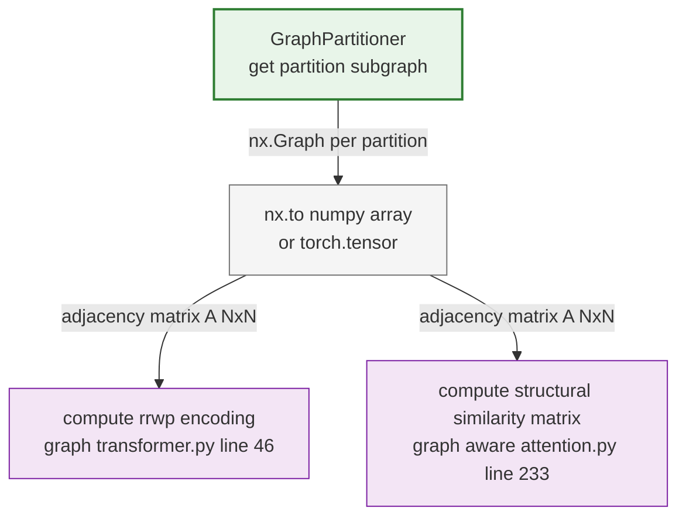
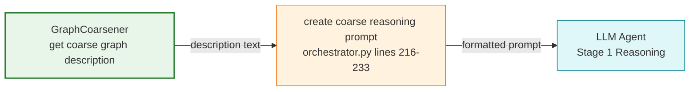
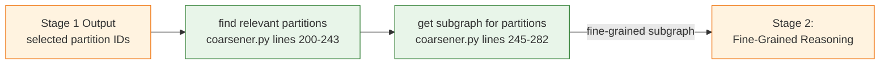
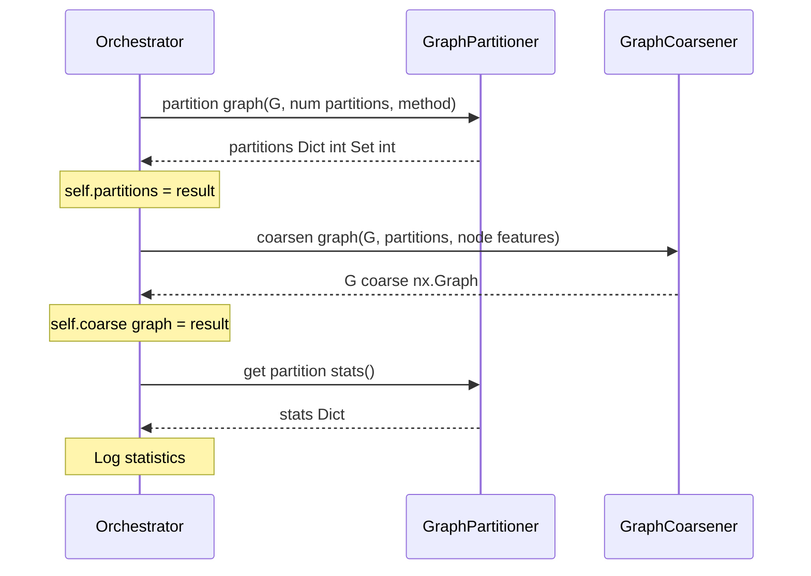
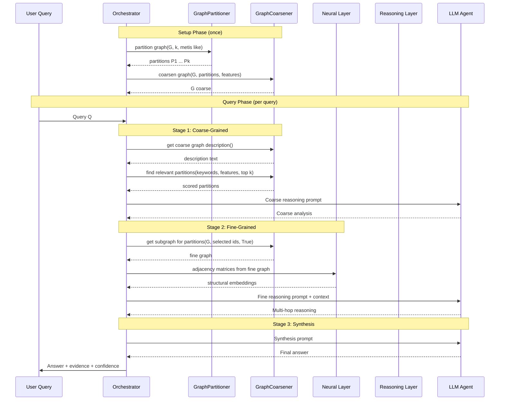

# Scalability Layer Integration — The Divide-and-Summarize Pipeline

> The two Scalability Layer components — the **Graph Partitioner** (The Divide Engine) and the **Graph Coarsener** (The Summarize Engine) — operate as a strict pipeline: the Partitioner divides the raw knowledge graph into manageable pieces, and the Coarsener creates a compact summary graph from those pieces. Together, they produce **three critical outputs** consumed by the Neural and Reasoning Layers: (1) partitioned subgraphs with adjacency matrices for the Neural Layer, (2) the coarse graph $G_\text{coarse}$ for Stage 1 coarse-grained reasoning, and (3) partition metadata and subgraph extraction capabilities for Stage 2 fine-grained reasoning. This document traces every data flow between the two components, every connection to downstream layers, the shared configuration surface, and how the orchestrator wires the pipeline together. Understanding these connections is essential for modifying any component without breaking the end-to-end system.
>
> **See also**: [README.md — Architecture Overview](../../README.md), [Component Guide — § 2 Scalability Layer](../component_guide.md), [Architecture Diagram — Layer 2](../../architecture_diagram.md), [Graph Partitioning Theory](../../graph_partitioning_theory.md).

---

## Architecture Overview

The S-GraphLLM four-layer stack is **Scalability → Neural → Reasoning → Output**. The Scalability Layer is **Layer 2**, the entry gate for large knowledge graphs. The two components form a pipeline, and their outputs fan out to both the Neural Layer and the Reasoning Layer.



The key takeaway: the Scalability Layer is a **one-time setup** that runs before any queries are processed. The Partitioner and Coarsener execute during the orchestrator's `setup()` call, and their results persist for all subsequent `reason()` invocations.

---

## Connection Breakdown

There are **four primary connections** from the Scalability Layer components to each other and to downstream layers. Each connection is documented below with exact code locations, data types, and dimensional constraints.

---

### Connection A: Partitioner → Coarsener

> The partition assignments `Dict[int, Set[int]]` produced by `GraphPartitioner.partition_graph()` are the primary input for `GraphCoarsener.coarsen_graph()`.



#### The Data

| Property | Value |
|----------|-------|
| **Producer** | `GraphPartitioner.partition_graph()` — `src/graph_processing/partitioner.py`, lines 35–70 |
| **Consumer** | `GraphCoarsener.coarsen_graph(graph, partitions, node_features)` — `src/graph_processing/coarsener.py`, lines 26–72 |
| **Variable name** | `self.partitions` (producer, line 31) → `partitions` parameter (consumer, line 29) |
| **Type** | `Dict[int, Set[int]]` — partition ID → set of node IDs |
| **Constraints** | Partitions must be disjoint ($P_i \cap P_j = \emptyset$ for $i \neq j$) and cover all nodes ($\bigcup P_i = V$) |

#### Where the Handoff Occurs in the Orchestrator

The handoff between Partitioner and Coarsener is coordinated by `HierarchicalReasoningOrchestrator.setup()` in `src/agents/orchestrator.py`, lines 67–98:

| Step | Lines | Action |
|------|-------|--------|
| 1 | 72–77 | Compute `num_partitions` from config or auto-calculate from graph size. |
| 2 | 79–83 | Call `self.partitioner.partition_graph(self.graph, num_partitions=num_partitions, method="metis_like")` → stores result in `self.partitions`. |
| 3 | 85 | Log partition count. |
| 4 | 88–92 | Call `self.coarsener.coarsen_graph(self.graph, self.partitions, self.node_features)` → stores result in `self.coarse_graph`. The `self.partitions` from step 2 flows directly into the Coarsener. |
| 5 | 94 | Log coarse graph creation. |
| 6 | 97–98 | Retrieve and log partition statistics via `self.partitioner.get_partition_stats()`. |

#### The Math

The partition dictionary encodes the fundamental decomposition:

$$V = P_0 \cup P_1 \cup \cdots \cup P_{k-1}, \qquad P_i \cap P_j = \emptyset \;\;\forall\; i \neq j$$

Each $P_i$ is stored as `self.partitions[i]: Set[int]`, and the Coarsener uses it to:
1. Create super-node $v^*_i$ for each partition $P_i$.
2. Determine inter-partition edges by checking, for each $(u,v) \in E$, whether $\pi(u) \neq \pi(v)$ (where $\pi(u)$ is the partition assignment of node $u$).

#### Plain English

The Partitioner takes a graph with potentially millions of nodes and divides it into, say, 100 partitions of ~10,000 nodes each. The result — a simple dictionary mapping partition IDs (0, 1, 2, ...) to sets of node IDs — is handed to the Coarsener, which collapses each partition into a single super-node and connects super-nodes based on whether any edges cross partition boundaries.

#### Python Perspective

```python
from src.graph_processing.partitioner import GraphPartitioner
from src.graph_processing.coarsener import GraphCoarsener
import networkx as nx

G = nx.erdos_renyi_graph(10000, 0.001)               # 10k-node graph

# Step 1: Partition
partitioner = GraphPartitioner(max_nodes_per_partition=2000)
partitions = partitioner.partition_graph(G, method="metis_like")
# partitions: Dict[int, Set[int]] — 5 partitions
# type(partitions): dict
# type(partitions[0]): set

# Step 2: Coarsen (consumes partitions from Step 1)
coarsener = GraphCoarsener()
G_coarse = coarsener.coarsen_graph(G, partitions)
# G_coarse: nx.Graph — 5 super-nodes, edges between connected partitions
```

---

### Connection B: Partitioner → Neural Layer (Adjacency Matrices)

> Partitioned subgraphs are converted to adjacency matrices that feed both the Structural Engine (RRWP Encoding) and the Focus Engine (Structural Similarity).



#### The Data

| Property | RRWP Path (Structural Engine) | Similarity Path (Focus Engine) |
|----------|-------------------------------|-------------------------------|
| **Producer** | `GraphPartitioner.get_partition_subgraph()` — `partitioner.py`, lines 189–209 → `nx.to_numpy_array()` / `torch.tensor()` | Same producer |
| **Consumer** | `compute_rrwp_encoding(adj_matrix, max_steps)` — `src/graph_processing/graph_transformer.py`, line 46 | `compute_structural_similarity_matrix(adj_matrix, seq_len, metric)` — `src/attention/graph_aware_attention.py`, line 233 |
| **Shape** | `(N, N)` as `torch.Tensor` where $N = |P_i|$ | `(N, N)` as `np.ndarray` where $N = |P_i|$ |
| **dtype** | `torch.float32` | `np.float64` |

#### How Subgraphs Become Adjacency Matrices

The conversion happens in two steps:

1. **Subgraph extraction** via `get_partition_subgraph()` (`partitioner.py`, lines 189–209):
   ```python
   subgraph = partitioner.get_partition_subgraph(graph, partition_id=0)
   # subgraph: nx.Graph — induced subgraph for partition 0
   ```

2. **Matrix conversion** via NetworkX:
   ```python
   # For RRWP (Structural Engine) — torch tensor
   adj_matrix = torch.tensor(nx.to_numpy_array(subgraph), dtype=torch.float32)
   # adj_matrix.shape: (|P_0|, |P_0|)

   # For Structural Similarity (Focus Engine) — numpy array
   adj_matrix_np = nx.to_numpy_array(subgraph)
   # adj_matrix_np.shape: (|P_0|, |P_0|)
   ```

#### The Math

From the same adjacency matrix $A \in \mathbb{R}^{N \times N}$:

**Structural Engine path** (RRWP — Equation 6 from the GraphLLM paper):

$$M = D^{-1}A, \qquad R_{i,j} = [I_{i,j},\; M_{i,j},\; M^2_{i,j},\; \ldots,\; M^{C-1}_{i,j}]$$

**Focus Engine path** (shortest-path similarity):

$$S(n_i, n_j) = \frac{1}{1 + d_A(n_i, n_j)}$$

Both encodings are deterministic given $A$ and capture complementary structural information (see [Neural Layer — Engine Integration, § Complementary Structural Representations](../neural_layer/engine_integration.md)).

#### Why It Matters

The Scalability Layer controls the **size** of the adjacency matrices the Neural Layer must process. With `max_nodes_per_partition=10000`, each adjacency matrix is at most $10000 \times 10000$, which is tractable for both RRWP computation ($O(N^2 C)$ for $C$ random walk steps) and structural similarity computation ($O(N^2)$ for BFS-based shortest paths).

---

### Connection C: Coarsener → Reasoning Layer (Stage 1)

> The coarse graph description text from `get_coarse_graph_description()` feeds directly into the LLM prompt for Stage 1 coarse-grained reasoning.



#### The Data

| Property | Value |
|----------|-------|
| **Producer** | `GraphCoarsener.get_coarse_graph_description()` — `src/graph_processing/coarsener.py`, lines 172–198 |
| **Consumer** | `HierarchicalReasoningOrchestrator._create_coarse_reasoning_prompt()` — `src/agents/orchestrator.py`, lines 216–233 |
| **Intermediate** | The `reason()` method calls `get_coarse_graph_description()` at line 124 and passes the result as `coarse_context` to `_create_coarse_reasoning_prompt()` at lines 141–145. |
| **Type** | `str` — multi-line natural-language description |
| **Content** | Partition count, inter-partition edges, per-partition statistics (node count, edge count, average degree, neighbor list) |

#### What the LLM Receives

The `_create_coarse_reasoning_prompt()` method (`orchestrator.py`, lines 216–233) constructs a prompt with this structure:

```
Given the following query and coarse-grained graph structure, identify which
partitions are most relevant for answering the query.

Query: {query}

{coarse_context}    ← output of get_coarse_graph_description()

Selected partitions for detailed analysis: {selected_partitions}

Please analyze the query and explain which partitions contain the most relevant
information for answering it. Provide your reasoning step by step.
```

The `coarse_context` string provides the LLM with a high-level map of the graph — which partitions exist, how large they are, and how they interconnect — enabling it to reason about which partitions likely contain relevant information.

#### Stage 1 Data Flow

| Step | Lines | Action | Output |
|------|-------|--------|--------|
| 1 | 124 | `coarse_context = self.coarsener.get_coarse_graph_description()` | Text description of $G_\text{coarse}$ |
| 2 | 128 | `query_keywords = query.lower().split()` | Keyword list from query |
| 3 | 131–135 | `relevant_partitions = self.coarsener.find_relevant_partitions(query_keywords, self.node_features, top_k=...)` | Scored partition list |
| 4 | 136 | `selected_partition_ids = [pid for pid, _ in relevant_partitions]` | Partition ID list |
| 5 | 141–145 | `coarse_prompt = self._create_coarse_reasoning_prompt(query, coarse_context, selected_partition_ids)` | Full LLM prompt |
| 6 | 147 | `coarse_reasoning = llm_agent.reason(coarse_prompt)` | LLM's coarse analysis |

---

### Connection D: Coarsener → Reasoning Layer (Stage 2)

> After Stage 1 selects relevant partitions, the Coarsener's `find_relevant_partitions()` and `get_subgraph_for_partitions()` methods extract fine-grained subgraphs for Stage 2 reasoning.



#### The Data

| Property | Value |
|----------|-------|
| **Producer (scoring)** | `GraphCoarsener.find_relevant_partitions()` — `src/graph_processing/coarsener.py`, lines 200–243 |
| **Producer (extraction)** | `GraphCoarsener.get_subgraph_for_partitions()` — `src/graph_processing/coarsener.py`, lines 245–282 |
| **Consumer** | Stage 2 logic in `HierarchicalReasoningOrchestrator.reason()` — `src/agents/orchestrator.py`, lines 150–186 |
| **Type (scoring)** | `List[Tuple[int, float]]` — partition IDs with relevance scores |
| **Type (extraction)** | `nx.Graph` — induced subgraph containing selected partitions + neighbors |

#### How Selected Partition IDs Flow Back into the Coarsener

After the LLM produces its coarse-grained analysis in Stage 1, the orchestrator uses the pre-computed partition scores (from `find_relevant_partitions()`) to determine which partitions to drill into:

| Step | Lines | Action | Output |
|------|-------|--------|--------|
| 1 | 131–135 | `relevant_partitions = self.coarsener.find_relevant_partitions(query_keywords, self.node_features, top_k=min(5, len(self.partitions)))` | Scored partitions |
| 2 | 136 | `selected_partition_ids = [pid for pid, _ in relevant_partitions]` | ID list |
| 3 | 154–158 | `fine_graph = self.coarsener.get_subgraph_for_partitions(self.graph, selected_partition_ids, include_neighbors=True)` | Fine-grained subgraph |
| 4 | 163–175 | Format nodes and edges from `fine_graph` into text context via `format_graph_context()` | Structured text |
| 5 | 179–183 | Pass context to `_create_fine_reasoning_prompt()` → LLM | Stage 2 reasoning |

#### Why `include_neighbors=True`

When extracting subgraphs for Stage 2, `include_neighbors=True` (line 157) ensures that **boundary information** is preserved. Nodes in neighboring partitions that connect to the selected partitions provide additional context for multi-hop reasoning paths that may cross partition boundaries.

---

## Dimension / Type Alignment Map

The Scalability Layer communicates with downstream layers through well-defined data types. The table below maps every data exchange.

| Data | Producer | Consumer | Type | Shape / Size | Constraints |
|------|----------|----------|------|-------------|-------------|
| Partition assignments | `GraphPartitioner.partition_graph()` | `GraphCoarsener.coarsen_graph()` | `Dict[int, Set[int]]` | $k$ entries, $\sum |P_i| = |V|$ | Disjoint and complete cover of $V$ |
| Coarse graph | `GraphCoarsener.coarsen_graph()` | Orchestrator `self.coarse_graph` | `nx.Graph` | $k$ nodes, $\leq \binom{k}{2}$ edges | One node per partition |
| Coarse description | `GraphCoarsener.get_coarse_graph_description()` | `_create_coarse_reasoning_prompt()` | `str` | Variable length | Human/LLM-readable text |
| Partition scores | `GraphCoarsener.find_relevant_partitions()` | Stage 1 partition selection | `List[Tuple[int, float]]` | $\leq \text{top}\_k$ entries | Sorted descending by score |
| Fine subgraph | `GraphCoarsener.get_subgraph_for_partitions()` | Stage 2 context formatting | `nx.Graph` | Variable; bounded by selected partitions + neighbors | Copy of induced subgraph |
| Partition stats | `GraphPartitioner.get_partition_stats()` | Orchestrator logging | `Dict[str, Any]` | 7 keys | For diagnostics only |
| Partition subgraph | `GraphPartitioner.get_partition_subgraph()` | Neural Layer (adj matrix) | `nx.Graph` | $|P_i|$ nodes | Per-partition induced subgraph |
| Adjacency matrix | `nx.to_numpy_array(subgraph)` | RRWP / Similarity | `torch.Tensor` or `np.ndarray` | $(|P_i|, |P_i|)$ | $|P_i| \leq \text{max}\_\text{nodes}\_\text{per}\_\text{partition}$ |
| Node summaries | `GraphCoarsener.node_summaries` | `get_coarse_graph_description()` | `Dict[int, Dict]` | $k$ entries | Contains `num_nodes`, `num_edges`, `avg_degree`, etc. |
| Cut edges | `GraphPartitioner.cut_edges` | Quality metrics, coarse edge construction | `List[Tuple[int, int, int, int]]` | Variable | `(src, dst, src_part, dst_part)` |

---

## Shared Configuration Surface

Both Scalability Layer components are parameterized through the same `Config` class (`src/utils.py`, lines 35–74) and `configs/model_config.yaml`. The table below shows which config fields affect the pipeline and how.

| Config Field | Line (utils.py) | Line (YAML) | Partitioner | Coarsener | Effect |
|-------------|-----------------|-------------|-------------|-----------|--------|
| `max_nodes_per_partition` | 47 | 12 | `__init__` parameter | Indirectly (determines partition sizes) | Controls the maximum size of each partition $P_i$. Smaller values → more partitions → finer coarse graph. |
| `max_edges_per_partition` | 48 | 13 | Reserved (not enforced) | — | Intended for future edge-count constraints. |
| `num_partitions` | 49 | 14 | `partition_graph()` parameter | Indirectly (determines $k$) | If set, overrides auto-computation of $k$. `null` means auto-compute. |
| `top_k` | 55 | 20 | — | `find_relevant_partitions()` parameter | Controls how many partitions are selected for Stage 2 (used by orchestrator). |

### YAML Excerpt

```yaml
# Graph configuration — shared Scalability Layer surface
max_nodes_per_partition: 10000   # → GraphPartitioner.__init__(max_nodes_per_partition=10000)
max_edges_per_partition: 50000   # Reserved for future use
num_partitions: null             # null → auto-compute k from max_nodes_per_partition

# Reasoning configuration — affects Coarsener usage
top_k: 50                       # Used by orchestrator for find_relevant_partitions()
```

### Interplay

The key relationship: `max_nodes_per_partition` is the single most influential parameter for both components. It determines:
- **Partitioner**: How many partitions $k$ are created (inversely proportional to `max_nodes_per_partition`).
- **Coarsener**: How many super-nodes $G_\text{coarse}$ contains (equals $k$).
- **Neural Layer**: The maximum size of adjacency matrices ($\text{max}\_\text{nodes}\_\text{per}\_\text{partition} \times \text{max}\_\text{nodes}\_\text{per}\_\text{partition}$).
- **Reasoning Layer**: The granularity of partition selection in Stage 1.

---

## Orchestrator Integration

The `HierarchicalReasoningOrchestrator` (`src/agents/orchestrator.py`, lines 33–318) is the glue that wires the Scalability Layer components together and connects them to the Reasoning Layer.

### Initialization — `__init__()` (lines 38–65)

```python
# src/agents/orchestrator.py, lines 56-60
self.partitioner = GraphPartitioner(
    max_nodes_per_partition=config.max_nodes_per_partition
)
self.coarsener = GraphCoarsener()
```

| Line | Action | Component |
|------|--------|-----------|
| 57–59 | Instantiate `GraphPartitioner` with `max_nodes_per_partition` from config. | Partitioner |
| 60 | Instantiate `GraphCoarsener` (no parameters needed). | Coarsener |
| 63 | Initialize `self.partitions: Optional[Dict[int, set]] = None`. | Shared state |
| 64 | Initialize `self.coarse_graph: Optional[nx.Graph] = None`. | Shared state |

### Setup — `setup()` (lines 67–98)

The `setup()` method executes the full Scalability Layer pipeline:



| Step | Lines | Code | Output |
|------|-------|------|--------|
| 1 | 72–77 | Compute `num_partitions` from config or auto-calculate | `int` |
| 2 | 79–83 | `self.partitions = self.partitioner.partition_graph(self.graph, num_partitions=num_partitions, method="metis_like")` | `Dict[int, Set[int]]` |
| 3 | 88–92 | `self.coarse_graph = self.coarsener.coarsen_graph(self.graph, self.partitions, self.node_features)` | `nx.Graph` |
| 4 | 97–98 | `stats = self.partitioner.get_partition_stats()` → log | `Dict[str, Any]` |

### Query Processing — `reason()` (lines 100–214)

During query processing, the orchestrator uses the Scalability Layer's pre-computed state:

| Stage | Lines | Scalability Layer Usage |
|-------|-------|------------------------|
| Stage 1 | 124 | `self.coarsener.get_coarse_graph_description()` — get coarse graph text |
| Stage 1 | 131–135 | `self.coarsener.find_relevant_partitions(query_keywords, self.node_features, top_k=...)` — score partitions |
| Stage 1 | 141–145 | `self._create_coarse_reasoning_prompt(query, coarse_context, selected_partition_ids)` — build LLM prompt |
| Stage 2 | 154–158 | `self.coarsener.get_subgraph_for_partitions(self.graph, selected_partition_ids, include_neighbors=True)` — extract fine subgraph |

---

## Full Pipeline Walkthrough

Below is the complete sequence of operations from raw graph input through the Scalability Layer and into the downstream layers, showing exactly when each component activates and what data it exchanges.



### Step-by-Step Execution Order

| Step | Component | Action | Output | Depends On |
|------|-----------|--------|--------|------------|
| S1 | Partitioner | Partition graph $G$ into $\{P_1, \ldots, P_k\}$ | `Dict[int, Set[int]]` | Input graph, config |
| S2 | Coarsener | Build $G_\text{coarse}$ from partitions | `nx.Graph` | Step S1 |
| Q1 | Coarsener | Generate coarse graph description | `str` | Step S2 |
| Q2 | Coarsener | Score partitions by query keywords | `List[Tuple[int, float]]` | Step S2, query |
| Q3 | LLM | Coarse-grained reasoning | Analysis text | Steps Q1, Q2 |
| Q4 | Coarsener | Extract fine subgraph for selected partitions | `nx.Graph` | Step S1, Q2 |
| Q5 | Partitioner | (Optional) `get_partition_subgraph()` for neural processing | `nx.Graph` per partition | Step S1, Q2 |
| Q6 | Neural Layer | RRWP + Graph Transformer + Graph-Aware Attention | Embeddings, attention | Step Q5 |
| Q7 | LLM | Fine-grained reasoning with graph context | Reasoning result | Steps Q4, Q6 |
| Q8 | LLM | Synthesize final answer | Answer + confidence | Step Q7 |

**Parallelism opportunities**: Steps Q1 and Q2 can run in parallel (both read from pre-computed state). Step Q5 (per-partition subgraph extraction) can run in parallel across partitions.

---

## Cross-References

### Component Documentation (This Folder)

- [**Graph Partitioner — The Divide Engine**](graph_partitioner.md) — Full documentation of the `GraphPartitioner` class with all methods, math, and code walkthrough.
- [**Graph Coarsener — The Summarize Engine**](graph_coarsener.md) — Full documentation of the `GraphCoarsener` class with all methods, math, and code walkthrough.

### Neural Layer Documentation

- [**Neural Layer — Engine Integration**](../neural_layer/engine_integration.md) — Documents Connection B (Scalability → Neural) in detail, including the shared adjacency matrix fan-out to RRWP and Structural Similarity.
- [**Neural Layer — Graph Transformer (The Structural Engine)**](../neural_layer/engine_graph_transformer.md) — Consumes adjacency matrices from partitioned subgraphs for RRWP encoding (`compute_rrwp_encoding()` at `graph_transformer.py`, line 46).
- [**Neural Layer — Graph-Aware Attention (The Focus Engine)**](../neural_layer/engine_graph_aware_attention.md) — Consumes adjacency matrices for structural similarity computation (`compute_structural_similarity_matrix()` at `graph_aware_attention.py`, line 233).
- [**Neural Layer — Node Encoder-Decoder (The Semantic Engine)**](../neural_layer/engine_node_encoder_decoder.md) — Encodes node text descriptions from partitioned subgraphs.

### Reasoning Layer Documentation

- [**docs/methodology/reasoning_layer/**](../reasoning_layer/) — Reasoning Layer documentation (Stage 1, Stage 2, Stage 3).

### Project Documentation

- [**README.md — Architecture Overview**](../../README.md) — High-level pipeline diagram showing the Scalability Layer's position and outputs.
- [**README.md — Novel Contributions**](../../README.md) — Lists Graph Partitioning and Graph Coarsening as novel contributions.
- [**README.md — Performance Targets**](../../README.md) — Scalability target of 1B+ nodes enabled via partitioning.
- [**docs/component_guide.md — § 2 Scalability Layer**](../../component_guide.md) — End-to-end guide covering both the Partitioner (§ 2.1) and Coarsener (§ 2.2).
- [**docs/architecture_diagram.md**](../../architecture_diagram.md) — Mermaid diagrams including:
  - Layer 2: Scalability Layer diagram (Partitioner → Coarsener with strategy branches).
  - Complete Data Flow diagram showing all inter-layer connections.
  - Component Interaction Matrix mapping data types between components.
- [**docs/graph_partitioning_theory.md**](../../graph_partitioning_theory.md) — Theoretical background covering:
  - METIS algorithm (three-phase multilevel approach: coarsening → initial partitioning → uncoarsening/refinement).
  - Spectral graph partitioning (Laplacian, Fiedler vector, Cheeger's inequality).
  - Balance and quality metrics (edge cut ratio, balance factor, communication volume).
  - Complexity analysis ($O(m)$ for METIS, $O(n^3)$ for spectral).
- [**docs/hierarchical_reasoning_theory.md**](../../hierarchical_reasoning_theory.md) — Explains how the coarse graph feeds into Stage 1 reasoning and how partition selection drives Stage 2.

---

**Document Version**: 1.0
**Last Updated**: February 2026
**Primary Sources**: `src/graph_processing/partitioner.py` (276 lines), `src/graph_processing/coarsener.py` (283 lines), `src/agents/orchestrator.py` (318 lines), `src/graph_processing/__init__.py` (10 lines), `src/utils.py` (240 lines), `configs/model_config.yaml` (36 lines)
